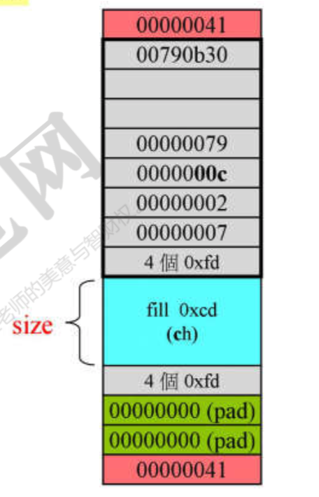

## 标准库&stl
标准库>stl  但是70%-80%都是stl
### 直接使用<库名>
新式的`#include`直接是`#include <header>` 不需要 `#include <header.h>`
### 新headers组件都放在std命名空间下
`using namespace std`直接可以使用各种的stl组件
旧的组件**不**在namespace std中

## gp和oop区别
`oo`会在类中把函数和成员放一起,但是`gc`不会,数据结构和算法分开
stl通过迭代器,泛化的指针,指向具体操作的内容
`functor`仿函数,对两个类做操作,加减之类的
`adapter`适配器用于转换容器,仿函数,迭代器

## 使用stl
```cpp

#include <iostream>
#include <vector>
#include <algorithm>
#include <functional>

using namespace std;
int main()
{
    int ia[6] = {12,59354,23,5345,23,123};
    //如果容器allocat的大小和内容不匹配可能有问题  
    //TODO 测试上面
    vector< int, allocator<int> > vi(ia,ia+6);

    //计算符合条件的元素个数 开始把头和尾范围写入
    //bind2nd 绑定第二个参数,function adapter
    //less 比xx小   
    //not >= function adapter
    cout << count_if(vi.begin(), vi.end(), not1(bind2nd(less<int>(), 40)));
    return 0;
}
```

###stl遵循前闭后开区间
容器的头和尾:
begin指向第一个元素,end指向的是最后一个元素的下一个位置
**end**指向的不是**最后一个**元素,可能是下一个需要分配的空间,但是**不是容器里的元素**
```
[s] [] [] [] [] [e]
`begin`在s位置,但是`end`在[e]的下一个位置,也就是超过容器范围的位置.
```
直接使用`end`可能不能控制
容器*不一定连续空间*


### 一般的遍历
```cpp
Container<T> c;
//每种容器都有自己的iterator
Container<T>::iterator ite = c.begin();
for(;ite!=c.end(); ++ite)
{...}
//ite是泛化的指针,++ *这些操作都支持
```

c++11以后 range-based for statement 
```cpp
for (decl:coll){}
```
ex:
```cpp
for(int i : {3,2,4,5,3,2,1,})
{
    std::cout << i << std::endl;
}
```
```cpp
std::vector<double> vec;
//使用auto:elem是vec的元素类型(vec的iterator)
//少用auto,应该更多指导使用的元素类型
for (auto elem:vec)
{
    std::cout << elem << std::endl;
}
//引用,可以更改内容
for (auto& elem : vec)
{
    elem *= 3;
}
```

## 容器分类
### 序列式容器 sequence container
按照放进去的元素顺序存储(逻辑顺序)
#### array 
把数组包装成类,前后没办法扩充 开始定长,直接往对应位置赋值
api
- []第几个元素的访问/赋值
- data 内存起始地址
- front 第一个元素
- back 最后一个元素

#### vector 
起点不动,后面如果长度增长,会扩充.单向扩充 
使用`push_back`从后面放入. 
如果vector放入的量较大,使用`try``catch`因为可能内存不够的时候可以缓解.因为两倍增长额时候需要重新申请内存空间进行分配.abort掉异常
在另外的地方进行扩容,然后迁移
常用api
- size 大小
- front 第一个元素
- back 最后一个元素
- data 内存其实地址
- capacity 实际内存大小 最后会2^n的大小
- push_back 放元素在后面.不能push_front

#### list 
链表,双向链表,双向环状链表
api
- max_size //TODO 确认max_size的算法
- front 第一个元素
- back 最后元素
- sort 排序 标准库有sort,但是如果容器自己有sort,用容器的sort会快点 //TODO 为什么
- push_back 放入list
  
#### forward-list(c++11)
单向链表(大小会比list小,少一个前缀指针)
- push_front 没有push_back函数,因为都是在前面进行插入,单向
- sort 排序 //TODO sort后的指针怎样变化

#### slist
单向链表,是gnu c
头文件在ext/slist

#### deque 
双向队列,两端可进可处,前后都可以扩充 
结构:一个buffer有多个元素,多个buffer组成deque,逻辑连续.map中控各个buffer,分段连续.
不断前后增加元素的时候,前/后buffer用完的时候会在前/后buffer继续扩充新的buffer
可以用c的sort函数

#### stack
deque的变种,一端不变
是container adapter 容器adapter.是deque的一种adapter
不会有iterator 可能破坏数据顺序(给了ite就可能让操作者更改里面的元素,破坏filo)
api
- push放进去元素
- top 顶
- pop 取出

#### queue
deque的变种,一端进一端出
是container adapter 容器adapter.是deque的一种adapter
不会有iterator 可能破坏数据顺序(给了ite就可能让操作者更改里面的元素,破坏fifo)


- push放进去元素
- top 顶
- pop 取出
- size 
- front

 


### 关联式容器 associative container
key value的 便于快速查找 为了查找方便 排序方便
**适合写慢查快的**
各家编译器的实现都用红黑树,因为查找快
高度平衡二叉树,查找快
- set 集合 元素不可以重复 使用红黑树.key就是value,value就是key 放入重复的会报错 //TODO 测试放入重复
- multiset 元素可以重复 
- map 红黑树 元素不可以重复 放入重复的会报错 //TODO 测试放入重复
- multimap 元素可以重复   

#### multiset
api
- insert 安插到应该的位置,具体位置不能由用户指定(红黑树制定了 已经排序)
- size 当前大小
- max_size
- find 找里面的值 会比c自己的find要快 因为已经排序了

#### multimap
不可以用[]做插入
api
- insert c.insert(pair<long,string>(i,buf)) 插入的是pair 因为是kv对
- size
- find  ite.second value

### unordered container 
c++11出现的,就是一种关联式容器
本质是hashtable 好查,但是顺序可能会因为后续更改而变.
hashtable 使用separate chaining容错 目前最被采用的
如果碰撞太多,可能会再把bucket打散,便于后续查找

#### unordered_multiset
如果元素个数>=桶数 会扩桶
不能用[]插入

api
- insert 放入
- bucket_count 桶个数
- load_factor 
#### unordered_multimap
适合大量使用搜索的场景
不能用[]插入

#### set

#### map
能用`[]`插入,key就是`[]`的值
#### unordered_map
类似map 能`[]`插入

## allocator
标准库中的分配器 
gnu下的分配器 都在ext/下 在命名空间`_gnu_cxx`下
- mt_allocator mt multi thread 多线程
- debug_allocator
- pool_allocator 内存池
- bitmap_allocator
- malloc_allocator

直接使用分配器,分配多少内存要归还同样大小的内存.
如果归还的和分配的不同,可能有问题 //TODO 查看可能问题

结论:直接使用容器可以避免对内存的管理,用完释放即可

### oop gp
oop data和method放一起
gp分开
- 方法负责上层的处理
- 类需要处理好自己的特性能力,比如> <这些函数需要重载好,供方法使用
  
#### 随机访问迭代器
random access iterator
可以直接通过ite ++ -- / 直接访问iterator
list的元素是用指针顺序放,不能随意拿到其中的元素指针
因为sort需要使用的额是`随机访问迭代器`,但是list的iterator不满足,所以不能用sort直接对list排序
因此不能随机访问的迭代器会有自己的sort函数


### 模板编程
- 类模板 `template <typename T> class X{T a();}`不指定类型,类的对应变量方式类型到了最后调用确定类型的时候再套入
- 函数模板 `template <class T> const T& min(const T& a, T& b)`编译器对函数模板进行实参推导,最终选用了对应的类型/类的函数
- 成员模板

#### 类模板
泛化 不指定类型
```cpp
template <class Key> struct hash{};
```

全特化 全特化就是限定死模板实现的具体类型
```cpp
template<> struct hash<char>{size_t operator()(char x) const {return x;}}; 
```

就是指定了char类型的时候hash的

偏特化
泛化
```cpp
template <class T, class Alloc = alloc>
class vector{...};
```

偏特化 偏特化就是如果这个模板有多个类型，那么只限定其中的一部分。(可能针对不同类型性能等做额外调整)
```cpp
template <class Alloc>
class vector<bool, Alloc>{...};
```

# allcoator
分配器,尽量不要直接使用.
容器直接使用

##  new 和 malloc
`operator new`会调用`malloc`
new操作源码会调用malloc.但是malloc分配内存空间的时候会有额外的内存开销,用于存放malloc的其他所需的信息
所以如果开辟的内存空间不大,此时额外的内存开销会占比大,不划算
如果都是分配大量的string,占用内存不大,这种情况下比较吃亏

头尾有些当前分配的内存大小

默认内存分配器是allocator

vc中的allocator使用new,new使用malloc,delete使用free,没有特殊设计

```cpp
int *p = allocator<int>().allocate(512,(int*)0);
allocator<int>().deallocate(p,512);
```
`allocator<int>()`就是一个临时对象,没有具体的名字.直接调用对应函数`allocate`
函数allocate的声明
```cpp
allocate(size_type _N, const void *)
```
通过`const void *`来确定allocate需要扩展的是什么


bc5的allocator也是使用new和delete分配内存

gnu2.9标准库 使用new delete分配内存,在`allocator`中.**但是不会使用allocator分配内存**,真正使用**alloc**
- 使用malloc对小内存的情况下开销大,对小空间申请内存的情况会
- gnu会另外使用内存管理工具克服缺点

alloc内存管理图

诉求:减少malloc次数,减少额外开销
做法:16条链表,每个链表负责对应对应大小的内存分配
0:8b
1:16b
...
15:128b
小容器都调整到8的倍数大小后申请内存空间
开始的时候就向操作系统申请一大块内存,切出来的内存另外用单向链表存起来.
因此只有这个内存的信息,但是没有具体每个对象的内存信息,减少不必要开销.这就是alloc的好处

gnu4.9版本
使用allocator,实质是__allocator_base, 本质是new_allocator,直接用malloc,free
__pool_alloc使用的就是G2.9的alloc

## 容器分类

复合关系,内嵌的有外层的
```
序列式容器:
array
-vector
--heap
--priority+queue
-list
-slist
-deque
--stack
--queue

关联式容器:
rb_tree
-set
-map
-multiset
-multimap
hasptable
-hash_set
-hash_map
-hash_multiset
-hash_multimap
```

## list
双向链表

list中list_node定义了指针,取大小的话应该是4
```cpp
template <class T>
struct __list_node{
    stpedef void *void_pointer;
    void_pointer prev; //gnu2.9之前写void_pointer gnu4.9之后是*__list_node
    void_pointer next;
    T data;
}
```
iterator:
- iterator++ 通过next拿到下一个迭代器
- iterator-- 通过prev拿到上一个迭代器

iterator会有大量操作符存在,iterator要模拟指针,使用-> * ++ --的特性.
几乎每个容器的iterator都会有自己的`ref` `T` `pointer`集中类型定义

iterator
++i prefix form 前置指针  self& operator++()
实现:拿next指针赋值给this
i++ postfix form 后置指针 self operator(int)
实现:使用++i

只能++++i 不能i++++
为了模拟整数的自增符

取值
```cpp
reference operator*() const{
    return (*node).data;//直接拿到data的数据
}
pointer operator->() const{
    return &(operator*());
}
```

list的begin是第一个指针,end是最后的节点的下一个.end的next是begin
是一个环状的链表

### iterator遵循的原则
iterator连接容器和算法,让算法可以处理容器的元素
算法需要根据不同的数据类型进行处理,iterator需要满足算法确定的条件,就是iterator associated type.包括
- iterator_category 移动性质.有的迭代器只能前进,有的能前进后退访问,有的可以+9 +3访问,这种属性 
- value_type 元素的类型 T
- pointer 没用
- reference 没用
- difference_type 元素之间的距离类型,ex:可以用unsinged int表示,或者其他类型
  
iterator traits用来分离class iterator和non-class iterator
如果是类 返回
```cpp
template <class I>
struct iterator_traits{
    typedef typename I::value_type value_type
};
```
如果收到的是指针,指针的类型就是value_type
```cpp
template <class T>
struct iterator_traits<T*>{
    typedef T value_type;
}
```
用偏泛型来把类或者指针的迭代器属性返回,通过增加一层traits来封装这些类型的不同
如果是指针类型,
- iterator_category random_access_iterator_tag 可以随意访问的类型
- difference_type ptrdiff_t
- pointer T*
- reference T&

## vector
扩充:新开辟内存后迁移过去
capacity: 容量,当前可以容纳的元素个数
size: 当前元素个数
```cpp
iterator start;//起始指针
iterator finish;//最后一个的下一个,[)区间
iterator end_of_storage;//最后的位置(并不是最后的那个,而是最后的下一个,尊徐前闭后开)
size_type capacity(){
    return size_type(end_of_storage()-begin());
}
size_type size(){
    return size_type(finish() - begin());
}
```
push_back函数
```cpp
void push_back(const T& x){
    if(finish != end_of_storage)//如果finish还没到capacity的最后
    {
        construct(finish, x);//finish位置构造
        ++finish;
    }
    else 
    {
        insert_aux(end(),x);//辅助插入 要构造新空间
    }
}
void vector<T,Alloc>::insert_aux(iterator position, const T&x){
    //作用:如果插入的时候需要整体挪动,但是空间足够:往后复制一个,挪动position到后面的,然后把位置放进去
    //如果插入不够空间,申请空间后再挪动
    if(finish != end_of_storage)//如果finish还没到capacity的最后 ~~因为可能会被其他的函数调用,所以再进行一次检查~~
    {
        //在后面新建一个最后的元素
        construct(finish, *(finish - 1));//finish位置构造
        ++finish;
        T x_copy=x;
        copy_backword(position, finish - 2, finish - 1);//把元素往后面挪
        *position = x_copy;//把x_copy这个元素放进去position这里
    }
    else{
        const size_tpye old_size = size();
        const size_type len=old_size != 0 ? 2*old_size:1;
        iterator new_start = data_allocator::allocate(len);//申请空间
        iterator new_finish=new_start;//空白区域start=finish
        try{
            //把原来的vector拷贝到新的vector
            new_finish = uninitial_copy(start, position, new_start);//start到position拷贝
            construct(new_finish, x);//x放position
            ++new_finish;//调整当前finish
            new_finish=uninitialized_copy(position,finish,new_finish);
        }
        catch(){
            ...
        }
        //释放旧的空间
        destroy(begin(),end());
        deallocate();
        start = new_start;
        finish=new_finish;
        end_of_storage = new_start + len;//总占用空间,len是最初的位置
    }
}
```
vector的iterator声明 G2.9
```cpp
template <class T, class Alloc=alloc>
class vector{
    public:
    typedef T value_type;
    typedef value_type * iterator;//T* 本质是一个T类型的指针
}
vector<int> vec;

vector<int>::iterator ite = vec.begin();
```

## array
封装:为了遵循容器的规则
```cpp
template <typename _Tp, std::size_t _Nm>//需要制定大小,因为array指定空间大小不变
struct array{
    typedef _Tp value_type;
    typedef _Tp* pointer;
    typedef value_type* iterator;

    value_type _M_instance[_Nm? _Nm:1];//不允许是0
    iterator begin(){
        return iterator(&_M_instance[0]);
    }
    iterator end(){
        return iteraotr(&_M_instance[_Nm]);
    }
}
//没有constructor 没有destroctor
```

使用
```cpp
array <int, 10> myArray;
auto ite=myArray.begin();
ite += 3;
cout << *ite;
...
```

## deque
分段串起来

vector作为中控,指向不同的buffer.这个vector称为map
前部扩充:vector前加一个buffer的指针,补充前部
后补扩充:vector后加一个buffer指针,扩充后补
增长:两倍增长(就是vector的增长方式)
```cpp
//一个缓冲区的默认大小.如果配置是0,默认值是 n!=0?n:(sz < 512?size_t(512/sz):size_t(1))
//传入是0,如果T的大小>512,就只放1个;如果不是很大,放入512/size(T)个
template <class T, class Alloc=alloc, size_t BUfsize = 0>
class deque{
    public:
    typedef T value_type;
    typedef __deque_iterator<T, T&, T*, BifSiz> iterator;
    protected:
    typedef pointer* map_pointer; //T** 是map_pointer的指针
    protected:
    //一共40个字节  iterator16*2+两个指针 
    iterator start;
    iterator finish;
    map_pointer map;
    size_type map_size;
    public:
    iterator begin(){return start;}
    iterator end(){return end;}
    size_type size() const {return finish - start;}
};
```

iterator
- cur 当前指针
- first 当前指针所在buffer的第一个元素位置
- last:当前指针所在buffer的end(前闭后开,是end的下一个)
- node:指向`map`的vectop
- ++/-- 每次都要判断是否到了边界.如果到了边界,node,first,last,cur都要判断看是否符合.借助`map`跳转到前一个/后一个buffer

start迭代器
指向当前begin cur first last node对应
finish迭代器
指向当前end(前闭后开,如果最后一个已经满了,cur是指向一个新的buffer的头)
```cpp
template <class T, class Ref, class Ptr, size_t BufSiz>
struct __deque_iterator{
    typedef random_access_iterator_tag iterator_category;
    typedef T value_type;
    typedef Ptr pointer;
    typedef Ref reference;
    typedef size_t size_type;
    typedef ptrdiff_t difference_type;
    typedef T** map_pointer; //因为最后map_pointer
    typedef __deque_iterator self;

    T* cur;
    T* first;
    T* last;
    map_pointer node;
}
```
一个deque的iterator大小是16(4个指针)

insert 指定位置插入
```cpp
iterator insert(iterator position, const value_type &x){
    if(position.cur==start.cur){//如果插入位置是最前端,且在最前端buffer的头:前端开辟,不用动原来数组
        push_front(x);//放前面
        return start;
    }
    else if(position.cur==finish.cur){//如果插入位置在后端buffer的最后面,直接放在最后面
        push_back(x);
        iterator tmp = finish;
        --tmp;
        return tmp;
    }
    else
    {
        return insert_aux(position,x);
    }
}
template <class T, class Alloc, size_t BufSize>
typename deque<T, Alloc, BufSize>::iterator
deque<T, Alloc, BufSize>::insert_aux(iterator pos, const value_type& x){
    difference_type index = pos - start;
    value_type x_copy = x;
    if(index < size() / 2){//如果在前半段,挪动前半段
        push_front(front());
        ...
        copy(front1, pos1, front1);
    }
    else
    {
        push_back(back());//如果在后半段,挪动后半段
        ...
        copy_backward(pos, back2,back1);
    }
    *pos = x_copy;//新位置赋值
    return pos;
}
```

模拟连续区间
```cpp
reference front()
{
    return *start;
}
reference back()
{
    iterator tmp = finish;
    --tmp;
    return *tmp;
}
size_type size() const
{
    return finish - start;//此处会过载 - 运算符,算出finish和start中间有多少个区间*个数+头尾的长度
}
bool empty() const
{
    return finish == start;
}
reference operator*() const
{
    return *cur;//直接那cur的内容
}
pointer operator->()const
{
    return &(operator*());//使用*的引用
}
difference_type
operator-(const self&x) const
{
    return difference_type(buffer_size()) * (node - x.node - 1)+(cur - first)+(x.last - x.cur);//buffer的大小*(当前的node-x的node -1)+(当前的cur-当前的first)+(x.last-x.cur) 
    //就是中间buffer个数+当前到当前buff头距离+减去的位置到它尾部的距离
}

self &operator++(){//++i
    ++cur;
    if(cur == last){//因为last指的是最后一个buffer的下一个空间,所以可以先加
        set_node(node + 1);
        cur = first;
    }
    return *this
}
self operator++(int){//i++ 使用++实现
    self tmp = *this;
    ++*this;
    return tmp;
}
self &operator--(){
    if(cur == first){//如果已经在buffer头,到前一个buffer
    //TODO 边界问题怎样避免?例如已经到了start的位置
        set_node(node - 1);
        cur = last;
    }
    -- cur;
    return *this;
}
self operator--(int){
    self tmp=*this;
    --*this;
    return *this;
}
void set_node(map_pointer new_node){
    node = new_node;
    first = *new_node;
    last = first + difference_type(buffer_size());
}
self& operator+=(difference_type n){//迭代器可以当做指针使用的话,+n表示范文n个后面的那个元素
    difference_type offset = n + (cur - first);//n直接加上当前cur与first的距离,超过buffer_size说明不在同一个buffer
    if(offset >= 0 && offset < difference_type(buffer_size()))
        cur += n;
    else{//offert/buffer_size求出跳几多个buffer
        difference_type node_offset = offset > 0? offset / difference_type(buffer_size())
        : -difference_type(-offset - node_offset*difference_type(buffer_size()));
        //支持小于0的difference_type操作,可以往前找
        set_node(node + node_offset);
        cur = first + (offset - node_offset * difference_type(buffer_size()));
    }
    return *this;
}
self operator+(difference_type n)const{
    self tmp=*this;
    return tmp += n;
}
self &operator -=(differenct_type n)
{
    return *this += -n;
}
self operator -(difference_type n)const
{
    self tmp = *this;
    return tmp-=n;
}
reference operator[](differenct_type n) const
{
    return *(*this + n);
}

```
`map`在扩容的时候会选择在vector的中段写入,方便前后扩容

### queue
一边入一边出的deque
```cpp
protected: Sequence c;
public:
bool empty()const { return c.empty();}
size_type size() const {return c.size();}
reference front() {return c.front();}
const_reference front() const {return c.front();}
reference back(){return c.back();}//队列尾巴:deque尾
const_reference back() const{return c.back();}
void push(const value_type &x){c.push_back(x);}//push就是deque的push_back 
void pop(){c.pop_front();}//pop就是deque的pop_front
//可以理解为deque改造:尾巴和头一样,尾巴进头出,没有了pop_back和push_front
```
### stack
```cpp
const_reference top() const{return c.back();}
void push(const value_type&x) {c.push_back(x);}
void pop(){c.pop_back();}
//可以理解为deque改造:尾巴进尾巴出.没有了push_front和pop_front
```

stack或者queue不允许遍历,不提供iterator,会干扰fifo等特性.
stack和queue可以选用list作为底层结构
queue不能选vector做底层结构,stack可以.因为vector没有pop_front
stack和queue都不可以用set或者map做底层结构 因为没有push_back back pop_back

# 关联式容器
查找快,插入算快
底层是红黑树,散列表
红黑树是平衡二叉树
**不应该改红黑树里的元素**,但是rb_tree更改迭代器是可以的.
map的key不能改,value可以改
### 红黑树
插入api
- insert_unique() unique放入重复key不造成异常,照常返回,只是放入元素会少一个
- insert_eqeal() 允许重复key 放在同key相邻的地方.多放几个会统计上
 ```cpp
 类成员
 size_type node_count;//树大小
 link_type header;//红黑树头结点
 Compare key_compare;//key比大小的规则,functor
 ```
 红黑树header没有数据,header指向的是红黑树第一个节点
 红黑树的value组成:key+data

### set & multiset
 set key不能重复 使用红黑树的insert_unique
 multiset key能重复 使用红黑树的insert_euqal
 底层红黑树
 set的红黑树 value就是key
 提供遍历操作 ++ite遍历
 不能使用ite改变元素值

### multi_map
 multi_map 不能使用[]

 ### map独有[],有小坑
 map的[]符号,传入key,返回data.**但是如果没有对应的key,map里会用这个key新建一个节点使用默认data,并返回**
 符号[]使用lower_bound,查找当前符合的,如果有大量一样的key,会找排最前的.
 如果找不到key,返回适合安放key的位置

###unordered系列
底层哈希 
哈希特性:如果桶个数不够元素个数多,会扩充两倍重新哈希

 ## 迭代器分类
 iterator_category:迭代器的分类
 各种tag是继承关系,不是枚举
- random_access_iterator_tag:随机访问 array deque vector属于
- bidirectional_iterator_tag:双向访问 list属于 map set红黑树的属于
- forward_iterator_tag:单向访问 forward_list属于 hashtable属于
- input_iterator_tag:istream
- output_iterator_tag:ostream
  
### 迭代器不同对算法有影响
计算元素之间距离的时候:
- input_iterator_tag需要挨个next访问到目标位置,计算个数
- random_access_iterator_tag直接end-start得到
往一个方向步进
- random_access_iterator_tag直接+n
- input_iterator_tag按照一个方向++i
- bidirectional_iterator_tag看方向++或者--i
copy
- char类型 memmove,效率高
- T* 如果没琐碎操作(trivial_op) memmove 效率高 有:n < end-start
- random_access_iterator_tag:挨个拷贝,但是 n< end - start 决定了循环次数 较快
- 最慢:挨个拷贝,但是 for(;last!=first;) 每次都要对比
trivial_op:如果没有析构函数构造函数,是使用系统默认的,就是has_no_trivial_op 否则就是has_trivial_op,因为有单独的复制拷贝

有的算法是固定了iterator_category的,例如sort只能使用random_access_iterator_tag

## reverse iterator

  
###仿函数
是一个函数对象,一个对象但是类似函数的特质
//TODO 函数适配器 move


#### move
c++11特性
如果move的内存破碎,不明显
vector:差别较大
其他差别不大


 
