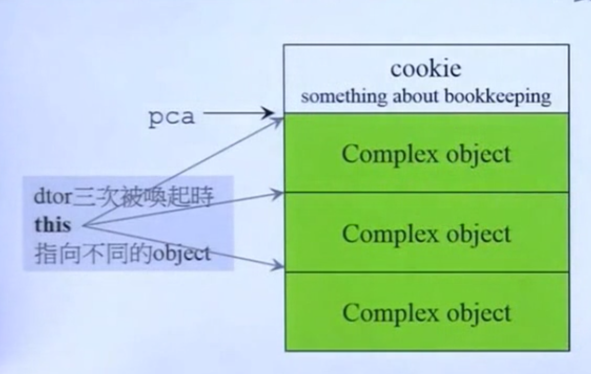

# primitives

linux中的malloc使用dl_malloc doug lea

operator::new就是malloc
- while循环中malloc分配
- 如果mallc失败,使用自己制定的new handler,可以的话应该在new handler中释放掉一些无用的内存,因为内存不够才会到new handler
- catch上述异常
delete就是free
编译器进行malloc的内存分配

调用new的时候  过程是:
- 使用operator::new分配类的空间
- 指针指向分配的空间
- 编译器使用初始值初始化类
- catch上述异常 可能分配内存失败

使用delete时候,编译器转为operator delete删除
operator delete使用free删除

**注意**平时用的new不是operator::new 编译器转换到的才是operator::new

string是宏定义 对应的是basic_string

gcc不能直接调用构造函数
```cpp
A *pa = new A(1);
pa->A::A(3);//gcc失败
A::A(5);//gcc失败
```

### array new array delete
```cpp
C *pc = new C[3];//会构造3次,无法传初始值
delete[] pc;//会释放3次
//很容易因为忘记用delete[] 而使用delete 漏了释放内存
```
malloc分配内存的时候会写上cookie,写入内存的相关信息
最后会在cookie里写入object的信息



如果只使用delete不使用delete[]释放

根据不同的编译器,要么释放上面的object,要么释放下面的object
内存释放不干净,导致内存泄漏

**使用array new 就应该用array delete**

手工构造 对对象数组初始化
```cpp
#include <iostream>
using namespace std;
class A
{
public : int id;
         A() :id(0){cout << "default ctr.this=" <<this<<"id="<<id<<endl;}
         A(int i):id(i){cout << "ctor.this="<<this<<"id="<<id<<endl;}
         ~A(){cout <<"dtor.this="<<this<<"id="<<id<<endl;}
};
int main()
{
    int size=3;
    A* buf = new A[size];
A* tmp = buf;
for(int i = 0; i < size; ++i)
{
    new(tmp++)A(i);//定点new(placement new) 会在原有地址上new以及构造
}
delete[] buf;//gnc c会从下往上析构
    return 0;
}
```
输出
```bash
default ctr.this=0x2143018id=0
default ctr.this=0x214301cid=0
default ctr.this=0x2143020id=0
ctor.this=0x2143018id=0
ctor.this=0x214301cid=1
ctor.this=0x2143020id=2
dtor.this=0x2143020id=2
dtor.this=0x214301cid=1
dtor.this=0x2143018id=0
```

#### 额外开销
例如在vc6下申请内存空间
```cpp
int* pi = new int[10];
delete pi;
```
vc6开辟的内存如下(debug mode下)

对于整数的array,直接delete可以

但是如果申请的是对象数组
```cpp
D *p = new D[3];
delete[] p;
```
内存如下

如果没有delete [] 直接delete,vc发现delete一个指针,但是发现内存布局不是,会报错
如果析构函数是默认的,不会记录这个3

#### placement new
允许在已经申请的内存里构建object
```cpp
char* buf = new char[sizeof(X)*3];
X *px = new(buf)X(12);
```
//TODO 如果构建的object和申请的内存不符会怎样
编译器不会再分配内存
编译器中的placement new:
```cpp
X *Pc
try{
    void *men = operator::new(sizeof(X),buf);//拿地址,不申请
    pc = static_vast<X*>(mem);
    pc->X::X(12);//构造
}
catch(std::bad_alloc){
    //失败就不构造
}
```

#### 重载
如果内存池 可以减少cookie损耗,值得做.
一个类可以重载 operator new 和operator delete
一般只改类自己的operator new 不会改全局的::operator new 因为全局的是所有类都依赖的,全局改可能不可可控
容器中不希望直接使用malloc free ,因此contruct和destroy会额外处理内存,在分配器里处理

重载::operator new/::operator delete
```cpp
inline void* operator new(size_t size){};
inline void* operator new[](size_t size){};
inline void* operator delete(void* ptr){};
inline void* operator delete[](void* ptr){};

```
类中重载new/delete
```cpp
class Foo{
    public:
    void* operator new(size_t);//需要静态,因为对象还没有构造的时候就要调用
    void operator delete(void*, size_t);//第二个参数optional//需要静态,因为对象还没有构造的时候就要调用
    void* operator new[](size_t);//需要静态,因为对象还没有构造的时候就要调用
    void operator delete[](void*, size_t);//第二个参数optional//需要静态,因为对象还没有构造的时候就要调用
}
```
在编译器调用构造/析构的时候
```cpp
//构建
try {
    void* mem = operator_new(sizeof(Foo));
    p=static_cast<Foo*>(mem);
    p->Foo::Foo(xx);
}

//析构
p->~Foo();
operator delete(p);
```
编译器的代码就会调用到类自己重载的代码进行构建/析构
如果使用::new ::delete 会绕过类自己定义的new delete,强制使用全局的new delete
ex:
```cpp
Foo *p = ::new Foo(7);
::delete p;

Foo *pA=::new Foo[5];
::delete[] pA;
```

重载placement new
可以自定义不同版本的placement new,但是第一个入参必须要size_t

//猜想:可能因为现在内存已经不值钱,后续的gnu版本没有针对地对内存做malloc的优化
 #### class allocator 
 内存池管理的目标:
 - 速度 减少malloc次数
 - 空间 减少cookie的个数

class中多一个next指针,把内存按照链表管理,并列存放
先拿到内存,初始化内存(各个类实例空间)然后挨个返回.
最后的实例会在这块内存空间中,直接指向对应的空间


进化版本
使用union
可能有不同的member,但是可以用里面不同的member角度来看.
把一个union的前4个当做指针来看
实现

使用union,类自己的存储就会有两种形态:类自己或者是next指针.初始化的时候使用next用来找到下一个待实例化的指针,类自己在实例化后可以使用该空间.
更多union看[这里](../c++/union.md)

delete都是把指针放给头指针,**事实上空间不会空着**,归还时候,free_list指向空余节点,而空余节点的next指向原来的free_list.

#### static allocator
集中一个地方进行申请,不管什么class.这样不需要针对单独的类设计内存分配器
对象中加入privete static allocator 用于分配

allocator类中使用
```cpp
struct obj{
    struct obj* next;
}
```
用于指向下一个对象的位置
因为allocator是静态类,因此会在静态区间.因为next指向的是类自己,因此在分配的时候,**不需要类自己union一个next指针**,交给allocator指向即可
//TODO 删除后的空间怎么办??释放掉的空间就在里面没有再用或者移走


#### =defalut, =delete
cpp 2.0 开始有
拷贝构造,拷贝复制,析构会有default版本
operator new new[] delete delete[]也有
=delete 不要对应的函数


# std::allocator

vc6 malloc布局

需要凑够16的倍数,pad用来填充空间.希望去除这种多余的开销

vc6 allocate就是malloc
deallocate就是free

bc5 allocate就是malloc
deallocate就是free

g2.9 allocator是malloc free
但是g2.9使用`alloc`分配器  
g4.9的叫`__pool_alloc`
但是g4.9的分配器不是,仅仅是普通的malloc

## g2.9 std::alloc
拿到的是8的倍数的内存大小


### embedded pointer
内存的使用方法是,使用的时候看成对象实例,空闲的时候会看成next指针.

这里可以看到,上到下如果标号1 到8,开始内存顺序交出,后续归还的时候按照 3 5 8 4 1的顺序归还.
因为归还的时候空余指针指向了原来空闲指针的头`free-list`,然后空闲指针的位置取代了原来的free-list,这样可以让空闲的内存**再次利用**
当进行了多次的申请/分配,随着回收和再次分配,内存可能会跨过多个区块

#### 分配策略
- 第一次malloc的时候拿到较大的空间,根据实际需要的内存大小(如32B的需要10个)先分配,剩余的作为pool处理
- 后续有需要分配的时候(如56B的要分配10个)先看pool还够不够,如果足够则在pool中分配,否则在剩下的能切分的先切分,再malloc.此处可能存在内存碎片.
- 每次malloc当前需要的内存*2+5200>>4
- 从pool切出来的最多20个区块


#### 如果内存分配到不能再拿到内存
- 把最后剩余的内存碎片给到适合的
- malloc会失败
- alloc会看比当前最靠近的(比如list到了7 就取8.如果8没有分配到,就往后找.ex找到9),pool就剩下list 9 - list7的大小.此时list9往下跳过(如果没有,指向空)
- 如果往后面都找不到,就gg

可能的进步空间
- 找小的空间合并,但是成本很高.因为链表不知道多长

#### 二级分配器
- 一级:malloc失败后模拟new handler.g4.9没有 
- 二级:内存池

构成:freelist+内存链表
freelist管理内存链表,每个序号i表示(i+1)*8大小的内存空间
静态变量start_free end_free记录的是剩余内存池pool的开始结尾指针
ROUND_UP
```cpp
return (((bytes) + __ALIGN - 1 ) & ~(__ALIGN - 1));
```
如果__ALIGN是4 bytes是13 `(bytes) + __ALIGN - 1`结果是bytes的ALIGN高位会进1,然后&上`(__ALIGN - 1)`,也就是保留高位去掉低位.
用于字节对齐

FREELIST_INDEX 拿到内存对应的freelist 序号
```cpp
return (((bytes)+__ALIGN- 1)/__ALIGN);
```
记录下内存池的头,尾,累计分配量

```cpp
static void* allocate(size_t n)
{
    obj* volatile *my_free_list;
    obj* result;

    if(n > (size_t)__MAX_BYTES){
        return (malloc_alloc::allocate(n));//使用第一级
    }
    my_free_list =free_list + FREELIST_INDEX(n);
    result = *my_free_list;
    if(result == 0){
        void* r = refill(ROUND_UP(n));//如果链表没有的时候,申请空间,指向第一个
        return r;
    }
    //如果能往下走,就直接拿freelist指向的当前已经分配空间的第一个
    *my_free_list = reslut->free_list_link;//TODO 这里my_free_list里的元素指针在分配之后应该要往下指向下一个 这里好像没看到
    return(result);
}
```
deallocate相当于在链表的头把释放的空间插入,更换链表头
```cpp
static void deallocate(void* p , size_t n)
{
    obj* q (obj*)p;
    obj* volatile *my_free_list;
    if(n > (size_t)__MAX_BYTES){//一级处理
        malloc_alloc::deallocate(p,n);
        return;

    }
    my_free_list = free_list + FREELIST_INDEX(n);
    q->free_list_link = *my_free_list;//q并没有释放,q的下一个指向当前的list指针.这里my_free_list是个**,*指的是my_free_list第几个的内容,**指的是当前index指向的具体地址空间
    *my_free_list = q;//当前index的内容指向给现在的q

}
```
缺点
- 没有free,因为链表可能交叉,内存可能不连续,归还系统比较麻烦
- 如果释放的p原来不是free_list内,可以归还,这里没有检查.只是这块空间会放入链表,如果和链表的空间不符合,可能会gg
  
```cpp
void* alloc::refill(size_t n)
{
    int nobjs = 30;
    char* chunk = chunk_alloc(n,nobjs);//nobjs会返回,看实际能拿到多少空间
    obj* volatile *my_free_list;
    obj* result;
    obj* current_obj;
    obj* next_obj;
    int i;
    if(1 == nobjs) return (chunk);//没有剩余的空闲
    my_free_list = free_list + FREELIST_INDEX(n);
    //这里的free_list_link可以理解为前面union里的next 
    for(i = 1;;++i){//第一个就要给回去,所以从开始
        current_obj=next_obj;//剩下的开始
        next_obj = (obj*)((char*)next_obj + n);//下个地址自增n 就是申请的空间.最后一个的时候会指向范围外的,但是已经不能用到
        if(nobjs-1==i){//到达了空间的上限
            current_obj->free_list_link = 0;//指向0
            break;
        }
        else{
            current_obj->free_list_link = next_obj;//指向下一个obj
        }
    }
    return (result);
}

```


chunk_alloc
```cpp
alloc::chunk_alloc(size_t size, int& nobjs){
    char* reslut;
    size_t total_bytes=size*nobjs;
    size_t bytes_left = end_free - start_free;
    if(bytes_left >= total_bytes){//剩余空间足够大  随意放,改下start_free
        result = start_free;
        start_free += total_bytes;
        return(result);
    }
    else if(bytes_left >= size){//剩余空间不够放 但是能放下一个以上
        nobjs = bytes_left/size;//看剩下的能放度搜好
        total_bytes = size*nbojs;
        result=start_free;
        start_free+=total_bytes;//改下start_free
        return(result);
    }
    else{//一个都放不下
        size_t bytes_to_get = 2 * total_bytes+ROUND_UP(heap_size>>4);//申请2个total_size大小
        if(bytes_left>0){
            //剩下的bytes就挂给适合的index中
            obj* volatile *my_free_list = free_list + FREELIST_INDEX(bytes_left);
            ((obj*)start_free)->free_list_link=*my_free_list;//剩下空间的free_list_link指向头
            * my_free_list =(obj*)start_free;//链表头更换
        }
        //开始真正分配内存
        start_free = (char*) malloc(bytes_to_get);
        if(0 == start_free){//如果分配失败
            int i;
            obj* volatile * my_free_list, * p;//意思是 obj * * p1; obj* p2
            //尝试在已经有的地方取内存
            //从较小的内存拿内存,在多进程机器不好 
            //TODO 原因?? jj说因为其他进程可能拿不到内存 有可能是因为fork的情况

            for(i = size;i <= __MAX_BYTES; i+= __ALIGN){//从list index往后找
                my_free_list = free_list + FREELIST_INDEX(i);
                p = *my_free_list;
                if(0 != p){//如果存在未分配的 大于自己的free_list
                    *my_free_list = p->free_list_link;//freelist指向下一个,当前空间给到需要分配的地方
                    start_free=(char*)p; //pool剩余空间指向了当前拿到的节点
                    end_free=start_free+i;//poo l尾指向了当前的找到内存链表的区间
                    return(chunk_alloc(size,nobjs));//尝试再次分配,也就是改了pool之后再分配 这时候nobjs可能改掉
                }
            }
            //剩下的都没有找到可以分配的空间,去分配内存
            end_free = 0;
            start_free = (char*)malloc_alloc::allocate(bytes_to_get);
        }
        heap_size += bytes_to_get;
        end_free = start_free + bytes_to_get;
        return(chunk_alloc(size,nobjs));//分配pool成功后,重新获取.pool足够的时候分配正常 这是nogjs可能改掉
    }
}
```
总结:alloc分配的时候会如果申请不到空间,会尝试在free_list比自己大的后面进行分配,把pool放在里面的一个内存单元再尝试.
如果都不行malloc分配

对比容器自己的和使用new
```cpp
list<Foo>c;
c.push_back(Foo(1));//建立临时对象,临时建立对象Foo(1),**并不是链表中容器的,是容器的对象**,从内存的栈分配.push_back的时候向分配器分配需求,拿到不带cookie的内存,然后拷贝构造临时对象Foo(1)过去.此时容器构造好(带指针),里面的Foo对象也得到构造.

Foo *p =new Foo(2);//直接在堆中新建Foo对象,有cookie
c.push_back(*p);//bush_back的时候和上面一样 拷贝构造
delete p;
```

# malloc/free

### debug header
在分配内存的时候,记录了
- 文件名
- 行数
- datasize 数据大小
- blockuse 后续解释
- id序列
- gap 在申请内存上下加上一个空余的空间,如果使用超过了空间,可感知

因为这些信息,debug的时候才会知道具体的信息
debug模式编译才会有debug header


### SBH small block heap
malloc能拿到的是类似链表的内存分布

分配内存的时候,如果小于1016,会交给sbh分配器分配.
1016 + 8 = 1024
因为cookie是8个B

#### 内存管理
加载程序之前,会有16个shb_header
每个header管理1M内存
每个header关联一个reagion的数据结构,分成**32**个`group`,每个group管理**64**个`listHead`,listHead链表形式存在

怎么管理:
1024k/32 32k 交给一个group管理
32k对应8个page   每页4k 
**因此每个group管理8个页**
页和页之间类似链表,临近的相互指向.最后这页放在group的最后两个listHead


每页前后设置成-1 后续方便回收
每个页第2格设置成4080 表示当前页大小 
4096-4-4=4088 设置成16的倍数  4080 会有"保留"多余位
后面分别指前后  头尾指到了最后的listHead


最后一条链表负责大于1K

#### 切割内存
从下往上,前后写入cookie,更改每页的大小(每个页的第2格)是剩余的内存大小.把内存的指针返回给调用方(这里是sbh的返回,最后**在ioinit拿到**的时候是里面真正内存中**实例需要拿到的指针**)


归还的时候类似alloc,根据大小挂到对应的listHead,每个listHead管理16B倍数的大小

header中high/low会记录当前哪些headerlist是挂有空闲的内存.所以第一次分配内存的时候只有最后一个位是1 其他都是0

listHead中的整数表示: >0:需要分配的次数 ==0 已经归还全部.  +1:即将分配 -1:归还


#### 回收内存
使用嵌入式指针 (embedded pointer) 就是复用内存空间做指针,指向前/后待分配的内存.
回收的时候被对应的listHead指向

head中对应的标记(是否有挂在空闲内存)置1


#### 再次分配

**注意**:如果没有合适的内存块,尽量拿临近较大的.最后最大的尽量不好动.因为已经切开的后续合并比较困难.主要因为合并的机会不多

再次分配


#### 回收内存合并

合并时候cookie作用:
cookie记录当前block的大小,上下两块,总是相同.
从图中能看到,已经占用的时候,cookie是301,上下的cookie是300.
301表示已占用,因为cookie会占用字节.但是300没有.
回收的时候根据自己的长度可以找到下一个块的cookie,这个cookie通过最后一个位**能知道当前是否被占用**.而根据`当前块-1`**能看到上一个内存块是否被占用**.
完整过程如下


## const

```cpp
double real() const {return a;}
```
这种类型的const放在函数后面,告诉编译器不会改变成员函数
对象调用函数的时候 会有这种关系

|   |const object(data member不能改变)|non-const object(data member能改变)|
|----|----|----|
|const member function(data member不变)| ✔️  | ✔️  |
|non-const member funcction(data member可能变)|  ❌ | ✅  |

ex
```cpp
const String str;
str.print();//print是non-const函数 但是class是const
```

string使用共享的技术,多个字符串可能指向同一个内存
当成员函数的const和non-const版本同时存在,const对象调用const函数,non-const对象调用non-const函数


 


 


