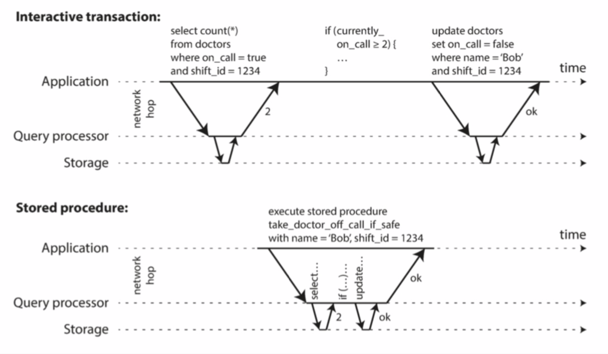

# ddia读书笔记
## 检索
### 哈希索引
bitcask使用的默认存储引擎.高读写性能.  
value可以及时获取(key只需要一次hash就能找到位置)  
key放入内存,value可以超过内存大小,放在磁盘.只要一次磁盘寻址,可以把value查找.(已经在内存的v直接返回).磁盘中记录的是**key-value**  
内容存放在磁盘,通过追加日志的形式存储.  
可以理解为磁盘中的数据是不管旧数据,新数据写入的时候直接在原来文件后面追加内容,只要更新哈希表即可  
```ditaa
┌───────────────────memory─────────────────────────────┐
│                                                      │
│                                                      │
│ ┌───────────┬────┬────┬────┬────┐                    │
│ │ hash(key) │key1│key2│... │keyN│                    │
│ └───────────┴────┴────┴────┴────┘                    │
│                │    │                                │
│                │    │                                │
└────────────────┼────┼────────────────────────────────┘
                 │    │                                 
                 │    │                                 
                 │    │                                 
┌────────────────┼────┼───────────────disk─────────────┐
│                ▼    ▼                                │
│             ┌────┬────┬────┬────┬────┬────┬────┬────┐│
│             │val1│val2│val3│val1│val1│val2│val3│val1││
│             └────┴────┴────┴────┴────┴────┴────┴────┘│
│                                                      │
│                                                      │
│                                                      │
│                                                      │
│                                                      │
└──────────────────────────────────────────────────────┘
```

但是追加后体积变大,事实上的日志系统是不需要很多重复的旧数据.所以需要日志文件压缩  

把旧的数据冲洗掉,保留新的数据  

事实上redis也是使用hash方式存储kv  

找value快,但是不好维护  
#### 需要考虑的问题
- 文件格式
    - 二进制最好,空间小,紧凑.更快更简单
- 删除记录
    - 不是马上删除,是在数据文件中打标.后续合并日志的时候删除
- 崩溃恢复
    - db重启,内存中hashmap会丢失.将每个段hashmap快照存储在磁盘,方便恢复加快
- 部分写入记录
    - 写入的时候db崩溃.通过数据文件校验值,发现损坏并丢弃
- 并发控制
    - 多个线程写入导致数据文件紊乱.实际实现使用一个写线程

#### 覆盖写入日志的好处
对比直接在磁盘中对应位置修改,覆盖写入的好处:
- 追加顺序写,比随机写快
- 数据文件追加,不需要担心重写时候崩溃(如果是覆盖写入,新旧数据混合,崩溃的时候需要多加校验)
- 合并旧段避免文件碎片化

#### 哈希的缺陷
- 必须放内存.对磁盘不友好(key很大的时候,很难做到磁盘的顺序写.而且哈希冲突的处理代价大)
- 区间查询效率低(需要全部key拉出来,不能直接区间查询)

### SSTable LSM-Tree
上面的做法中数据文件的key是没有顺序的.在SSTable中,需要保证数据文件的**Key有序**  
Sorted String Table(SSTable)优点:  
- 合并更高效
    - 类似合并排序算法,拉出多个文件对比每个键(因为键已经有序).输出最小最新的键到文件中  

- 查找方便
    - 不需要在内存知道key的索引位置.根据类似二分的方法,根据key的对比可以确定目标key的区间.从而完成搜索


#### 构建SSTable
- 写入时候加入到平衡树(红黑树等),这个表成为内存表
- 内存超过阈值(一般几M),作为SSTable文件写入磁盘
    - 因为已经有序,写入快
    - 写入磁盘同时新写入写到新的内存表实例
- 读请求先读内存表,然后最新磁盘,然后次新,如此类推到gg
- 后台周期性执行合并&压缩,丢弃被删除或者被覆盖的值

这种做法存在问题:请求写入成功没有及时写入磁盘的数据在机器宕机之后会丢失.补救措施:使用WAL,写入之后追加到日志.崩溃之后从日志恢复  
```ditaa
                                                               ┌────┐        
                                          ┌────────────────────│cli │        
                                          │                    └────┘        
                                          │                                  
   ┌──────────────────────────────────────┼────────────────────────────────┐ 
   │                                      ├────────────────┐               │ 
   │                               2.write rb_tree         │               │ 
   │                                      ▼                │               │ 
   │             Λ                        Λ                │               │ 
   │            ╱ ╲                      ╱ ╲               │               │ 
   │           ╱   ╲                    ╱   ╲              │               │ 
   │          ╱     ╲                  ╱     ╲             │               │ 
   │         ╱       ╲                ╱       ╲            │               │ 
   │        ╱         ╲              ╱         ╲           │               │ 
   │       ▕           ▏            ▕           ▏      1.write             │ 
   │        ╲         ╱              ╲         ╱         WAL               │ 
   │         ╲       ╱                ╲       ╱            │               │ 
   │          ╲     ╱                  ╲     ╱             │               │ 
   │           ╲   ╱                    ╲   ╱              │               │ 
   │            ╲ ╱                      ╲ ╱               │               │ 
   │             V                        V                │               │ 
   │             │                                         │               │ 
   └─────────────┼─────────────────────────────────────────┼───────────────┘ 
                 │                                         │                 
               save                                        │                 
┌────────────────┼─────────────────────────────────────────┼────────────────┐
│                │                                         │                │
│                ▼                                         │                │
│      ┌───────────────────┐     ┌───────────────────┐     │                │
│      │        Log        │     │        WAL        │◀────┘                │
│      └───────────────────┘     └───────────────────┘                      │
│                                                                           │
│      ┌───────────────────┐                                                │
│      │      Log New      │◀───┐                                           │
│      └───────────────────┘compress                                        │
│                               │                                           │
│                               │                                           │
│    ┌ ─ ─ ─ ─ ─ ─ ─ ─ ─ ─ ─ ─ ─ ─ ─ ─ ─ ─ ─ ─ ─ ─ ─ ─ ─ ─ ┐                │
│      ┌───────────────────────────────────────────────┐                    │
│    │ │                    Log T1                     │   │                │
│      └───────────────────────────────────────────────┘                    │
│    │ ┌───────────────────────────────────────────────┐   │                │
│      │                    Log T2                     │                    │
│    │ └───────────────────────────────────────────────┘   │                │
│      ┌───────────────────────────────────────────────┐                    │
│    │ │                    Log T3                     │   │                │
│      └───────────────────────────────────────────────┘                    │
│    │                                                     │                │
│     ─ ─ ─ ─ ─ ─ ─ ─ ─ ─ ─ ─ ─ ─ ─ ─ ─ ─ ─ ─ ─ ─ ─ ─ ─ ─ ─                 │
└───────────────────────────────────────────────────────────────────────────┘
```

### LSM-Tree
SSTable是levelDb使用的  
基于合并和压缩排序文件原理的存储引擎通常叫Log-Structured Merge-Tree,LSM Tree  

Lucene(Elasticsearc的搜索引擎)的倒排映射是key=>doc id,使用累SSTable的排序,后续需要合并  

#### 优化
- LSM-Tree的做法读不友好
    - 如果key不存在,其实可能会遍历整个文件.
    - 所以会使用**布隆过滤器**.返回不存在的可以断定key不存在.但是返回存在的是可能存在,才继续在文件数据中搜索  
- SSTable的压缩和合并顺序实际
    - 分层压缩:LevelDb,RcoksDb.
        - key的范围分裂成多个更小的SSTable,旧数据移动到单独的"层级".压缩可以逐步进行,节省磁盘
    - 大小压缩:HBase
        - 较新和较小的SSTable被连续合并到较旧和较大的SSTable

总体来说,SSTable对写比较友好.因为顺序写

### B树
普遍使用.是覆盖磁盘原来value位置的写.  
将数据库分解成若干大小固定块或者页,页是内部最小读/写单元.接近底层硬件,磁盘尽量可以顺序摆放  
节点值是磁盘地址(页的引用)  

如果当前节点不够,可能进行分裂  


分裂操作比较危险.如果分裂的时候db写入部分页然后崩溃,索引被破坏  
为了能从崩溃中恢复,常见B树实现要有WAL.必须先更新WAL再进行树的修改.  
多线程访问B树需要锁  

#### 优化
- 不使用WAL做崩溃恢复,使用COW,修改页写入不同位置,父的作为新版本被创建
- 保存键的压缩信息,节省页空间
- 为了查询按照顺序扫描,一般设计成磁盘相邻布局.但是树变大之后顺序很难维护.
- 添加额外节点,例如叶子页面有向左向右的节点指向同级的兄弟页,不需要返回到上一级也可以继续顺序扫描
- 分型树

### 对比B树 LSM树
LSM树写快 B树读快(LSM读可能遍历所有数据,B树写要更改树以及维护磁盘顺序)
#### LSM树
优点:  
LSM树的数据压缩占用磁盘io  
但是通常写吞吐更高,也支持更好的压缩(通常SSTable的大小比B树小)  
定期压缩消除碎片,这点B树做不到  

缺点:  
压缩过程干扰读写  
占用磁盘IO.这点B树响应快  
db的数据量越大,压缩需要的磁盘带宽越多  
对比B树key的val对应一个空间,但是LSM树会有多个副本.  
LSM树提供实务能力  

### 其他索引
二级索引,CREATE INDEX创建二级索引,val是主键  
二级索引key不是唯一的,一级索引(主键)key是唯一的  
二级索引如果有多个一样的key,可以通过值成为标识,或者追加其他标识  

#### 在索引中存值
存实际的行或者其他行的引用(二级索引就是存储主键)  
存储其他行引用叫做堆文件
更新值不改key,堆文件高效(只要新的val字节数不大于旧val)  
如果新val字节大于旧val,可能需要移动数据.
- 所有索引要更新新的堆文件位置
- 或者旧的堆位置保留一个间接指针

聚集索引:索引行直接存储到索引中(数据内容存在索引)
表的主键是聚集索引,二级索引引用主键 -->mysql做法  

覆盖索引:非聚集索引中写入数据(只能读,还要更新两次)  

#### 全文索引
leveldb 会对数据使用hash索引  
lucene中是类似字典树的索引机制  

#### 内存 磁盘
保存内存更快不是因为在内存读取快,是因为避免使用写磁盘的格式对内存数据结构的编码开销,以及直接在磁盘很难实现直接在内存能实现的数据结构模型  

### 列式存储
就是不分多个表,一个打标搞定  
对于搜索条件,很多时候数据量多,但是某一列的内容范围有限(例如product_id).使用位图和游程编码可以加快查询  
位图直接根据条件做位操作.游程编码泽根据<有多少个0><有多少个1><有多少个0><...>这样的方式压缩位图.  
  

## 编码和演化
### thrif 


### protobuf  

pb有顺序之分,不能随便更改pb顺序.标记号码在解码的时候会反推成对应字段的key  
随便改顺序可能导致数据无效,因为filed_tag确定了位置  
required字段是在解码的时候做检查,不存在报错  
向前兼容:不该老字段  
向后兼容:后面不识别的字段pb解码会跳过  

### 使用消息队列的好处
- 接收方不可用,过载,当缓冲,提高可靠性
- 防止消息发给崩溃进程,防止消息丢失(还是可靠性)
- 避免发送方要感知接收方ip port(这种可以在上层proxy处理)
- 支持广播发送
- 发送方接收方业务解耦

但是使用mq代表了发送方不会理会后续业务流程,真正的异步了  

## 数据复制  
### 同步复制 异步复制
同步复制是主节点复制完成才算写成功.但是这种情况不实际  
一般使用异步模式,未复制到从节点的写请求会丢失.但是应用广泛  
### 配置新从节点
- 主节点数据产生快照
- 快照拷贝到新的从节点
- 从节点连接到主节点请求快照后所有数据变更日志
- 从节点追赶主节点的数据

### 节点失效
#### 从节点失效:追赶式恢复
从主节点获取.如果从节点故障后到上线较长,可能需要拉取快照

#### 主节点失效:切换节点
- 确认主节点失效
    - 心跳包
- 选举新节点
    - 候选节点最好信息和新的对比是最新的
- 重新配置新主节点生效
    - 告诉其他节点
    - 配置原来的slave
    - gg的主节点回来成为从机

切换过程可能出现的问题:
- 使用异步复制,失效前新节点没有原来gg主机的所有数据.gg主机上线,gg节点收到新请求而且没有意识到角色变化,尝试同步其他从节点==>主节点没有复制完成的请求丢弃
- 数据库之外其他数据系统依赖数据库并且协同使用.ex:mysql从节点升为主,同步落后,redis引用了这些主键,导致mysql 和redis不一致. 结果是一些私有数据被泄漏给其他用户->github
- 可能两个节点都认为自己是主节点-->脑裂. 强制关闭某个节点,但是需要设计好,否则可能两个都关闭
- 合适的超时时长(主节点失效)难设置.太短,主节点可能只是因为网络阻塞问题导致节点频繁切换.太长,网络延迟增加.

### 复制日志
#### 基于语句复制
INSERT, UPDATE这些语句直接发送给从节点  
不使用场景:
- 有非确定函数语句.例如NOW RAND这些函数.可以确定执行结果后再同步
- 使用了自增列,所有副本必须按照主机顺序执行,否则可能结果不一致
- 有副作用的语句,例如触发器,函数和存储过程

mysql5.1之前都是基于语句复制.如果有不确定操作,会切换为基于行的复制

#### 基于WAL传输
- 日志结构存储引擎(SSTable)日志是存储方式
- 覆盖写入磁盘的B树,每次预先写入WAL

上面两种情况都可以使用完全一样的日志在节点构建副本,存盘+发给从机  
WAL很底层:那个磁盘块的什么字节发生变化->对版本要求需要一直,否则db可能导入失败

#### 基于行的逻辑日志复制
复制和存储逻辑分离  
关系数据库的逻辑日志:
- 插入,日志有新值
- 删除,日志有唯一标识表示删除行 通常主键
- 更新,有唯一信息标识更新行,新值

事务信息需要另外补充.binlog就是基于行的逻辑日志复制  
这种技术成为变更数据捕获

#### 基于触发器复制
oracle goldengate

### 复制滞后
写主机,读从机.但是可能从机滞后

#### 读自己的写

因为从机滞后,读的时候数据和写的不一致.这里读写一致性没有保证到.  
保证读写一致性:
- 用户访问后可能读修改地方,从主机读.否则从从机读.执行需要检测到读的可能性
- 从最快的从机读.要统计从机的同步情况
- cli带时间戳,读的时候看从机的同步情况分发读请求到从机

如果一种情况是:同一个物理用户使用不同的客户端进行读取.这种情况下:
- 确保用户元数据全局共享
- 无法保证路由经过那个数据中心,这种情况只能从主机读

#### 单调读
因为从机备份不同步.同一个cli访问从机A之后访问从机B,如果B未同步A已经同步,可能读取同一个数据先后结果不同

单调读一致性保证这种异常不发生.比强一致性弱,比最终一致性强  
实现方式:确保每个用户总是**从同一个副本读取**.副本失效才到另外的副本读.

#### 前缀一致读
因为从机同步不一致,读从机的时候序列与写入时候的不一致  

前缀一致读避免这种异常,保证按照某个顺序写入,按照某个顺序读.方案是有因果顺序关系(可以理解为时间顺序需要一致)的写入都交给一个分区完成.(例如happened before)

### 多主节点复制
配置多个主节点,可能存在冲突

同时对某个数据进行写,不同的主节点都以为写成功,结果同步冲突.  
解决方式:  
- **应用层把同一个写请求固定一个主节点**,但是可能存在一种情况:某个数据中心gg,用户请求要路由到其他数据中心.此时不能确定用户是否能路由到同一台机器(例如用户第一次请求和第二次请求网络入口不同,导致路由到的数据中心不同)
- 使用序列号确保数据一致.不同主节点请求带上不同的序列号,最后只有序列号最大才能覆盖,保证最终一致
    - 序列号可以是时间戳,副本唯一id等.只要能区分并且有规则对比即可

应用层应该自定义冲突解决的逻辑.acid中的c 一致性应该由应用层保证,不是数据库的特性  

### 拓扑结构

环形,星型:某个节点故障,影响其他节点之间的日志复制和转发  
全拓扑:某些网络链路比其他更快,导致复制日志之间覆盖  

可以使用类似版本向量的方法.对于多个主节点m1 m2 m3,<mv1, mv2, mv3>表示多个节点的版本集合,成为版本向量

### 无主节点复制
放弃使用主节点,允许任何副本直接接受客户端写请求.-->无主节点,或者叫去中心化,无中心复制  
客户端直接将请求发送到多个副本(实现中可能是一个协调方写入)
协调方不负责维护写入的顺序

#### 节点失效写入
失效节点上线之后会丢失在下线过程的数据.如果cli读取,可能是过期数据  
因此客户端读取数据的时候**并行读多个副本,采用版本号确定哪个值更新**来决定真正的值

#### 读修复
并行读取多个副本的时候检查过期版本,拿新版本更新过去


#### 反熵过程
后台进程不断查找副本之间数据差异,将缺少的数据从一个副本迁移到另一个副本

#### 读写quorum
一共n,读w,写r.需要w+r>n  
一般来说,w,r=n/2+1(向上取整)

鸽笼原理保证总有一个机器版本最新  
但是下面的情况可能会gg
- sloopy quorum,就是机器允许到其他的数据中心中写入/读,防止数据中心大量机器gg时候不可用.这种其实就不算是无主节点复制
- 两个写同时发生.靠序列号可以解决
- 一些副本写入失败,总副本数 < w,已成功的副本不会回滚.这种情况下写操作失败,但是读到新写的值
- 新值节点失效,恢复数据来自某个旧值,导致新值 < w,之前条件不成立

Dynamo风格(无主节点复制)一般是为了最终一致性存在  

#### 检查并发写
如果总是通过覆盖进行写,总会有新的覆盖旧的.无法保证那个写入的才是真正最终的状态

需要一些机制确保序列
- 最后写入者胜利
    - 新写入的总是覆盖旧写入的.可以使用时间戳判定哪个最新 然后写入
- 确定前后关系
    - 通过版本号,每次要先读,拿到版本号之后更新.服务端更新的时候根据版本号来更新.版本号不符合的gg,更新失败
- 合并写入值
    - 多个操作并发发生,客户端要合并旧的值来写新的值.如果两个客户端同时写入共同的信息,客户端应该**根据需要判断是否合并要写入的同类项**
- 版本矢量
    - 多个副本没有主节点,更新的时候也根据版本号.不过这种情况下是更新其他节点的时候也要带版本号.所有版本号集合就是版本矢量.

## 数据分区
使用key -value分区可能导致数据倾斜.某些key的数据量会很多  
根据关键字哈希分区会导致查询不方便,没有区间查询能力.查询都要全部key获取后再查  

当某个key的数据量比较大的时候,会出现数据倾斜.  
而某个key的访问量比较频繁,例如大V的热点事件,产生热点  

### 分区再动态平衡
把热点和数据倾斜请求从一个节点转移到另一个节点  

#### 固定数量分区
初始化的时候先逻辑上划分1000个分区,但是只有10个节点  
实际添加节点的时候把各个分区上的节点均匀迁移过去.  
key已经固定好和分区的关系.只迁移分区.因此key对应的分区容易获取.只要管理好分区和节点的关系即可.  类似redis的slot


但是这种分区方法需要预估业务量的分区总数,**分区总数后续不会调整**,防止key和分区之间关系打破

#### 动态分区
某个分区体积过大,拆分成两个分区.  
类似B树分裂操作  
体积超过阈值(例如HBase是10G)就会进行拆分.key对应分区也会调整

#### 按照节点比例分区
动态分区数量集和分区数量成正比,但是和节点多少无关.根据数据量大小进行再平衡  
节点比例分区每个节点有固定分区.新节点加入的时候选择随机的分区进行分裂.拿走一半分区的数据量.当平均分区数量较大,新节点可以拿走节点的负载.  

### 路由请求
分区再平衡的情况可能调整key所在节点.而且日常访问的时候也需要key知道要访问那个节点/分区.  
- cli随意连任意节点.节点有对应分区直接处理,没有的话转发到适合的节点.  redis集群做法,cassandra riak做法
- cli请求到路由层.路由层只做转发,根据key感知分区位置,转发.  zookeeper做法
- cli感知分区和节点分配关系.这样cli直接连接目标node,但是需要存储映射关系


zookeeper类似方案2,有独立协调服务跟踪集群的元数据.存储下key的映射关系,同时和所有节点通信,节点把自己的分区 key告诉给zookeeper,因此zookeeper有节点实时信息(存活,迁移等),路由信息保持最新  


cassandra和riak使用gossip协议同步集群状态变化,每个节点的映射表都是最新的.节点负责分发目标区节点.增加节点复杂性,但是降低对外部服务依赖

## 事务
目标:故障的时候不要中断多个步骤的完整性.**要么成功,要么失败**

### acid
Atomicity,原子性  
Consistency,一致性  
Isolation,隔离性  
Durability,持久性  


- 原子性:整个操作不可分割.要么都成功,要么都失败.失败情况下**db要丢弃或者撤销局部完成的更改**  
- 一致性:更多需要应用层支持.不应该在db考虑范围内.应用层借助原子性和隔离性达到目的
- 隔离性:并发访问同一个数据会带来竞争问题.隔离性要求并发执行的事务相互隔离.可以使用串行化方式隔离.
- 持久性:不担心数据丢失.存盘.


上图表示事务隔离性没有做好导致的问题

### 单对象,多对象(单机)
原子性:要么全部成功,要么全部失败.某个步骤失败,全部回滚  
隔离性:并发事务写入,其中的事务应该看到的是事务进行中的观察结果,不被其他事务影响  

插入,更新考虑:
- 关系数据库的外键更新
- 二级索引需要更新

这些情况需要考虑隔离性  

### 隔离级别
#### 读-提交
读-提交(提交读)保证以下:
- 防止脏读:读db时候只看到已经成功提交的数据
- 防止脏写:写db时候只覆盖已经提交成功的数据

**脏读**  
```ditaa

      begin    read.x=1   write(x,2)     commit
┌────┐                                                                        
│cli1│──╳─────────╳────────────╳───────────╳─────────────────────────────────▶
└────┘   ╲         ╲            ╲           ╲                                 
          ╲         ╲            ╲           ╲                                
           ╲         ╲            ╲           ╲                               
            ╲         ╲            ╲           ╲                              
             ╲         ╲            ╲           ╲                             
┌────┐        ╲         ╲            ╲           ╲                            
│ db │─────────▼────▲────▼────▲───────▼──▲────────▼─────▲────────────────────▶
└────┘             ╱         ╱          ╱              ╱                      
                  ╱         ╱          ╱              ╱                       
                 ╱         ╱          ╱              ╱                        
                ╱         ╱          ╱              ╱                         
               ╱         ╱          ╱              ╱                          
              ╱         ╱          ╱              ╱                           
┌────┐       ╱         ╱          ╱              ╱                            
│cli2│──────╳─────────╳──────────╳──────────────╳────────────────────────────▶
└────┘          
         begin     read.x=1    read.x=2      commit

```
cli2可以在cli1没有成功提交的时候就读到了cli1写入的数据  

防止脏读:只有写成功之后才能被读取  


**脏写**  
后写的覆盖了先写的就是脏写  


**实现**  
使用**行锁**防止脏写.修改某个对象先获得锁,另外一个事务进来要等待,到了前一个事务结束才能获得锁.**脏写是更新丢失**  
防止脏读可以用锁,但是读锁导致**读事务阻塞**,性能下降.更多使用**维护旧值得办法**,每个事务提交前读旧值,提交后读新值  

#### 快照隔离级别&可重复读
读-提交级别只能保证提交之后才能**读到别人已经提交的数据,但是自己事务内还是可能读到不同的结果**


上面这种现象称为不可重复读,或者**读倾斜**  

备份场景和大量查询,对这种读倾斜不能容忍.  

**实现快照级别隔离**  
通过事务版本号区分不同的快照,同一个事务读取自己版本内的快照,达到可重复读的能力  

delete by情况是因为其他事务已经更改了对应字段,这种情况下快照其实是过期的.存储引擎后台有需要对这些快照进行回收  

**一致性快照可见性规则**  
- 事务开始时候列出其他事务.未提交完的事务更新数据不可见
- 所有中止事务修改不可见
- 比当前事务晚的事务修改不可见,不管是否提交完成
- 除了这些事务的写入,其他写入对查询可见(因为目的是事务隔离)

因此可见的是  
- 事务开始时候已经完成提交的事务改动
- 对象没有标记删除,或者标记了但是删除事务还没提交

**索引和快照隔离级别**  
postgresSQL使用同一个对象不同版本区分存储隔离  
CouchDB,Datomic和LMDB主结构是B树,隔离方式是不会修改现有页面,而是创建新的修改副本,拷贝必要内容,让父节点递归到根节点创建新的树.不受更新影响的页面不复制,保持不变而且被父节点指向(可以理解为拷贝一个子树的影响)  

#### 防止更新丢失
同时更新的时候,第一个写入后第二个事务写操作不包括第一个事务修改后的值,导致第一个事务写丢失(通过行锁可以解决)  
  
解决方式:    
**原子写操作**
- 使用独占锁的方式实现,更新提交前其他事务不能读.-->游标稳定性  
- 强制所有原子操作在单线程执行(强制串行)  

**显式加锁**  
```sql
BEGIN TRANSACTION;
SELECT XXX FROM talbe where column=param FOR UPDATE;
--强制加锁
UPDATE table SET xxx = param where column=param;
```
对读-修改-协会的方式直接在读过程进行加锁,其他事务必须等待当前事务执行完成才能处理  
  
**原子比较&设置**  
读-修改-写回 方式,更新的时候修改项指定为旧内容
```sql
UPDATE table set content = new_content where id = param and content = old_content
```
确保是就内容的前提才能写入

**冲突解决和复制**  
多个主节点或者无主节点需要应用层解决  
如果操作可交换(顺序无关,不同副本不同顺序有相同结果),原子操作还是可行

#### 写倾斜&幻读
对于下面这种情况:  

两个并行的操作都根据条件是表中没有,然后进行修改.结果是两个都被修改了,和最初的条件不匹配.  

写倾斜的模式
- 1.select所有满足的行(是否为空,对应位置是否为空,是否被占用等)
- 2.根据查询条件应用层决定后续操作
- 3.符合条件,发起insert,update或者delete,提交事务

其中步骤3的写入会影响步骤1的查询.针对这种条件,如果是所在的行存在,可以通过锁行方式解决.但是**可能步骤1的时候select不到任何数据,select for update也无法加锁**  

一个事务的写入改变另一个事务查询结果的现象叫**幻读**  
快照只能防止查询幻读,但是上面的这种读-写事务,无法避免写倾斜  

**实体化冲突**  
对没有的对象加锁,例如对某个范围进行加锁,范围内的就算不存在有不可以写入 
这种方法称为实体化冲突(物化冲突),把幻读问题解决为针对db具体行锁冲突问题.这类问题使用串行化更可靠 

#### 串行化
串行化一般使用这几种方式处理
- 严格顺序执行
- 二阶段锁定
- 乐观并发控制.例如转为可串行化快照隔离

**实际串行执行**   
使用**存储过程**.存储过程和交互式事务区别:

不同db机制会不同,而且可能性能不好  

让每个事务在**同一个分区执行**

#### 2PL
2阶段锁 two-phase locking,加锁防止脏写
- 事务**A读取**,事务**B要写入**需要等待A事务提交后才能继续
- 事务**B写入**,事务**A要读取**需要等待B事务提交后才能继续

**实现方式**  
- 事务读取,共享锁.其他事务可以读不能写
- 事务写入,独占锁.其他事务读写不能
- 事务读取后写入,共享锁->独占锁
- 事务获得锁后,知道事务结束(提交或者终止)锁才能释放.二阶段就是事务开始获得锁以及事务结束释放锁

**缺点**  
性能.导致竞争条件,存在阻塞  

**谓词锁**  
根据动作的范围进行锁.例如事务A select一个范围,范围都会加锁.  
规则和防止脏写的策略一致  

**索引区间锁**  
谓词锁需要在范围中进行锁,**性能不高**.大多数2PL使用索引去检索,或者叫next-key locking,本质是谓词锁的简化或者近似

谓词锁把保护对象扩大.例如select time>x,会把[x,+无限)锁住.其他事务获取锁需要等待阻塞.查询条件的近似值会**附加到某个索引**上.另外事务向进行操作需要**更新索引**,发生**锁冲突**.  

通过范围的锁定,可以防止读倾斜和幻读.  
对比谓词锁,谓词锁对区间进行行锁,但是索引区间锁在索引层面进行锁,效率更高

```ditaa
      Λ                                                          
     ╱ ╲                                                         
    ╱   ╲                                                        
   ╱     ╲              ┌────────────────────────────╦══════════╗
  ╱       ╲             │            data            ║   lock   ║
 ╱         ╲            ├────────────────────────────╬══════════╣
▕  index    ▏──────────▶│            data            ║   lock   ║
 ╲         ╱            ├────────────────────────────╬══════════╣
  ╲       ╱             │            data            ║   lock   ║
   ╲     ╱              ├────────────────────────────╬══════════╣
    ╲   ╱               │            data            ║   lock   ║
     ╲ ╱                └────────────────────────────╩══════════╝
      V                                                          
                                                                 
                                                                 
                                                                 
      Λ                                                          
     ╱ ╲                                                         
    ╱   ╲                                                        
   ╱     ╲              ┌────────────────────────────┬──────────┐
  ╱╔════╗ ╲             │            data            │   lock   │
 ╱ ║lock║  ╲            ├────────────────────────────┼──────────┤
▕  ╚════╝   ▏──────────▶│            data            │   lock   │
 ╲  index  ╱            ├────────────────────────────┼──────────┤
  ╲       ╱             │            data            │   lock   │
   ╲     ╱              ├────────────────────────────┼──────────┤
    ╲   ╱               │            data            │   lock   │
     ╲ ╱                └────────────────────────────┴──────────┘
      V                                                          
```

#### 可串行化快照隔离
在快照中感知即将更改的事务(感知已经开始但是还没有提交的事务)  
对比索引区间锁,没有了阻塞.  
**检查事务从mvcc读了旧值**  

**检查事务mvcc更改了**


检查到读或者写的冲突,**事务提交失败**   

## 分布式的问题
### 网络
网络问题,超时这些不细说  
- 多个不同节点给相同节点发送数据报,在网络交换机排队.网络负载过重,可能需要等待才能到达目标节点(网络拥塞).数据量过大,交换机队列塞满,之后的数据报会丢弃,调至丢包重传
- 到达机器后机器繁忙,网络请求包在os中排队,知道能处理
- 虚拟化环境,CPU切换虚拟机的时候有几十ms切换,包会放入虚拟机管理器排队
- TCP流量控制,节点控制速率,这时候在发送方机器排队  

### 时间戳
物理时间上可能A客户端先写入,但是因为网络等原因,最后其他客户端的可能会先到达

而且时钟可能有时钟漂移,不是所有的机器时钟是一致的  
有意思的是,google通过gps同步机房,使得总体时钟偏差控制在范围内
### 进程暂停
例如gc,暂停虚拟机,磁盘同步,上下文切换等,或者SIGSTOP这些操作都可能使得主机进程暂停,响应延迟

### 主节点&锁
一般通过超过半数的节点确定一个事件在集群中的正确性.例如选主,确定值这些操作  
但是在响应可能延迟的情况下,加锁的正确性可能不能保证  


可以使用**fencing token**确保唯一性.访问的时候先获取序列号(fencing token),通过序列号进行互斥

通过这种方式可以有一个唯一的依据(版本号)去确保锁的正确性,不产生歧义.  

**fencing token的正确性**  
- 唯一性.两个token不能相同
- 单调递增.这样可以有一个标准,大的比小的要优先,确定最终的结果唯一
- 可用性.请求token的节点不发生崩溃最终会受到回应

## 一致性&共识
### 可线性化
也叫做**原子一致性**,**强一致性**,基本思想是让系统看起来只有一个副本  


线性化举例:  

注意b最后的read=2,这里不是线性化.因为读到了旧的值.  

**可线性化&可串行化**  
- 可串行化表示事务隔离开,确保事务执行结果与串行(就算每个事务单独执行)都是一样的
- 可线性化指的是读和写保证最新  

分布式中可线性化:
- 主从复制部分支持.主节点更新或者同步从最新的从节点读取,可以满足.但是可能延迟原因,或者脑裂导致不是最新的值,不支持可线性化
- 共识算法支持.paxos,raft可以确保某个时间范围的共识最新
- 多主复制不可线性化.多主的冲突不能满足
- 无主复制可能不能线性化

**就算使用quorum,网络延迟可能导致不能线性化**  
因为
- 只考虑多数
- 可能存在延时

如果有版本号可以避免这种问题.使用读修复和反熵就可以  

### CAP
Consistency(一致性)、 Availability(可用性)、Partition tolerance(分区容错性)不能兼得
- 要求线性化,如果网络问题,需要线性化的情况下服务不可用
- 不要求线性化,副本独立处理请求后再维护.符合线性化

在无共享系统适合使用.-->适合平行扩展  
  
很少系统会真的满足线性化,就连cpu和内存都是非线性化
```ditaa
┌────────────────────────────┐                                     
│            cpu             │                                     
│  ┌─────┐       ┌──────┐    │          ┌─────────────────────────┐
│  │core1│◀──────│cache1│◀─get x┐       │                         │
│  └─────┘       └──────┘    │  │       │       memory x=0        │
│                            │  ├───────│                         │
│  ┌─────┐       ┌──────┐    │  │       │                         │
│  │core2│◀──────│cache2│◀─get x┘       └─────────────────────────┘
│  └─────┘       └──────┘    │                                     
└────────────────────────────┘                                     
                                                                   
                                                                   
                                                                   
                                                                   
                                                                   
┌────────────────────────────┐                                     
│                            │                                     
│            cpu ┌───────┐   │          ┌─────────────────────────┐
│  ┌─────┐       │cache1 │   │          │                         │
│  │core1│x=1───▶│  x=1  │───┼──┐       │  memory x=? depends on  │
│  └─────┘       └───────┘   │  ├race──▶│     access sequence     │
│                ┌───────┐   │  │       │                         │
│  ┌─────┐       │cache2 │   │  │       └─────────────────────────┘
│  │core2│─x=2──▶│  x=2  │───┼──┘                                  
│  └─────┘       └───────┘   │                                     
│                            │                                     
└────────────────────────────┘                                     
```

### 顺序
- 可线性化:写入,读取都是最新
- 因果关系:两个操作都没有发生在对方之前,是并发关系.有前后顺序的就是因果关系(实际就是顺序)

使用版本向量可以确保**因果关系**  

保证因果关系可以使用序列号排序.不同的客户端使用序列号可以在全局范围有一个全序的关系.如果A发生在B之前,A的序列号应该更小.  
多个节点可以考虑这样的序列号
- 每个节点都产生,通过奇数/偶数或者%获取
- 时间戳
- 预先分配号段.例如A是0-999,B是1000-1999

但是这些方法都可能因为一些原因,例如节点处理速度导致节点的序列号和因果关系不一致,时钟偏移导致时间戳和因果关系不符,因为路由问题路由到不同节点导致获取的序列号不一致  
  
**lamport时间戳**  
[时间戳,节点id]
时间戳大的胜,时间戳一致节点id大的胜
 

但是多个节点的情况下需要搜集所有节点的lamport时间戳才能确定.  

### 分布式事务&共识
需要场景
- 选主.防止脑裂
- 原子事务提交.所有节点必须对事务的结果达成一致.

#### 原子提交&2pc
**原子提交**  
单节点原子事务.要么成功,要么全部回退.  
关键是事务之前写入日志,这样机器崩溃也能提交事务  

多节点情况下需要满足多个节点对事务的共识.  

**2pc**  
2phase commit,两阶段提交  

过程:  
- 1.向协调者申请事务id,全局唯一
- 2.带上id每个节点执行单节点事务,读写都在单节点完成.如果出现问题,协调者和其他参与者都可以安全终止
- 3.应用准备提交,协调者向所有节点发送**准备请求**,带上id.任何一个请求失败或者超时,全局放弃
- 4.参与者收到请求,检查事务在任何情况下都可以提交,包括安全落盘,检查是否存在冲突或者违反约束.**一旦给协调者回答是,节点成都会提交事务**.所以就算没有真正提交,参与者表态事务会执行到底
- 5.协调者收到准备请求答复,只有所有参与者都回答"是",协调者把最后的决定写入到磁盘事务日志,防止系统崩溃可以恢复.这个时刻叫**提交点**
- 6.协调者决定落盘后向所有参与者发送提交/放弃请求.如果请求失败或者超市,协调者必须充实到成功为止.

总体来说有两个关键地方
- 第一阶段参与者投票是,肯定做事务的诺言
- 协调者第二阶段的提交.只要提交了,一直跟到底.  

如果协调者gg,第二阶段之后的崩溃只能等机器恢复.  


#### zookeeper做法
模仿chubby分布式锁  

- 线性化原子操作
    - 原子CAS(比较,设置)实现加锁.多个节点同时加锁只有一个成功.共识协议满足原子性,线性化.分布式锁带有租约,某个节点网络问题等故障可以释放掉,防止客户端gg
- 操作全序
    - 使用fencing token.每个操作都有事务id和版本号,都是递增.
- 故障检测
    - cli和zookeeper维护长会话.通过周期心跳检查健康程度.如果没有回包,只要没有超过session长度,暂时保留.session超时所资源会自动释放.
- 更改通知
    - cli可以读取其他cli的锁和key,监视变化.cli可以感知其他cli什么时候加入集群,以及客户端是否发生了故障.订阅机制客户端可以不轮训只接受感兴趣的对象变化情况

使用这些特性,zookeeper实现的特性:
- 节点分配.主备切换,分区资源分配,负载动态平衡(分区再平衡)
    - 使用原子操作,故障检测以及通知机制实现.
    - 扩展到很多节点(>1k等)的时候再集群投票很低小.zookeeper同上是固定数量的节点(3到5台)投票,可以高效支持大量cli.
    - 通常情况下zookeeper管理数据变化很慢,分钟到小时级别.不适合管理实时性高的状态数据.可以考虑bookeeper
- 服务发现
    - 新/旧节点的出现,删除.选主
- 成员服务
    - 确定哪些成员属于活跃状态以及属于哪个集群.


