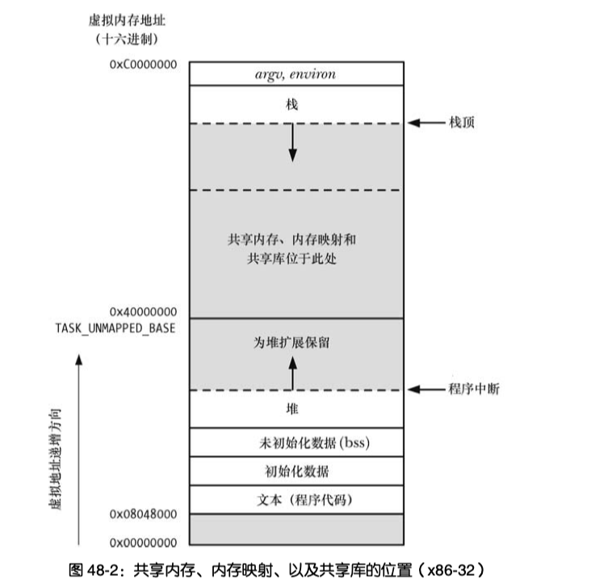

mmap位置不在堆,在共享存储位置
```cpp
 #include <stdio.h>
#include <stdlib.h>

#include <sys/mman.h>
#include <unistd.h>
#include <stdio.h>
#include <fcntl.h>
//#include "csapp.h"
#include <sys/stat.h>
#include <stdlib.h>
#include <string.h>
#include <errno.h>
#define PAGESIZE 4096
int main()
{
    /* int  fd = 0; */
    int sss = 1;
    printf("sss=%p\n",&sss);
    printf("Hello world\n");
    void *  first =  mmap(NULL, PAGESIZE, PROT_READ | PROT_WRITE, MAP_PRIVATE|MAP_ANONYMOUS, -1, 0);
    printf("mmap:%p\n", first);
    void *a = sbrk(0);
    printf("brk:%p\n", a);

    return 0;
}
```
输出
```
sss=0x7fffcf6bb4dc
Hello world
mmap:0x7f642ad11000
brk:0xc9b000
```
brk是堆顶.可以看到栈sss在mmap上方,堆在底层
分配位置

