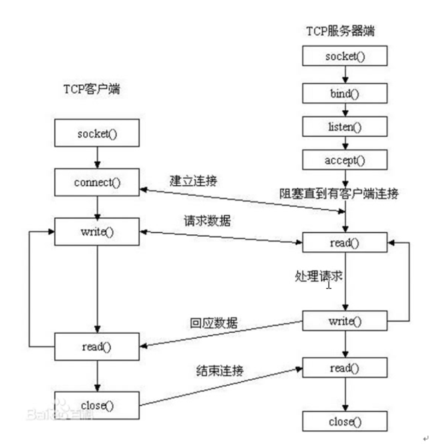

# socket

通信过程中,socket是成对出现的.
(socket应为是插座)

socket内部是通过一个fd管理发送和接收两个缓冲区(发缓冲,写缓冲)
```ditaa
┌───────socket─fd───┐                        ┌───socket fd───────┐
│                   │                        │                   │
│ ┌─────────────┐   │                        │   ┌────────────┐  │
│ │ send buffer │───┼────────────────────────┼──▶│rcvd buffer │  │
│ └─────────────┘   │                        │   └────────────┘  │
│                   │                        │                   │
│                   │                        │                   │
│  ┌────────────┐   │                        │   ┌───────────┐   │
│  │rcvd buffer │◀──┼────────────────────────┼───│send buffer│   │
│  └────────────┘   │                        │   └───────────┘   │
│                   │                        │                   │
└───────────────────┘                        └───────────────────┘
```

网络中使用大端解包.因此需要一次网络字节序和主机字节序的转换.

#### ip地址转换
转换函数:
htonl //host to network long 本地转到网络(ip)
htons //host to network short 本地转网络(port)
ntohl //network to host long 网络转本地(ip)
ntohs //netowrk to host short 网络转本地(port)

现在的ip转换
inet_pton 本机字符串类型的ip转为网络字节序的二进制ip
inet_ntop 

 <arpa/inet.h>
int inet_pton(int af, const char *src, void *dst);//本地字节序->网络字节序
参数:
- af 指定当前ip是什么协议 只有AF_INET AF_INET6
- src ip地址 点分十进制
- dst 回参,转换(网络字节序)ip地址
回参
- 成功返回1
- 如果src入参无效,返回0

int const char *inet_ntop(int af, const void *src, char *dst, socklen_t size);
参数:
- af 同上
- src 网络字节序的ip地址
- dst 本地字节序ip
- size dst大小

返回
- 成功 dst
- 失败 NULL

### sockaddr
 
```cpp

sockaddr                    sockaddr_in                 sockaddr_un                 sockaddr_in6
                            AF_INET                     AF_UNIX                     AF_INET6
┌───────────────┐         ┌───────────────┐         ┌───────────────┐           ┌───────────────┐
│16bit addr type│         │16bit addr type│         │16bit addr type│           │16bit addr type│
├───────────────┤         ├───────────────┤         ├───────────────┤           ├───────────────┤
│               │         │  16bit port   │         │               │           │  16bit port   │
│               │         ├───────────────┤         │               │           ├───────────────┤
│               │         │   32bit IP    │         │               │           │  32bit flow   │
│               │         │    address    │         │               │           │     label     │
│  14byte addr  │         │               │         │               │           │               │
│     data      │         ├───────────────┤         │               │           ├───────────────┤
│               │         │               │         │               │           │               │
│               │         │8 bytes padding│         │               │           │               │
│               │         │               │         │   108bytes    │           │               │
│               │         └───────────────┘         │   pathname    │           │               │
│               │                                   │               │           │               │
└───────────────┘                                   │               │           │  128 bite IP  │
                                                    │               │           │    address    │
                                                    │               │           │               │
                                                    │               │           │               │
                                                    │               │           │               │
                                                    │               │           │               │
                                                    │               │           │               │
                                                    └───────────────┘           │               │
                                                                                ├───────────────┤
                                                                                │     32bit     │
                                                                                │   scope ID    │
                                                                                │               │
                                                                                └───────────────┘
```
sockaddr_in ipv4的地址
sockaddr_un unix套接字地址
sockaddr_in6 ipv6的地址

sockaddr地址结构
    struct sockaddr_in addr addr
    bind(fd, (struct sockaddr*)&addr, ...)

man 7 ip 查看相关

使用bind accept等之前需要先初始化sockaddr
struct socketaddr_in addr;
addr.sin_family = AF_INET;
addr.sin_port=htons(xxx);
addr.sin_addr.saddr = htonl(INADDR_ANY) 取出系统中有效的任意IP地址,默认是二进制类型
inet_pton(AF_INET,"xxx.xxx.xxx.xxx",);

## socket创建流程图
整个建立连接过程,**svr会有两个socket**,cli会有一个.


socket()
```ditaa
                                                                          ┌───────────────┐              ┌───────────────┐             ┌───────────────┐                                            
                                                                          │   socket()    │              │      fd       │────────────▶│    socket     │                                            
                                                                          └───────────────┘              └───────────────┘             └───────────────┘                                            
                                                                                  │                                                                                                                 
                                                                                  │                                                                                                                 
                                                                                  │                                                                                                                 
                                                                                  │                                                    ┌───────────────┐                                            
                                                                                  │                                                    │               │                                            
                                                                                  │                                                    │               │                                            
                                                                                  ▼                                                    │               │                                            
                                                                          ┌───────────────┐               ┌───────────────┐            │    socket     │                                            
                                                                          │    bind()     │               │      fd       │───────────▶│               │                                            
                                                                          └───────────────┘               └───────────────┘            ├───────────────┤                                            
                                                                                  │                                                    │   addr info   │                                            
                                                                                  │                                                    │   ip + port   │                                            
                                                                                  │                                                    └───────────────┘                                            
                                                                                  │                                                                                                                 
                                                                                  │                                                                                                                 
                                                                                  │                                                                                                                 
                                                                                  │                                                    ┌───────────────┐                                            
                                                                                  │                                                    │               │                                            
 ┌───────────────┐                                                                ▼                                                    │               │                                            
 │               │                                                        ┌───────────────┐                                            │               │                                            
 │               │                                                        │   listen()    │                 ┌───────────────┐          │    socket     │                                            
 │               │                 ┌───────────────┐                      └───────────────┘                 │      fd       │─────────▶│               │                                            
 │    socket     │                 │   socket()    │                               │                        └───────────────┘          ├───────────────┤                                            
 │               │                 └───────────────┘                               │                                                   │   addr info   │                                            
 │               │                         │                                       │                                                   │   ip + port   │                                            
 │               │                         │                                       │                                                   ├───────────────┤                                            
 │               │                         │                                       │                                                   │  maximum of   │                                            
 └───────────────┘                         │                                       │                                                   │  connections  │                                            
                                           │                                       │                                                   └───────────────┘                                            
                                           │                                       │                                                                                                                
                                           │                                       │                                                                                                                
                                           │                                       │                                                  ┌───────────────┐                                             
                                           │                                       │                                                  │               │                                             
                                           │                                       │                                                  │               │                                             
                                           ▼                                       │                                                  │               │                                             
                                   ┌───────────────┐                               │                       ┌───────────────┐          │    socket     │                                             
                                   │   connect()   │                               │                       │      fd       │─────────▶│               │──┐                                          
                                   └───────────────┘                               │                       └───────────────┘          ├───────────────┤  │                                          
                                           │                                       │                                                  │   addr info   │  │                                          
                                           │                                       │                                                  │   ip + port   │  │                                          
                                           │                                       │                                                  ├───────────────┤  │                                          
                                           │                                       │                                                  │  maximum of   │  │                                          
                                           │                                       │                                                  │  connections  │  │                                          
                                           │                                       │                                                  └─────────────block for                                       
                                           │                                       │                                                          ▲     accepting                                       
                                           │                                       │                                                          │     connection                                      
                                           │                                       │                                                          └──────────┘                                          
                                           │                                       │                                                                                                                
                                           │                                       │                                                                                                                
                                           │                                       │                                                                                                                
                                           │                                       │                                                                                                                
                                           │                                       │                                                                                                                
                                           │                                       │                                 ┌───────────────┐                                                              
                                           ▼                                       │                  ┌─────────────▶│  syns_queue   │                                                              
                                      ┌─────────┐                                  │                  │              ├───────────────┤                                                              
                                      │SYN_SENT │╲                                 │                  │              │               │    max limited by /proc/sys/net/ipv4/tcp_max_syn_backlog     
                                      └─────────┘ ╲                                │                  │              ├───────────────┤                                                              
                                                   ╲───────────────────────╲       ▼                  │              │               │                                                              
                                                                            ╲ ┌─────────┐             │              ├───────────────┤                                                              
                                                                             ▼│SYN_RCVD │─────────────┘              │               │                                                              
                                                                             ╱└─────────┘                            └───────────────┘                                                              
                                                                            ╱      │                                                                                                                
                                                    ╱──────────────────────╱       │                                                                                                                
                                                   ▼                               │                                                                                                                
                                   ┌──────────────┐                                │                                                                                                                
         ┌─────────────────────────│ ESTABLISHED  │╲                               │                                                                                                                
         │                         └──────────────┘ ╲                              │                                                                                                                
         │                                 │         ╲                             │                                                                                                                
         │                                 │          ╲                            │                                                                                                                
         │                                 │           ╲───────────────╲           │                                                                                                                
         │                                 │                            ╲          ▼                                                                                                                
         │                                 │                             ╲ ┌──────────────┐                           ┌───────────────┐                                                             
         │                                 │                              ▼│ ESTABLISHED  │──────────────────────────▶│ accept_queue  │   max limited by (backlog, /proc/sys/net/core/somaxconn).   
         │                                 │                               └──────────────┘                           ├───────────────┤   param somaxconn can be set. backlog is 2nd param set in   
         │                                 │                                       │                                  │               │                           listen()                          
         │                                 │                                       │                                  ├───────────────┤                                                             
         │                                 │                                       │                                  │               │                                                             
         │                                 │                                       ▼                                  ├───────────────┤                                                             
         ▼                                 │                               ┌───────────────┐                          │               │─────────┐                                                   
 ┌───────────────┐                         │                               │   accept()    │                          └───────────────┘         │                                                   
 │               │                         │                               └───────────────┘                                                    ▼                                                   
 │               │                         │                                       │                                                    ┌───────────────┐                                           
 │               │                         │                                       │                                                    │               │                                           
 │    socket     │                         │                                       │                                                    │  socket for   │                                           
 │               │◀────────────────────────┼───────────────────────────────────────┼───────────────────────────────────────────────────▶│  connection   │                                           
 │               │                         │                                       │                                                    │               │                                           
 │               │                         │                                       │                                                    └───────────────┘                                           
 │               │                         │                                       │                                                            ▲                                                   
 └───────────────┘                         │                                       │                                                            │                                                   
                                           │                                       │                                                            │                                                   
                                           │                                       │                                                            │                                                   
                                           │                                       │                                                            │                                                   
                                           │                                       │                                                            │                                                   
                                           │                                       │                                                            │                                                   
                                           │                                       │                                                            │                                                   
                                           │                                       │                                                            │                                                   
                                           │                                       │                                                            │                                                   
                                           │                                       │                                                            │                                                   
                                           │                                       │                                                        generate                                                
                                           │                                       │                                                            │                                                   
                                           │                                       │                                                            │                                                   
                                           │                                       │                                                            │                                                   
                                           │                                       │                                                            │                                                   
                                           │                                       │                                                            │                                                   
                                           │                                       │                                                            │                                                   
                                           │                                       │                                                    ┌───────────────┐                                           
                                           │                                       │                                                    │               │                                           
                                           │                                       │                                                    │               │                                           
                                           │                                       │                                                    │               │                                           
                                           │                                       │                         ┌───────────────┐          │    socket     │                                           
                                           │                                       │                         │      fd       │─────────▶│               │                                           
                                           │                                       │                         └───────────────┘          ├───────────────┤                                           
                                           │                                       │                                                    │   addr info   │                                           
                                           │                                       │                                                    │   ip + port   │──┐                                        
                                           │                                       │                                                    ├───────────────┤  │                                        
                                           │                                       │                                                    │  maximum of   │  │                                        
                                           │                                       │                                                    │  connections  │  │                                        
                                           │                                       │                                                    └───────────────┘  │                                        
                                           ▼                                       ▼                                                            ▲          │                                        
                                   ┌───────────────┐                       ┌───────────────┐                                                    │block for │                                        
                                   │  do_logic()   │                       │  do_logic()   │                                                    └accepting ┘                                        
                                   └───────────────┘                       └───────────────┘                                                     connection                                         
                                           │                                       │                                                                                                                
                                           │                                       │                                                                                                                
                                           │                                       │                                                                                                                
                                           │                                       │                                                                                                                
                                           │                                       │                                                                                                                
                                           │                                       │                                                                                                                
┌───────────────┐                          │                                       │                                                                                                                
│               │                          │                                       │                                                                                                                
│               │                          │                                       │                                                   ┌───────────────┐                                            
│               │                          ▼                                       ▼                                                   │               │                                            
│    socket     │                  ┌───────────────┐                       ┌───────────────┐                                           │  socket for   │                                            
│               │                  │   cloese()    │                       │   cloese()    │                                           │  connection   │                                            
│               │                  └───────────────┘                       └───────────────┘                                           │               │                                            
│               │                                                                                                                      └───────────────┘                                            
│               │                                                                                                                                                                                   
└───────────────┘                                                                                                                                                                                                                                                                                                                             
```
注意:
- listen()只是设置了套接字的**最大连接上限**,并没有进行阻塞.
- accept()进行了阻塞,等待cli的连接.因此tcp握手是在accept阻塞的时候进行的
- accept()在成功返回的时候会返回一个已经和cli建立连接的socket.用于监听的fd继续监听,而返回的socket继续进行逻辑操作.(所以cli一个socket,svr2个socket)
- close的时候需要svr感知到cli侧close

<sys/types.h>          /* See NOTES */
<sys/socket.h>
#### socket()
int socket(int domain, int type, int protocol);
入参
- domain: AF_INET, AF_INET6, AF_UNIX
- type: 数据传输协议
> - SOCK_STREAM 流式 tcp
> - SOCK_DGRAM 报文 udp
- protocol: 0

返回值
- 成功:新socket对应的fd
- -1 errno
#### bind()
int bind(int sockfd, const struct sockaddr *addr,
                socklen_t addrlen);
parma
- sockfd 
- addr 地址结构体 绑定socket的addr.sin_family应该和建立socket时候的domain一致.

struct sockaddr_in addr;
addr.sin_family=AF_INET;
addr.sin_port=htons(xxxx);
addr.sin_addr.s_addr=htonl(INADD_ANY);

- addrlen addr的大小
返回
- 成功:0
- -1 errno

#### listen()
设置**同时与服务器建立连接的上限数**(同时进行3次握手的客户端个数)
int listen(int sockfd, int backlog);
param
- sockfd
- backlog 上限最大不能超过128.linux内核决定.不论传多大,最大不超过这个值.
返回
- 成功:0
- -1 errno

**listen不是用来阻塞监听的!**

#### accept()
阻塞等待客户端建立连接,成功返回一个与客户端成功连接的socket fd
int accept(int sockfd, struct sockaddr *addr, socklen_t *addrlen);
入参中有sockfd,实际上accept返回的socket是依靠入参sockfd监听,靠这个fd的ip和端口和客户端建立连接.
入参
- sockfd 
回参
- addr 成功与服务器建立连接的cli的地址结构
- addrlen 回参addr长度 传入的是addr的大小,返回的是实际客户端cli的地址结构大小
返回
- 成功:0
- -1 errno


socklen_t clit_addr_len = sizeof(addr);
accept(fd, addr, &clit_addr_leln);

#### connect()
客户端用于连接服务端的动作
int connect(int sockfd, const struct sockaddr *addr,
                   socklen_t addrlen);
入参
- sockfd 客户端自己的fd
- addr 服务端的地址结构
- addrlen addr的大小

如果不使用 bind函数绑定客户端地址,采用"隐式绑定"

### test code
测试  server把内容都改成大写
测试的时候可以用命令**nc**
nc ip port
这时候会连接对应的port
服务端代码


```cpp
#include <stdio.h>
#include <stdlib.h>
#include <string.h>
#include <unistd.h>
#include <errno.h>
#include <pthread.h>
#include <sys/types.h>          /* See NOTES */
#include <sys/socket.h>
#include <arpa/inet.h>
#include <ctype.h>

#define BUFSIZE 4096
void sys_err(const char* str){
    perror(str);
    exit(1);
}

int main(int argc, char* argv[])
{
    int lfd = 0;
    lfd = socket( AF_INET, SOCK_STREAM, 0 );
    if(lfd== -1){
        sys_err("socket err");
    }
    struct sockaddr_in t_addr;
    struct sockaddr_in * t_cli_addr;
    t_cli_addr = (struct sockaddr_in *)malloc(sizeof(struct sockaddr_in));

    socklen_t *t_cli_size;
    t_cli_size = (socklen_t * )malloc(sizeof(socklen_t));
    *t_cli_size = sizeof(struct sockaddr_in);

    t_addr.sin_family= AF_INET;
    t_addr.sin_port = htons(9999);
    t_addr.sin_addr.s_addr = htonl(INADDR_ANY);
    int ret = bind(lfd, (struct sockaddr* )&t_addr, sizeof(t_addr));
    if(ret== -1){
        sys_err("bind err");
    }
    int iBackLog = 3;
    ret = listen(lfd, iBackLog);
    if(ret== -1){
        sys_err("listen err");
    }

    int cfd= accept(lfd, (struct sockaddr* ) t_cli_addr, t_cli_size);
    if(cfd == -1){
        sys_err("accept err");
    }

    char buf[BUFSIZE];
    char cCliIp[100];
    printf("cli ip=%s,port=%d\n",
           inet_ntop(AF_INET, &t_cli_addr->sin_addr.s_addr, cCliIp, sizeof(cCliIp)),
           ntohs(t_cli_addr->sin_port));

    while(1){
        ret = read(cfd, buf, sizeof(buf));
        if(ret== -1){
            sys_err("read err");
        }

        printf("===svr read:%s\n", buf);

        int i = 0;
        for(i = 0; i < ret; i++){
            buf[i]= toupper(buf[i]);
        }
        write(cfd,buf,ret);
        if(ret== -1){
            sys_err("write err");
        }

    }


    return 0;
}


```
使用nc测试
```
➜  socket ./s
===svr read:sfds

===svr read:shit

^C
```
nc的测试
```
➜  socket ./s
cli ip=127.0.0.1,port=48888
===svr read:23fesf

===svr read:sdfsdf

^C
```
注意:
t_cli_size = (socklen_t * )malloc(sizeof(socklen_t));
*t_cli_size = sizeof(struct sockaddr_in);
这里如果sizeof没有设置,不能正确拿回ip port


使用客户端写
```cpp
#include <stdio.h>
#include <stdlib.h>
#include <string.h>
#include <unistd.h>
#include <errno.h>
#include <pthread.h>
#include <sys/types.h>          /* See NOTES */
#include <sys/socket.h>
#include <arpa/inet.h>
#include <ctype.h>

#define BUFSIZE 4096
void sys_err(const char* str){
    perror(str);
    exit(1);
}

int main(int argc, char* argv[])
{

    int cfd;
    cfd = socket(AF_INET, SOCK_STREAM, 0);
    if(cfd==-1){
        sys_err("socket err");

    }
    struct sockaddr t_addr;
    struct sockaddr_in t_svr;
    t_svr.sin_family = AF_INET;
    t_svr.sin_port = htons(9999);
    t_svr.sin_addr.s_addr = htonl(INADDR_ANY);
    socklen_t t_svr_size = sizeof(t_svr);

    socklen_t *t_cli_size;
    t_cli_size = (socklen_t * )malloc(sizeof(socklen_t));
    *t_cli_size = sizeof(struct sockaddr_in);

    t_addr.sa_family= AF_INET;
    /* t_addr.sin_port = htons(9999); t_addr.sin_addr.s_addr = htonl(INADDR_ANY); */
    int ret =connect(cfd, (struct sockaddr*)&t_svr, t_svr_size);
    if(ret == -1)
    {
        sys_err("socket err");

    }
    char b[4096];
    while(1){
        scanf("%s",b);

        write(cfd, b,sizeof(b));

        ret = read(cfd, b, sizeof(b));
        if(ret){
            printf("%s\n", b);
        }
    }

    return 0;
}

```


