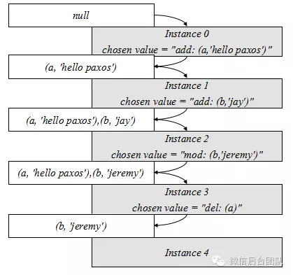
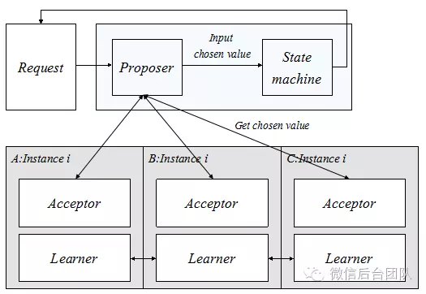
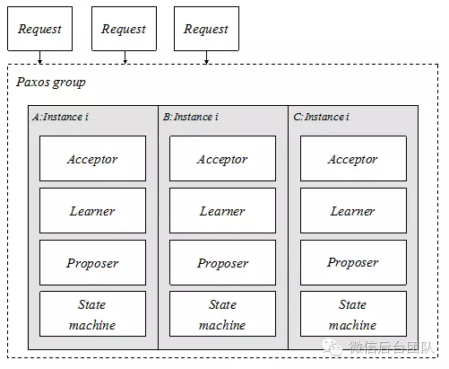
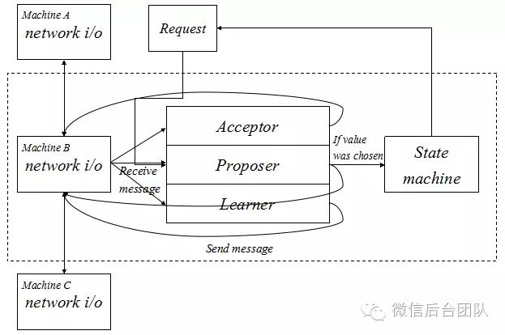

# CAP
Consistency 一致性,所有数据节点上数据一致性和正确性.更新操作成功后所有用户应该读到最新之
Availability 可用性.每个操作总能在一定时间返回结果,不管失败还是成功
Partition Tolerance 分区容错性.是否可以对数据进行分区.考虑性能和可伸缩性

# 二阶段提交
## 角色
协调者 发起请求
事务参与者  具体存储
## 过程
### 请求阶段(或者叫表决阶段)
协调者将通知事务参与者准备提交或者取消事务,进入表决过程.
事务参与者告知协调者自己的策略:同意(参与者本地操作成功)或者取消(参与者本地执行故障)
### 提交阶段
协调者基于请求阶段的投票结果,提交或者取消
所有参与者同意协调者才能通过食物,否则协调者要去下o
## 缺点
- 数据同步阻塞.所有参与节点都是事务阻塞
- 如果协调者故障,参与者资源阻塞
- 数据局部一致性.提交阶段执行一半协调者出现问题,只有部分的数据在参与者手上是一致的

## 问题
协调者和参与者同时出错,事务完整性无法保证完整性.例如:协调者发出commit后宕机,参与者也宕机.这时候的数据状态不确定,就算有新的协调者,这条数据的正确性无法保证.

# 三阶段提交
## 角色
协调者 发起请求
事务参与者  具体存储
## 过程
### CanCommit
协调者向参与者发送commit请求,参与者如果可以就返回yes,否则返回no
### PreCommit
协调者根据参与者的反映决定是否preCommit
#### 假如参与者在CanCommit返回都是Yes
进入PreCommit.
参与者接收到PreCommit,执行事务操作,将undo,redo信息记录下来.如果参与者成功执行了事务操作,返回ACK响应,开始等待最终指令.
#### 假如参与者在CanCommit给协调者发送No,或者协调者等待超时
中断事务.
### DoCommit
真正事务提交.
#### 执行提交
- 发送提交请求.协调者收到参与者发送的ACK,协调者进入提交状态,向所有协调者发送doCommit请求
- 事务提交.参与者收到doCommit后,执行正式事务提交.事务完成后释放所有事务资源
- 响应反馈.事务提交完后,参与者向协调者发送ACK响应
- 完成事务.协调者收到所有参与者的ack响应后,完成事务

#### 中断事务
协调者没有收到参与者的ACK,执行终端事务.

## 缺点
进入PreCommit后,协调者发出中断,如果不是所有的参与者都收到了请求,只有一个收到,对于其他不感知的参与者会继续根据3PC选择继续Commit,此时系统状态不一致.

# 对比二阶段提交,三阶段提交
二阶段(2PC)只有协调者有超时机制,如果一定时间内没有收到参与者消息默认失败
三阶段(3PC)协调者和参与者都有超时机制.PreCommit保证最后提交阶段之前各个节点状态一致,因为此时**各个节点已经执行了事务,只是在等待确认是否全局一致**.

```
三阶段提交是“非阻塞”协议。
三阶段提交在两阶段提交的第一阶段与第二阶段之间插入了一个准备阶段，
使得原先在两阶段提交中，参与者在投票之后，由于协调者发生崩溃或错误，
而导致参与者处于无法知晓是否提交或者中止的“不确定状态”所产生的可能相当长的延时的问题得以解决。 举例来说，假设有一个决策小组由一个主持人负责与多位组员以电话联络方式协调是否通过一个提案，以两阶段提交来说，主持人收到一个提案请求，打电话跟每个组员询问是否通过并统计回复，然后将最后决定打电话通知各组员。
要是主持人在跟第一位组员通完电话后失忆，而第一位组员在得知结果并执行后老人痴呆，那么即使重新选出主持人，也没人知道最后的提案决定是什么，也许是通过，也许是驳回，不管大家选择哪一种决定，都有可能与第一位组员已执行过的真实决定不一致，老板就会不开心认为决策小组沟通有问题而解雇。
三阶段提交即是引入了另一个步骤，主持人打电话跟组员通知请准备通过提案，以避免没人知道真实决定而造成决定不一致的失业危机。
为什么能够解决二阶段提交的问题呢？
回到刚刚提到的状况，在主持人通知完第一位组员请准备通过后两人意外失忆，即使没人知道全体在第一阶段的决定为何，全体决策组员仍可以重新协调过程或直接否决，不会有不一致决定而失业。
那么当主持人通知完全体组员请准备通过并得到大家的再次确定后进入第三阶段，
当主持人通知第一位组员请通过提案后两人意外失忆，这时候其他组员再重新选出主持人后，
仍可以知道目前至少是处于准备通过提案阶段，表示第一阶段大家都已经决定要通过了，此时便可以直接通过。
```

# paxos
## 角色
proposer 提议者
acceptor 接受者
提议 propose,表示一次事务的标记.
## 单机版paxos
提议者提议将v1写入到接受者的var x1中
为保证写入成功后不被修改,需要**CAS**
- 当var x1为空,写入成功
- 当var x1已经被确认(chosen),写入失败,返回已经被确认的值
- var x1的值判断和写入需要是**原子操作**.


```ditaa
提交成功
                                                 ┌────────────┐
                                                 │  acceptor  │
┌──────────┐                                     │            │
│          │─────────accept(v1)────────────────▶ │ ┌ ─ ─ ─ ─  │
│ proposer │                                     │   var x1 │ │
│          │                                     │ │   v1     │
│          │◀───────────ok───────────────────────│  ─ ─ ─ ─ ┘ │
└──────────┘                                     │            │
                                                 │            │
                                                 └────────────┘

提交失败
                                                 ┌────────────┐
                                                 │  acceptor  │
┌──────────┐                                     │            │
│          │─────────accept(v2)────────────────▶ │ ┌────────┐ │
│ proposer │                                     │ │ var x1 │ │
│          │                                     │ │   v1   │ │
│          │◀───────<fail,v1>────────────────────│ └────────┘ │
└──────────┘                                     │            │
                                                 │            │
                                                 └────────────┘
```

## acceptor需要容灾(多副本)
protosor需要发送accept请求到**多数派**acceptor
acceptor需要部署奇数个节点,2N+1个节点容忍N个失败

分布式CAS
- compare
    - 多数派加锁
    - 读多数派
    - 判空
- swap
    - 写多数派
    - 多数派解锁

对应的是2PC
2PC的分布式CAS
- acceptor增加互斥锁
- 增加prepare作为第一阶段,负责加锁和读多数派
- accept作为第二阶段,负责写多数派和解锁
- 如果**写多数派成功**,**提议chosen**
- 读多数派,多个结果,以版本号最大为准.引入**proposalID**作为版本号

流程
- prepare访问多数派,上锁
- prepare请求带上proposalID,表示提议版本号以及加锁身份
- prepare读acceptor曾接受过的提议,proposer只保留proposalID最大的,用于做compare
- 如果存在老提议,compare失败,更改提议为老提议
- accept将提议发送给多数派,写var x1,解锁
  

开始状态
```ditaa
┌──────────┐                             ┌──────────────┐
│          │                             │   acceptor   │
│          │                             │┌────────────┐│
│          │                             ││ ┌ ─ ─ ─ ─  ││
│          │                             ││   var x1 │ ││
│          │                             ││ │          ││
│          │                             ││  ─ ─ ─ ─ ┘ ││
│          │                             ││ ┌ ─ ─ ─ ─  ││
│          │                             ││    lock  │ ││
│          │                             ││ │          ││
│          │                             ││  ─ ─ ─ ─ ┘ ││
│          │                             │└────────────┘│
│          │                             │┌────────────┐│
│ proposer │                             ││ ┌ ─ ─ ─ ─  ││
│          │                             ││   var x1 │ ││
│          │                             ││ │          ││
│          │                             ││  ─ ─ ─ ─ ┘ ││
│          │                             ││ ┌ ─ ─ ─ ─  ││
│          │                             ││    lock  │ ││
│          │                             ││ │          ││
│          │                             ││  ─ ─ ─ ─ ┘ ││
│          │                             │└────────────┘│
│          │                             │┌────────────┐│
│          │                             ││ ┌ ─ ─ ─ ─  ││
│          │                             ││   var x1 │ ││
│          │                             ││ │          ││
│          │                             ││  ─ ─ ─ ─ ┘ ││
└──────────┘                             ││ ┌ ─ ─ ─ ─  ││
                                         ││    lock  │ ││
                                         ││ │          ││
                                         ││  ─ ─ ─ ─ ┘ ││
                                         │└────────────┘│
                                         └──────────────┘
```
prepare访问多数派,使用自己的proposal ID上锁
proposer请求上锁
```ditaa
┌──────────┐                             ┌──────────────┐
│          │                             │   acceptor   │
│          │                             │┌────────────┐│
│          │                             ││ ┌ ─ ─ ─ ─  ││
│          │                             ││   var x1 │ ││
│          │                             ││ │          ││
│          │                             ││  ─ ─ ─ ─ ┘ ││
│          ├─────────prepare(#1)─────────▶│ ┌ ─ ─ ─ ─  ││
│          │                             ││    lock  │ ││
│          │                             ││ │   #1     ││
│          │                             ││  ─ ─ ─ ─ ┘ ││
│          │                             │└────────────┘│
│          │                             │┌────────────┐│
│          │                             ││ ┌ ─ ─ ─ ─  ││
│proposer1 │                             ││   var x1 │ ││
│          │                             ││ │          ││
│          │                             ││  ─ ─ ─ ─ ┘ ││
│          ├─────────prepare(#1)─────────▶│ ┌ ─ ─ ─ ─  ││
│          │                             ││    lock  │ ││
│          │                             ││ │   #1     ││
│          │                             ││  ─ ─ ─ ─ ┘ ││
│          │                             │└────────────┘│
│          │                             │┌────────────┐│
│          │                             ││ ┌ ─ ─ ─ ─  ││
│          │                             ││   var x1 │ ││
│          │                             ││ │          ││
│          │                             ││  ─ ─ ─ ─ ┘ ││
│          │                             ││ ┌ ─ ─ ─ ─  ││
│          │                             ││    lock  │ ││
└──────────┘                             ││ │          ││
                                         ││  ─ ─ ─ ─ ┘ ││
                                         │└────────────┘│
                                         └──────────────┘
```
acceptor返回上锁结果
```ditaa
┌──────────┐                             ┌──────────────┐
│          │                             │   acceptor   │
│          │                             │┌────────────┐│
│          │                             ││ ┌ ─ ─ ─ ─  ││
│          │                             ││   var x1 │ ││
│          │                             ││ │          ││
│          │                             ││  ─ ─ ─ ─ ┘ ││
│          ├─────────prepare(#1)─────────▶│ ┌────────┐ ││
│          │                             ││ │  lock  │ ││
│          │◀──ok,nil,nil────────────────┼┤ │   #1   │ ││
│          │                             ││ └────────┘ ││
│          │                             │└────────────┘│
│          │                             │┌────────────┐│
│          │                             ││ ┌ ─ ─ ─ ─  ││
│proposer1 │                             ││   var x1 │ ││
│          │                             ││ │          ││
│          │                             ││  ─ ─ ─ ─ ┘ ││
│          ├─────────prepare(#1)─────────▶│ ┌────────┐ ││
│          │                             ││ │  lock  │ ││
│          │◀──────ok,nil,nil────────────┤│ │   #1   │ ││
│          │                             ││ └────────┘ ││
│          │                             │└────────────┘│
│          │                             │┌────────────┐│
│          │                             ││ ┌ ─ ─ ─ ─  ││
│          │                             ││   var x1 │ ││
│          │                             ││ │          ││
│          │                             ││  ─ ─ ─ ─ ┘ ││
│          │                             ││ ┌ ─ ─ ─ ─  ││
│          │                             ││    lock  │ ││
└──────────┘                             ││ │          ││
                                         ││  ─ ─ ─ ─ ┘ ││
                                         │└────────────┘│
                                         └──────────────┘
```
proposer发起accept请求
```ditaa
┌──────────┐                             ┌──────────────┐
│          │                             │   acceptor   │
│          │                             │┌────────────┐│
│          │                             ││ ┌ ─ ─ ─ ─  ││
│          │                             ││   var x1 │ ││
│          │                             ││ │ #1,v1    ││
│          │                             ││  ─ ─ ─ ─ ┘ ││
│          ├────────accept(#1,v1)────────▶│ ┌────────┐ ││
│          │                             ││ │  lock  │ ││
│          │                             ││ │   #1   │ ││
│          │                             ││ └────────┘ ││
│          │                             │└────────────┘│
│          │                             │┌────────────┐│
│          │                             ││ ┌ ─ ─ ─ ─  ││
│proposer1 │                             ││   var x1 │ ││
│          │                             ││ │ #1,v1    ││
│          │                             ││  ─ ─ ─ ─ ┘ ││
│          ├────────accept(#1,v1)────────▶│ ┌────────┐ ││
│          │                             ││ │  lock  │ ││
│          │                             ││ │   #1   │ ││
│          │                             ││ └────────┘ ││
│          │                             │└────────────┘│
│          │                             │┌────────────┐│
│          │                             ││ ┌ ─ ─ ─ ─  ││
│          │                             ││   var x1 │ ││
│          │                             ││ │          ││
│          │                             ││  ─ ─ ─ ─ ┘ ││
│          │                             ││ ┌ ─ ─ ─ ─  ││
│          │                             ││    lock  │ ││
└──────────┘                             ││ │          ││
                                         ││  ─ ─ ─ ─ ┘ ││
                                         │└────────────┘│
                                         └──────────────┘
```

acceptor返回accept的结果
**提议v1写多数派成功(chosen)**,将不会再被修改别的值
```ditaa
┌──────────┐                             ┌──────────────┐
│          │                             │   acceptor   │
│          │                             │┌────────────┐│
│          │                             ││ ┌────────┐ ││
│          │                             ││ │ var x1 │ ││
│          │                             ││ │ #1,v1  │ ││
│          │                             ││ └────────┘ ││
│          ├────────accept(#1,v1)────────▶│ ┌────────┐ ││
│          │                             ││ │  lock  │ ││
│          │◀──────────ok────────────────┤│ │   #1   │ ││
│          │                             ││ └────────┘ ││
│          │                             │└────────────┘│
│          │                             │┌────────────┐│
│          │                             ││ ┌────────┐ ││
│proposer1 │                             ││ │ var x1 │ ││
│          │                             ││ │ #1,v1  │ ││
│          │                             ││ └────────┘ ││
│          ├────────accept(#1,v1)────────▶│ ┌────────┐ ││
│          │                             ││ │  lock  │ ││
│          │◀───────────ok───────────────┤│ │   #1   │ ││
│          │                             ││ └────────┘ ││
│          │                             │└────────────┘│
│          │                             │┌────────────┐│
│          │                             ││ ┌ ─ ─ ─ ─  ││
│          │                             ││   var x1 │ ││
│          │                             ││ │          ││
│          │                             ││  ─ ─ ─ ─ ┘ ││
│          │                             ││ ┌ ─ ─ ─ ─  ││
│          │                             ││    lock  │ ││
└──────────┘                             ││ │          ││
                                         ││  ─ ─ ─ ─ ┘ ││
                                         │└────────────┘│
                                         └──────────────┘
```

如果此时proposer2发起新提议v2,读多数派,发现**存在老提议v1**,因此**不可再提议v2**
```ditaa
┌──────────┐                             ┌──────────────┐
│          │                             │   acceptor   │
│          │                             │┌────────────┐│
│          │                             ││ ┌────────┐ ││
│          │                             ││ │ var x1 │ ││
│          │                             ││ │ #1,v1  │ ││
│          │                             ││ └────────┘ ││
│          │                             ││ ┌────────┐ ││
│          │                             ││ │  lock  │ ││
│          │                             ││ │   #1   │ ││
│          │                             ││ └────────┘ ││
│          │                             │└────────────┘│
│          │                             │┌────────────┐│
│          │                             ││ ┌────────┐ ││
│proposer2 │                             ││ │ var x1 │ ││
│          │                             ││ │ #1,v1  │ ││
│          │                             ││ └────────┘ ││
│          ├─────────prepare(#2)─────────▶│ ┌────────┐ ││
│          │                             ││ │  lock  │ ││
│          │◀───────<ok,#1,v1>───────────┤│ │   #2   │ ││
│          │                             ││ └────────┘ ││
│          │                             │└────────────┘│
│          │                             │┌────────────┐│
│          │                             ││ ┌ ─ ─ ─ ─  ││
│          │                             ││   var x1 │ ││
│          │──────────prepare(#2)────────▶│ │          ││
│          │                             ││  ─ ─ ─ ─ ┘ ││
│          │                             ││ ┌────────┐ ││
│          │◀─────<ok,nil,nil>───────────┤│ │  lock  │ ││
└──────────┘                             ││ │   #2   │ ││
                                         ││ └────────┘ ││
                                         │└────────────┘│
                                         └──────────────┘
```

老提议v1可能未chosen,所以将提议内容从v2改成v1,继续提议.
因为提议内容是v1,所以**之前x1提议的v1不会被更改**.
```ditaa
┌──────────┐                             ┌──────────────┐
│          │                             │   acceptor   │
│          │                             │┌────────────┐│
│          │                             ││ ┌────────┐ ││
│          │                             ││ │ var x1 │ ││
│          │                             ││ │ #1,v1  │ ││
│          │                             ││ └────────┘ ││
│          │                             ││ ┌────────┐ ││
│          │                             ││ │  lock  │ ││
│          │                             ││ │   #1   │ ││
│          │                             ││ └────────┘ ││
│          │                             │└────────────┘│
│          │                             │┌────────────┐│
│          │                             ││ ┌────────┐ ││
│proposer2 │                             ││ │ var x1 │ ││
│          │                             ││ │ #2,v1  │ ││
│          │                             ││ └────────┘ ││
│          ├────────accept(#2,v1)────────▶│ ┌────────┐ ││
│          │                             ││ │  lock  │ ││
│          │◀──────────<ok>──────────────┤│ │   #2   │ ││
│          │                             ││ └────────┘ ││
│          │                             │└────────────┘│
│          │                             │┌────────────┐│
│          │                             ││ ┌────────┐ ││
│          │                             ││ │ var x1 │ ││
│          │─────────accept(#2,v1)───────▶│ │ #2,v1  │ ││
│          │                             ││ └────────┘ ││
│          │                             ││ ┌────────┐ ││
│          │◀─────────<ok>───────────────┤│ │  lock  │ ││
└──────────┘                             ││ │   #2   │ ││
                                         ││ └────────┘ ││
                                         │└────────────┘│
                                         └──────────────┘
```

## 死锁
proposer获得锁后挂掉,导致死锁
锁住的变量无法被重新chosen
```ditaa
┌──────────┐                             ┌──────────────┐
│          │                             │   acceptor   │
│          │                             │┌────────────┐│
│          │                             ││ ┌ ─ ─ ─ ─  ││
│          │                             ││   var x1 │ ││
│          │                             ││ │          ││
│          │                             ││  ─ ─ ─ ─ ┘ ││
│          ├─────────prepare(#1)─────────▶│ ┌────────┐ ││
│          │                             ││ │  lock  │ ││
│          │◀──ok,nil,nil────────────────┼┤ │   #1   │ ││
│          │                             ││ └────────┘ ││
│          │                             │└────────────┘│
│          │                             │┌────────────┐│
│          │                             ││ ┌ ─ ─ ─ ─  ││
│proposer1 │                             ││   var x1 │ ││
│          │                             ││ │          ││
│          │                             ││  ─ ─ ─ ─ ┘ ││
│          ├─────────prepare(#1)─────────▶│ ┌────────┐ ││
│          │                             ││ │  lock  │ ││
│          │◀──────ok,nil,nil────────────┤│ │   #1   │ ││
│          │                             ││ └────────┘ ││
│          │                             │└────────────┘│
│          │                             │┌────────────┐│
│          │                             ││ ┌ ─ ─ ─ ─  ││
│          │                             ││   var x1 │ ││
│          │                             ││ │          ││
│          │                             ││  ─ ─ ─ ─ ┘ ││
│          │                             ││ ┌ ─ ─ ─ ─  ││
│          │                             ││    lock  │ ││
└──────────┘                             ││ │          ││
                                         ││  ─ ─ ─ ─ ┘ ││
                                         │└────────────┘│
                                         └──────────────┘


┌──────────┐                             ┌──────────────┐
│          │                             │   acceptor   │
│          │                             │┌────────────┐│
│          │                             ││ ┌ ─ ─ ─ ─  ││
│          │                             ││   var x1 │ ││
│          │                             ││ │          ││
│          │                             ││  ─ ─ ─ ─ ┘ ││
│          ├─────────prepare(#2)─────────▶│ ┌────────┐ ││
│          │                             ││ │  lock  │ ││
│          │◀─────<fail,nil,nil>─────────┼┤ │   #1   │ ││
│          │                             ││ └────────┘ ││
│          │                             │└────────────┘│
│          │                             │┌────────────┐│
│          │                             ││ ┌ ─ ─ ─ ─  ││
│proposer2 │                             ││   var x1 │ ││
│          │                             ││ │          ││
│          │                             ││  ─ ─ ─ ─ ┘ ││
│          ├─────────prepare(#2)─────────▶│ ┌────────┐ ││
│          │                             ││ │  lock  │ ││
│          │◀────<fail,nil,nil>──────────┤│ │   #1   │ ││
│          │                             ││ └────────┘ ││
│          │                             │└────────────┘│
│          │                             │┌────────────┐│
│          │                             ││ ┌ ─ ─ ─ ─  ││
│          │                             ││   var x1 │ ││
│          │                             ││ │          ││
│          │                             ││  ─ ─ ─ ─ ┘ ││
│          │                             ││ ┌ ─ ─ ─ ─  ││
│          │                             ││    lock  │ ││
└──────────┘                             ││ │          ││
                                         ││  ─ ─ ─ ─ ┘ ││
                                         │└────────────┘│
                                         └──────────────┘

```

## 使用乐观锁防止死锁
acceptor使用乐观锁,当收到proposalID更大的prepare请求,记录其proposalID,让proposalID更小的accept请求失效
如果acceptor当前锁版本是#1,当有prepare请求是#2的时候,acceptor会更换其锁版本为#2
后续#1的accept请求会拒绝,并返回当前的锁版本#2.
带有#2的accept可以请求成功.

## proposer容灾
proposor冗余部署即可,仅仅一个节点存活也能服务.

## basic paxos总结
- 为了容灾,需要多个acceptor
- 为了多acceptor实现CAS,使用二段提交
- 避免二段提交死锁,使用乐观锁
- proposor容灾,冗余部署

## 问题
- 避免活锁:避免多个proposor并发发起提议,采用随机避让
- 避免不同proposor使用同一个proposalID:每个proposolID生成时加上自己特有后缀
- 不同proposer使用同一个proposalID:可能导致CAS失效,被chosen提议被更改.因为accept根据proposalID进行判断,对值不敏感.=
- CAS失败需要提议为老提议:老提议可能未chosen,推向chosen保证paxos活性,避免无法chosen

## basic paxos整体流程总结

可以理解为:prepare和accept是两个阶段.
- preapare 
    - proposer不感知当前的K是否满足条件,先尝试提议.
    - acceptor已经确定了当前的maxN是否能满足当前变量的协议.
        - 如果自己的maxN已经比proposer的要大,说明这次的proposer协议版本太低.不能接受.
        - 如果当前变量已经被chosen了,应该告知proposer.如果自己的maxN比K小,自己的maxN改成K
        - 如果当前的acceptor里maxN为空,直接返回ok
- accept
    - proposer已经能知道上次prepare的时候自己的版本号情况.
        - 超过一半的acceptor返回pok,说明有戏,这次可以提议.就看这次提议怎么来.
            - 如果超过半数都是(pol,null,null),说明之前没有写过,直接写.发起请求accept(K,V)
            - 回复中有acceptN,acceptV,说明之前已经有过被chosen,应该给其他acceptor同步一下.
            - 收到的ack没有超过半数,回到prepare阶段
    - acceptor
        - 在accept阶段,如果K>=maxN,直接批准,返回ok,proposer给啥要啥
        - 如果K< maxN,之前都告诉proposer应该发多少了,真心gg.
    - proposer收到acceptor
        - 收到超过半数的ack,说明任务完成,结束,结果给learner说
        - 收到ack没超过半数,回到prepare阶段.
        - 
## paxos协议理解
分布式系统会对数据进行多个副本存储
如果对各个副本的操作不使用序列进行控制,因为网络延迟等原因导致请求到各个机器的先后顺序不同,可能导致各个副本的数据不一致,不能保证副本一致性.因此希望多个副本的更新操作序列是相同的,不变的.就是每一个副本,在第一步做什么,第二步做什么,序列是一样的,不变的.
希望每个副本的处理系列一致.
使用paxos能确定op的序列一致.

### 问题转化
转化成一个系统存储名称为var的变量
系统要满足:
- var的取值一致性
    - var值没确定,var值返回null
    - var值取值被确定,**不可以被更改**,并且可以一致获取到这个值 **为什么不能被更改??**

- 满足容错性
    - 可以容忍任意proposer故障
    - 可以容忍少量acceptor故障

#### 问题
- 管理多个proposer并发执行
- 保证var不可变
- 容忍任意proposer故障
- 容忍半数一下acceptor故障


## multi-paxos
- 不止一个变量
- 每个变量有一套独立的paxos逻辑,成为一个instance
- 变量var xi的instanceID为i
- 如果原提议被更改,可将元提议写入下一个变量


### 优化点
1.prepare的时候prepare多个instances的锁,(提前prepare),这样可以满足的效果是,不需要多次prepare,只要一次prepare后多次accept
2.是在chosen之前的prepare多次锁,否则可能导致paxos失效

## 注意
paxos的目标是实现多个acceptor的**不可更改变量一致**,实际上使用并不是存放数据.
paxos就是用来让一个值在集群中是一致的.
怎么使用

db一般做法是使用wal write ahead log来完成数据的写入,就是写入db之前先记录log,然后再写入db.
paxos只能是确定一个值,这里可以看成是wal的一个entry.
对比mysql的binlog,redis的复制日志.
这些日志都是一些操作序列,op1,op2,...,opn
所以通过paxos的多个instance是可以确定多个值得.对比binlog,复制日志,如果每个entry都是根据当前的日志序号来标记,这样paxos就对db存在有意义.因为这样的日志文件对db的恢复以及同步很重要.

把日志看成状态机.当前如果写到i这个entry是chosen的,下一个可能是pending.paxos能保证当前机器chosen的entry都是全局一致的.但是目标是日志的同步.
这时候要learner进行同步.learn这个步骤让不同的机器进行entry的同步.因为有的机器entry比较快(就是i比较大),有的比较慢.分布式系统这种情况很常见.所以让learner进行不同机器间chosen的entry同步,可以缩短机器间的不一致状态.

### 状态机
状态机可以理解为db的日志.


### 运行机制
proposer在和acceptor的paxos过程确定了chosen value(就是日志的一个entry)之后,写入状态机中


### 部署方式
proposer和状态机应该放一起,因为proposer的chosen value需要给状态机.
appeptor管理的data数据缺是状态机需要的,所以proposer,acceptor,状态机应该放在一起

learner觉得比较单独,但是实际上learner角色是同步不同的节点的状态机.所以learner应该和状态机放在一起.
综上所述


### 磁盘管理
只要paxos在保证的时候,就应该记录一个pending状态的日志.但是落盘的时候内核有缓冲区,没有刷到磁盘.每次写盘需要用到fsync,防止在缓冲区的时候因为机器宕机导致日志丢失->状态机不一致
矛盾点:fsync是内核操作,占据资源,希望更少频次使用.

### 解决accept冲突的性能问题
因为状态机是受proposer约束的.如果一个节点的日志可以成功落盘,通过learner可以让全局共享.因此选举一个proposer的leader不会影响到paxos的进行.
相反,如果有多个proposer,这时候在paxos过程在accept的冲突概率会更大,降低性能.
目标是希望accept成功之后减少冲突,对全局的性能提高.通过简单的心跳和租约方式保证一个proposer能减少锁的冲突,

### 状态机必须记录输入过的最大实例编号
当一个实例的值已经chosen之后,必须记录下来.这样的好处是如果某个机器启动的时候发现paxos的实例编号已经比自己已经确定的要大(也就是状态机最新的编号比paxos最大实例编号小),这时候可以通过重放的方法让状态机编号恢复到最新.这个过程是**启动重放**.
因此leader proposer在记录状态机的时候做法是:chosen的实例会记录下来,然后当前pending的实例也会记录下来.这样能确保chosen的实例一定会记录下来.
重放过程只要把已经落盘的数据开始,到当前paxos的实例重放一次就可以.这里需要learner的同步机制.

### 异步信息处理模型
paxos协议需要和其他节点进行通信,通信流程是异步流程.
proposer一旦感知一个value是被chosen的,就写入状态机.这个步骤应该是同步的.


摘抄网络:
```
这里分为四个部分：
Request，即外部请求，这个请求直接输入到Proposer里面，由Proposer尝试完成一个值的确定。
Network i/o，网络i/o处理，负责paxos内部产生的消息的发送与接收，并且只处理paxos消息，采用私有端口，纯异步，各台机器之前的network i/o模块互相通信。
Acceptor，Proposer，Learner。用于响应并处理paxos消息。
State machine，状态机，实例确定的值(chosen value)的应用者。

工作流程：
收到Request，由Proposer处理，如需要发送paxos消息，则通过network i/o发送。
Net work i/o收到paxos消息，根据消息类型选择Acceptor，Proposer，或Leaner处理，如处理后需要发送paxos消息，则通过network i/o发送。
Proposer通过paxos消息获知chosen value，则输入value到State machine完成状态转移，最终通知Request转移结果，完成一个请求的处理。当
paxos完成一个值的确认之后，所有当前实例相关角色状态进行清空并初始化进行下一个编号的实例。

```

### learner对齐数据
learner负责各个节点的状态机对齐.
参考流式传输,learner边发边学.例如A机器Learner记录当前实例编号是x，B机器是y，而x < y.B机器源源不断的往A机器输送数据，而A机器只需要收到一个实例最小单元的包体，即可立即解开进行学习并完成写盘。

具体实现可以是:主proposer机器建立session通道,通过心跳机制维护,一旦断开停止发送/接收.session通道直接发送A机器需要学习的entry.

### 删除paxos数据
矛盾点:
- 很多节点的状态机都是靠learner学习得到.如果某机器需要重放,启动重放流程会依赖其他(主节点)机器.
- 主节点机器日志不可能无限记录,总需要定期删除.

#### 使用checkpoint
状态机镜像数据成为checkpoint.具体的数据镜像可以对应到某个编号之前的日志.主机定期制作数据镜像,可以删除对应状态机编号之前的日志.新机器启动的时候:
- 如果当前状态机最大编号在checkpoint之后,学习剩下的状态机即可
- 如果在之前,拉取镜像+学习

### 正确性
#### 运行时对账
对当前编号有序多个值进行累加校验,拿到当前数据版本的crc32,一旦发现机器校验值不同,core处理,防止错误扩散
#### 拜占庭问题
- 拜占庭问题
假设节点总数是N，叛徒将军数为F，则当 N 》= 3F+1 时，问题才有解，共识才能达成，这就是Byzantine Fault Tolerant（BFT）算法。

不满足3F+1:

叛徒不是提案人
```ditaa
  (0,0)
  ┌────┐                   ┌────┐  
  │ A  │─────────0────────▶│ c  │  
  └────┘                   └────┘  
     │                             
     │                             
    0│                             
     │                             
     │                             
     ▼                             
  ╔════╗                           
  ║ B  ║                           
  ╚════╝                           
                                   
                                   
                                   
                                   
                                   
                                   
   (0,0)                   (0,?)             
  ┌────┐                   ┌────┐  
  │ A  │                   │ c  │  
  └────┘                   └────┘  
     ▲                        ▲    
     │                        │    
    0│                        │    
     │                       1│    
     │                        │    
     │                        │    
  ╔════╗                      │    
  ║ B  ║──────────────────────┘    
  ╚════╝                           
   (0,1)                                
                                   
                                   
                                   
                                   
                                   
    (0,0)                    (0,1)   ???         
   ┌────┐                   ┌────┐ 
   │ A  │                   │ c  │ 
   └────┘                   └────┘ 
                                   
                                   
                                   
                                   
                                   
                                   
   ╔════╗                          
   ║ B  ║                          
   ╚════╝                          
(0,1) 

```
此时c将军不知道那个才是可信的,因此不能达成一致

叛徒是提案人
```ditaa

  (0,1)
  ╔════╗                   ┌────┐  
  ║ A  ║─────────1────────▶│ c  │  
  ╚════╝                   └────┘  
     │                             
     │                             
    0│                             
     │                             
     │                             
     ▼                             
  ┌────┐                           
  │ B  │                           
  └────┘                           
                                
                                   
                                   
                                   
                                   
                                   
   (0,1)                   (1,0)             
  ╔════╗                   ┌────┐  
  ║ A  ║                   │ c  │  
  ╚════╝                   └────┘  
     ▲                        ▲    
     │                        │    
    0│                        │    
     │                        │    
     │                       0│    
     │                        │    
  ┌────┐                      │    
  │ B  │──────────────────────┘    
  └────┘                           
     (0,0)                                 
                                   
                                   
                                   
                                   
                                   
                              ???     
   ╔════╗                   ┌────┐ 
   ║ A  ║                   │ c  │ 
   ╚════╝                   └────┘ 
                                   
                                   
                                   
                                   
                                   
                                   
   ┌────┐                          
   │ B  │                          
   └────┘                          
```
此时c将军也不知道究竟是A发错还是B发错

满足 N 》= 3F+1
非提案人叛徒
```ditaa
                  ┌────┐                    
                  │ A  │                    
                  └────┘                    
                     │                      
                    0│                      
                     │                      
   ┌─────────────────┼─────────────────┐    
   │                 │                 │    
   │                 │                 │    
   ▼                 ▼                 ▼    
╔════╗            ┌────┐            ┌────┐  
║ B  ║            │ c  │            │ D  │  
╚════╝            └────┘            └────┘  
                                            
                                            
                                            
                                            
                                            
                                            
                                            
                    ┌────┐                  
                    │ A  │                  
                    └────┘                  
                                            
                                            
                                            
                                            
     ┌───────────────0───────────────────┐  
     │                                   │  
     ▼                                   │  
  ╔════╗◀───0───────┬────┬────0──────▶┌────┐
  ║ B  ║──────1────▶│ c  │ ◀─0────────│ D  │
  ╚════╝            └────┘            └────┘
     │                                   ▲  
     │                                   │  
     └─────────────1─────────────────────┘  
                                            
```

此时可以看到

|将军结果|A|B|C|D|
|--|--|--|--|--|
|A|N|0|0|0|
|B|0|N|1|1|
|C|0|1|N|0|
|D|0|1|0|N|


将军C,D能感知到1是小众,所以B是叛徒

提案人叛徒
```ditaa
                    ╔════╗                    
                    ║ A  ║                    
                    ╚════╝                    
                       │                      
                       │                      
                       │                      
     ┌─────────────────┼─────────────────┐    
    0│                 │                 │    
     │                1│                1│    
     ▼                 ▼                 ▼    
  ┌────┐            ┌────┐            ┌────┐  
  │ B  │            │ c  │            │ D  │  
  └────┘            └────┘            └────┘  
                                              
                                              
                                              
                                              
                                              
                                              
                                              
                      ╔════╗                  
                      ║ A  ║                  
                      ╚════╝                  
                                              
                                              
                                              
                                              
       ┌───────────────1───────────────────┐  
       │                                   │  
       ▼       1                  1        │  
    ┌────┐◀───────────┬────┬───────────▶┌────┐
    │ B  │──────0────▶│ c  │ ◀─1────────│ D  │
    └────┘            └────┘            └────┘
       │                                   ▲  
       │                                   │  
       └─────────────0─────────────────────┘  
                                              
```

此时可以看到

|将军结果|A|B|C|D|
|--|--|--|--|--|
|A|N|0|1|1|
|B|0|N|1|1|
|C|1|0|N|1|
|D|1|0|1|N|

可以看到:每个将军能达成共识.

- 因为接收者会发送自己的信,以及收到他人的信息.因此每个成员收到的信息都是叠加的,总数就是群总体-1.
- 每个成员收到的信息如果好坏比例是1:1,显然无法感知那边是好人,那边是坏人.
- 所以对这种情况,其实只需要稍微增大好人比例,也就是好人>坏人即可,2F+1


但是极端情况:坏人是提议者以及受众.提议者发送不一致的消息到所有受众,而且坏的受众也会发不一致的消息给好人.

如果一个消息可以被好人认可,大于半数的作为一致的目标.极端情况下:提议者发送一半的错误信息给好人.

如果好人是a,坏人是b:如果要让总体的认识是一致的.

假设达成共识的总数是C,也就是**C这个数量的成员指向同一个结果才算出结果**,C一定不能太小.例如C只要20%的总体的话,总体可能出现多个结果.

分析好人中的情况,极端情况下a/2的半数应该代表**真正一致的结果**

如果**C设置的过大**,会导致:**b只要都投错误的,就算a全部投对,也算达成不了共识**.

合理情况下,**应该有a>C,让好人真正投票认可,坏人参脚失败**

这里需要一个C的最小值.

为了让坏人无法干扰到最终的结果,让C>0.5a+b
这样,坏人b就算怎样搞事,但是不满足C这个条件,b的搞事也算失败.

所以**b要搞事可以,但是得全都帮其中一边搞.否则搞事失败**

这样,**就算b搞事,还能达成共识**,起码**能代表a中半数人的意愿**

如果好人已经超过一半投了某个结果,当然距离C更近.但是坏人只要存在,就必须满足C条件才能达成共识.

这样:
```
a+b > C > 0.5a+b
a > C
a > 0.5a + b
a > 2b
```
所以好人要比坏人两倍要多
所以拜占庭问题:N 》= 3F+1
N=a+b
F=b

总结:分析的时候两个制约点:
- 达成共识的总数C应该少于好人a,如果超过了,就不算这个集体的共识,因为超出了好人的能力范围(比真正要头的都要多,完成不了)
- 防止坏人捣乱,C要比0.5a+b要大,这样坏人就算两边投,C满足不了也不过,所以坏人想搞事也没办法,搞事也只能根据a的意思搞
- 通过达成共识(拿到C)作为目标,找出a和b的关系
- 反推,当发现b的存在,只要b的总数在总体的1/3以下,还能确定当前的共识是有效的.但是当b超过1/3,这个系统就gg


#### 防止拜占庭问题
所有写入磁盘的数据都要二次校验(写入后校验),防止磁盘数据被篡改.发现被篡改及时回滚到上个校验成功的数据,产生告警.

## raft
每个节点有3种状态
- follower
- candidate
- leader

```ditaa
┌─────────┐    ┌ ─ ─ ─ ─ ┐        ╔═════════╗
│follower │     candidate         ║ leader  ║
└─────────┘    └ ─ ─ ─ ─ ┘        ╚═════════╝
```

所有节点从follower状态开始.  
如果follower不听leader的,可以成为candidate  

### 选leader
candidate可以向其他节点发送请求,follower可以返回投票.  
如果candidate获得多数投票,candidate成为leader  


### 选举leader
raft协议会在leader选举中有两个timeout设置
- 选举timeout(election timeout)
    - follower在选举timeout之后会成为candidate
    - 选举timeout随机,150ms到300ms不等
    - 一旦过了选举timeout,follower会成为candidate,马上进入选举期(election term),给其他节点发送投票请求(request vote),让大家选他做leader
        - 收到投票请求的follower会给candidate返回,**并且重置选举timeout**
        - 一旦拿到**多数节点的投票**,**candidate成为leader**
        - leader开始给它的follower发送append entry,通过心跳包发送.follower需要回应.
        - 收到append entry的follower的选举timeout都会重置.除非follower没有收到心跳包,成为了candidate

如果一个leader gg了,因为follower的选举timeout,总会有一个follower会成为candidate,然后发起投票请求,成为新leader.  
必须多数节点返回投票才能成为leader,这是保证leader唯一的基础.  

如果有两个candidate产生了:
例如:A B节点都成为了candidate,同时向其他的节点发出投票请求.

两个candidate同时发送投票请求
```ditaa
┌ ─ ┐                     ┌ ─ ┐
  A    ────▶         ◀────  B  
└ ─ ┘                     └ ─ ┘
  │   ─┐                    │  
  │    │              ┌─────┤  
  ▼    └─▶            ▼     ▼  
                               
                               
                               
                               
                               
                               
                               
                               
┌───┐                     ┌───┐
│ C │                     │ D │
└───┘                     └───┘
```

加入A的比B先到C,B的比A先到D
```ditaa
┌ ─ ┐                     ┌ ─ ┐
  A  ──────▶      ◀───────  B  
└ ─ ┘                     └ ─ ┘
  ▲                         ▲  
  │                         │  
  │                         │  
  │                         │  
  │                         │  
  │                         │  
  │                         │  
  │                         │  
  │                         │  
  │                         │  
  │                         │  
┌───┐                     ┌───┐
│ C │                     │ D │
└───┘                     └───┘
```
现在每个candidate只有2票

此时candidate会从新等待一次选举,然后每个candidate都会重复上面步骤发起投票选举.  
上述情况就是选leader的冲突.通过这个机制做重选.

### 日志复制(log replication)
所有系统的改变都会先经过leader
一旦有了新的leader,之前的change(就是entry)需要复制到各个节点.

通过上述的append entry可以把entry的信息同步到各个节点.

例如:cli要求set 5这个请求.leader会把请求发送给每个follower.每次更改都会给节点的日志加上这个entry  
日志还没有提交,所以节点的值不会更改  
```ditaa
                                             ┌────┐ 
                                             │    │ 
                                             └────┘ 
                                                    
                                                    
┌─────────┐                ╔═════╗                  
│   cli   │────set 5──────▶║     ║                  
└─────────┘                ╚═════╝                  
                                                    
                                                    
                                              ┌────┐
                                              │    │
                                              └────┘
```

leader给各个follower提交请求 set 5  
```ditaa
                                             ┌────┐ 
                                      set 5─▶│    │ 
                                       │     └────┘ 
                                       │            
                                       │            
┌─────────┐                ╔═════╗     │            
│   cli   │                ║     ║─────┤            
└─────────┘                ╚═════╝     │            
                                       │            
                                       │            
                                       │      ┌────┐
                                     set 5───▶│    │
                                              └────┘
```
leader会等到大多数节点都写入了entry(日志的entry)  
```ditaa
                                             ┌────┐ 
                                       ┌─ok──│    │ 
                                       │     └────┘ 
                                       │            
                                       │            
┌─────────┐                ╔═════╗     │            
│   cli   │                ║     ║◀────┤            
└─────────┘                ╚═════╝     │            
                                       │            
                                       │            
                                       │      ┌────┐
                                       └─ok───│    │
                                              └────┘
```
之后,leader的值会改成5  
```ditaa
                                             ┌────┐ 
                                             │    │ 
                                             └────┘ 
                                                    
                                                    
┌─────────┐                ╔═════╗                  
│   cli   │                ║  5  ║                  
└─────────┘                ╚═════╝                  
                                                    
                                                    
                                              ┌────┐
                                              │    │
                                              └────┘
```
这之后leader把结果发送给cli
```ditaa
                                             ┌────┐ 
                                             │ 5  │ 
                                             └────┘ 
                                                    
                                                    
┌─────────┐                ╔═════╗                  
│   cli   │◀─────ok────────║  5  ║                  
└─────────┘                ╚═════╝                  
                                                    
                                                    
                                                    
                                              ┌────┐
                                              │ 5  │
                                              └────┘
```

leader告诉follower这个entry已经提交了
```ditaa
                                    entry    ┌────┐ 
                                  committed─▶│    │ 
                                       │     └────┘ 
                                       │            
                                       │            
┌─────────┐                ╔═════╗     │            
│   cli   │                ║  5  ║─────┤            
└─────────┘                ╚═════╝     │            
                                       │            
                                       │            
                                    entry     ┌────┐
                                  committed──▶│    │
                                              └────┘
```

被leader告知的follower会把自己的值设置成5
```ditaa
                                             ┌────┐ 
                                             │ 5  │ 
                                             └────┘ 
                                                    
                                                    
┌─────────┐                ╔═════╗                  
│   cli   │                ║  5  ║                  
└─────────┘                ╚═════╝                  
                                                    
                                                    
                                                    
                                              ┌────┐
                                              │ 5  │
                                              └────┘
```
这时候,集群的分布式一致性达成.

发送的是一个entry.例如对这个节点+2 一样.只是最后同步的信息是+2,以及最后的值是7.

### 网络异常
如果存在网络屏障
```ditaa
                                          ┌────┐                             
                                          │    │                             
                                          └────┘                             
                                                                             
┌─────────┐              ┌────┐                             ┌────┐           
│   cli   │              │    │                             │    │           
└─────────┘              └────┘                             └────┘           
                                                                             
                                                                             
                                                                             
                        ────────────────barrier─────────────────────────────▶
                                                                             
                                                                             
                                                                             
                                                                             
                                                                             
                                                                             
                                                                             
 ┌─────────┐                   ╔═════╗         ┌────┐                        
 │   cli   │───────set 5──────▶║     ║         │    │                        
 └─────────┘                   ╚═════╝         └────┘                        
 ```
 上面3个节点因为网络屏障,自动选leader
 ```ditaa
 ┌─────────┐                             ╔════╗                             
 │   cli   │──────set 8─────────────────▶║    ║                             
 └─────────┘                             ╚════╝                             
                                                                            
                        ┌────┐                             ┌────┐           
                        │    │                             │    │           
                        └────┘                             └────┘           
                                                                            
                                                                            
                                                                            
                       ────────────────barrier─────────────────────────────▶
                                                                            
                                                                            
                                                                            
                                                                            
                                                                            
                                                                            
                                                                            
┌─────────┐                   ╔═════╗         ┌────┐                        
│   cli   │                   ║     ║         │    │                        
└─────────┘                   ╚═════╝         └────┘                        
 ```
因为下面的leader没有办法获得大多数的节点返回,当前不停在commit阶段

但是因为上面的有3个节点,满足大多数的个数(包括leader自己),所以cli设置给上面的leader是8的时候能设置成功
```ditaa
                                    election term 2
 ┌─────────┐                             ╔════╗                             
 │   cli   │                             ║ 8  ║                             
 └─────────┘                             ╚════╝                             
                                                                            
                        ┌────┐                             ┌────┐           
                        │ 8  │                             │ 8  │           
                        └────┘                             └────┘           
                                                                            
                                                                            
                                                                            
                       ────────────────barrier─────────────────────────────▶
                                                                            
                                                                            
                                                                            
                                                                            
                                                                            
                                                                            
                              election term 1                                            
┌─────────┐                   ╔═════╗         ┌────┐                        
│   cli   │                   ║     ║         │    │                        
└─────────┘                   ╚═════╝         └────┘                        
```

当网络恢复后,leader都会对所有节点都发送心跳包
```ditaa
 ┌─────────┐                             ╔════╗                  
 │   cli   │                             ║ 8  ║                  
 └─────────┘                        ┌─── ╚════╝                  
                                 ◀──┘       │────┐               
                        ┌────┐       ┌──────┤    └───▶     ┌────┐
                        │ 8  │       │      └┐             │ 8  │
                        └────┘       ▼       │             └────┘
                                             ▼                   
                                                                 
                                                                 
                                                                 
                                                                 
                                                                 
                                     ▲                           
                           ▲         │  ┌─────▶                  
                           └─────┬───┘  │                        
                                 │      │                        
                                 │─────┬┴───▶                    
┌─────────┐                   ╔════─╦──┘      ┌────┐             
│   cli   │                   ║     ║         │    │             
└─────────┘                   ╚═════╝         └────┘             
```

因为上面leader的election term比下面的要新,所以下面的leader收到上面leader发送的心跳包时候,就把信息进行了同步,而下面的leader就降级成follower
```ditaa
 ┌─────────┐                             ╔════╗                  
 │   cli   │                             ║ 8  ║                  
 └─────────┘                             ╚════╝                  
                                                                 
                        ┌────┐                             ┌────┐
                        │ 8  │                             │ 8  │
                        └────┘                             └────┘
                                                                 
                                                                 
                                                                 
                                                                 
                                                                 
                                                                 
                                                                 
                                                                 
                                                                 
                                                                 
                                                                 
┌─────────┐                   ┌─────┐         ┌────┐             
│   cli   │                   │  8  │         │ 8  │             
└─────────┘                   └─────┘         └────┘   

```
节点**A,B都需要回滚之前没有提交的entry**,最终要**和新的leader的log一致**

这样能确保数据的一致性


## paxos vs raft
### 概念映射

|paxos|raft|意义|
|instanceID|index|变量编号,变量内容是提议,对应日志的entry|
|chosen|commit|表示提议被确认,多数派写成功,提议确认后不能更改|
|proposalID|term|raft和paxos都忽略较小的id请求,用于处理冲突.multi_paxos在进入快速accept之前的第一次prepare和raft通过副本同步选举leader,流程完全等价.|

结论:multi_paxos和raft原理上一样.

### 对比

|对比|mutipaxos|raft|
|角色|需要两类节点参与:proposer,acceptor|只需要一类节点,但是在leader,candidate,follower切换|
|部署|accept 2n+1,proposer容易|node节点2n+1|
|确认顺序|乱序|顺序|

### 顺序确认的坏处
raft要顺序commit,muti-paxos可以乱序chosen,但是都要求顺序apply
顺序commit的问题:
- 并发事务没有因果/先后顺序
- 一个事务因抖动无法commit,影响另外一个无关事务的commit

顺序commit的问题影响
- 支持多表事务的数据库
    - 多表事务使用2PC,加入ABC三个表,事务1无法commit导致后续用到A B C表的事务会被阻塞,其他事务依赖的其他表也会阻塞,形成连锁效应
    - 事务1后事务2,3也会被阻塞无法commit,家具连锁效应
- 队列场景,一条队列对应一个group,
