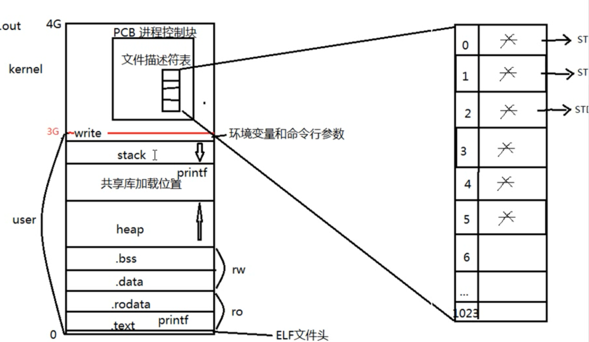
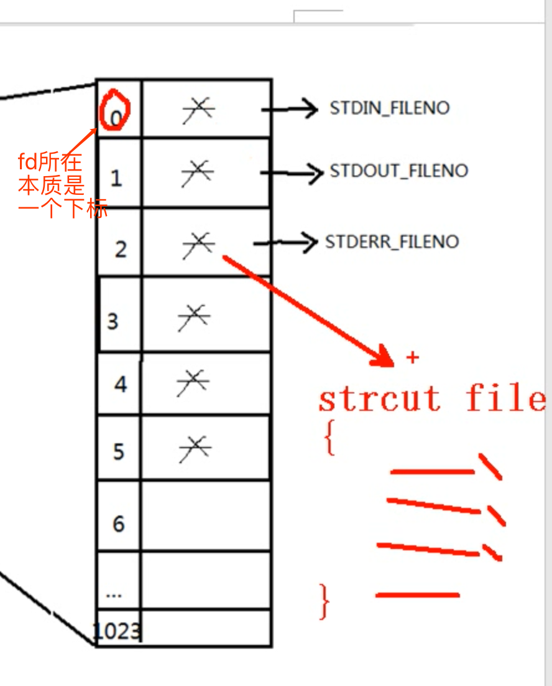

事实上是系统函数,因为是系统内核的函数封装
## open
```cpp
int open(const char* pathname, int flags);
//路径,指定flag,包括O_RDONLY 只读,O_WRONLY 只写, O_RDWR 读写 
//返回fd. -1 gg
int open (const chat* pathnam, int flags, mode_t mode);
//mode_t 文件的权限 可以创建文件
//O_APPEND 追加 O_CREAT 创建 O_EXCL 是否存在 O_TRUNC 清空内容 O_NONBLOCK 非阻塞

int creat(const char* pathname, mode_t mode);

int close(int fd);
```
实例代码
```cpp
  #include <stdio.h>
  #include <stdlib.h>
  #include <string.h>
  #include <unistd.h>
  #include <pthread.h>
  #include <unistd.h>//open close所在
  #include <fcntl.h>//O_RDONLY所在

✗ int main(int argc, char* argv[])
  {
      int fd = open("./dxxx", O_RDONLY);
      int ret = close(fd);
      printf("fd=%d close=%d\n",fd,ret);
      return 0;
  }
  ```
  文件存在
  ```
  fd=3 close=0
  ```
  不存在
  ```
  fd=-1 close=-1
  ```

  open时候创建
```cpp
   #include <stdio.h>
  #include <stdlib.h>
  #include <string.h>
  #include <unistd.h>
  #include <pthread.h>
  #include <unistd.h>
  #include <fcntl.h>//O_RDONLY所在

✗ int main(int argc, char* argv[])
  {
      int fd = open("./oxxk", O_RDONLY | O_CREAT, 0664);
      int ret = close(fd);
      printf("fd=%d close=%d\n",fd,ret);
      return 0;
  }
```
  会创建文件

使用trunc


```cpp
#include <stdio.h>
#include <stdlib.h>
#include <string.h>
#include <unistd.h>
#include <pthread.h>
#include <unistd.h>
#include <fcntl.h>//O_RDONLY所在

int main(int argc, char* argv[])
{
    int fd = open("./oxxk", O_RDONLY | O_CREAT | O_TRUNC, 0664);
    int ret = close(fd);
    printf("fd=%d close=%d\n",fd,ret);
    return 0;
}
```
文件权限: mode &~umask
最后存在的文件会清空(ll看到大小为0)

可能错误
- 文件不存在
- 只写方式打开只读文件
- 只写方式打开目录
  
#### 文件不存在
```cpp
#include <stdio.h>
#include <stdlib.h>
#include <string.h>
#include <unistd.h>
#include <pthread.h>
#include <unistd.h>
#include <fcntl.h>//O_RDONLY所在
#include <errno.h>//errno所在

int main(int argc, char* argv[])
{
    //int fd = open(argv[1], O_RDONLY | O_CREAT | O_TRUNC, 0664);
    int fd = open(argv[1], O_RDONLY  | O_TRUNC);
    printf("errno=%d errmsg=%s", errno, strerror(errno));

    int ret = close(fd);
    printf("fd=%d close=%d errno=%d errrmsg=%s\n",fd,ret, errno, strerror(errno));
    return 0;
}

```
运行写入不存在的文件  返回:
```
./open ./423432
errno=2 errmsg=No such file or directoryfd=-1 close=-1 errno=9 errrmsg=Bad file descriptor
```

#### 只写方式打开只读文件
chmod 
- 4:读 r
- 2:写 w
- 1:执行 x
chmod 444 oxxk后

使用只写方式
```cpp
#include <stdio.h>
#include <stdlib.h>
#include <string.h>
#include <unistd.h>
#include <pthread.h>
#include <unistd.h>
#include <fcntl.h>//O_RDONLY所在
#include <errno.h>//errno所在

int main(int argc, char* argv[])
{
    //int fd = open(argv[1], O_RDONLY | O_CREAT | O_TRUNC, 0664);
    int fd = open(argv[1], O_WRONLY  | O_TRUNC);
    printf("errno=%d errmsg=%s", errno, strerror(errno));

    int ret = close(fd);
    printf("fd=%d close=%d errno=%d errrmsg=%s\n",fd,ret, errno, strerror(errno));
    return 0;
}
```
结果
```
./open ./oxxk
errno=13 errmsg=Permission deniedfd=-1 close=-1 errno=9 errrmsg=Bad file descriptor
```
fd = -1,拿不到fd
`errno`是13,表示没有权限`Permission denied`

#### 只写方式打开目录
和上面代码一样,打开./
结果
```
./open ./
errno=21 errmsg=Is a directoryfd=-1 close=-1 errno=9 errrmsg=Bad file descriptor
```
`errno`是21,打开路径`Is a directory`

## read write 
```cpp
ssize_t read(int fd, void *buf, size_t count);
//buf 缓冲区
//count 缓冲区大小
//成功:读取字节数
//失败 -1 errno设置
```

```cpp
ssize_t write(int fd, const void *buf, size_t count);
//buf 待写出数据缓冲区
//count 写入的长度大小  如果buf长度比count小
//成功:读取字节数
//失败 -1 errno设置
```

### 简单cp
```cpp
#include <stdio.h>
#include <stdlib.h>
#include <string.h>
#include <unistd.h>
#include <pthread.h>
#include <unistd.h>
#include <fcntl.h>//O_RDONLY所在
#include <errno.h>//errno所在

int main(int argc, char* argv[])
{
    char buf[1];
    int n = 0;
    int fd1=open(argv[1], O_RDONLY);
    if(fd1 < 0){
        perror("open argv1 err");
        exit(1);
    }
    int fd2=open(argv[2], O_WRONLY|O_CREAT|O_TRUNC, 0664);//因为cp如果文件存在,应该覆盖,所以用了_TRUNC
    if(fd2 < 0){
        perror("open argv2 err");
        close(fd1);
        exit(1);
    }

    while((n = read(fd1, buf, 1024))!=0){
        if(n < 0){
            perror("read err");
            close(fd1);
            close(fd2);
            exit(1);
        }
        write(fd2, buf,n);
    }
    close(fd1);
    close(fd2);
    return 0;
}


```

使用 `perr` `exit` 输出错误以及异常处理

`fputc`使用`write`写文件
### write只用1个字节buff和fputc只用1个字节buff一起做cp呢个快?
write
```cpp
#include <stdio.h>
#include <stdlib.h>
#include <string.h>
#include <unistd.h>
#include <pthread.h>
#include <unistd.h>
#include <fcntl.h>//O_RDONLY所在
#include <errno.h>//errno所在

#define N 1
int main(int argc, char* argv[])
{
    char buf[1];
    int n = 0;
    int fd1=open(argv[N], O_RDONLY);
    if(fd1 < 0){
        perror("open argv1 err");
        exit(1);
    }

    int fd2=open(argv[2], O_WRONLY|O_CREAT|O_TRUNC, 0664);//因为cp如果文件存在,应该覆盖,所以用了_TRUNC
    if(fd2 < 0){
        perror("open argv2 err");
        close(fd1);
        exit(1);
    }

    while((n = read(fd1, buf,N))!=0){
        if(n < 0){
            perror("read err");
            close(fd1);
            close(fd2);
            exit(1);
        }
        write(fd2, buf,n);
    }
    close(fd1);
    close(fd2);
    return 0;
}


```

getc
```cpp
#include <stdio.h>
#include <stdlib.h>
#include <string.h>
#include <unistd.h>
#include <pthread.h>
#include <unistd.h>
#include <fcntl.h>//O_RDONLY所在
#include <errno.h>//errno所在

int main(int argc, char* argv[])
{
    FILE *fp , *fp_out;
    int n = 0;
    fp =  fopen(argv[1], "r");
    if(fp == NULL)
    {
        perror("fopen err");
        exit(1);

    }

    fp_out= fopen(argv[2],"w");
    if(fp_out == NULL)
    {
        perror("fopen err");
        exit(1);
    }
    while((n = fgetc(fp)) != EOF){
        fputc(n, fp_out);
    }
    fclose(fp);
    fclose(fp_out);

    return 0;
}

```
明显看到getc版本快很多
**原因** 
strace查看 用法:strace <运行命令>
write版本的
```
write(4, "f", 1)                        = 1
read(3, "s", 1)                         = 1
```
可以看到确实是read一个write一个

getc版本的
```
read(3, "sfesesf\nfsfesesf\nfsfesesf\nfsfese"..., 4096) = 4096
write(4, "fsfesesf\nfsfesesf\nfsfesesf\nfsfes"..., 4096) = 4096
read(3, "fesesf\nfsfesesf\nfsfesesf\nfsfeses"..., 4096) = 1726
write(4, "sfesesf\nfsfesesf\nfsfesesf\nfsfese"..., 4096) = 4096
```
可以看到,每次fgetc fputc的做法是每次读/写 4096个,是fputc fgetc的做法
因此快很多
具体原因

**预读入缓输出**
ex:用户希望读入5个字节,但是内核从磁盘中读会读更多,减少磁盘的读.
写反过来,写入的时候先写入内核的缓冲区,再批量写入磁盘

```ditaa  {cmd=true args=["-E"]}
用户程序     user                          kernel        磁盘
+-----------+-----------------------+-----------+    +-----------+
|           |                       |           |    |           |
| buf       |                       |           |    |           |
| +---+     |     +-----------+     |           |    |           |
| |  -------------->          |     |          -------->         |
| +---+     |     |    fputc  |     |           |    |           |
|           |     +-----------+     |           |    +-----------+
+-----------+-----------------------+-----------+    
                                --write->

```

因为write都会存在用户空间切换到内核空间的过程,这个消耗较大.write就是用户空间到内核空间的切换.
**tip**文件不是直接写磁盘,内核先写在内核缓冲区,批量写入磁盘.因为写磁盘开销更大,会在cpu空闲的时候写入

read write称为unbuffered io,指的是没有用户级缓冲区(但是可能使用内核缓冲区)

#### fd
```ditaa
                            +-------------------------------------------------------------------+
                            |kernel                                                             |
                            |  +---------+                                                      |
                          +-+-->fd list1 |                                                      |
+----------(4G)---------+ | |  |+---+---+|                                                      |
|+---------------------+| | |  ||fd |ptr++---+                                                  |
||       kernel        || | |  |+---+---+|   |                                                  |
||    +-----+  +-----+ || | |  ||fd0|ptr||   |                                                  |
||    |pcb2 |  |pcb1 | || | |  |+---+---+|   |                             +------------------+ |
||    +-----+  +-----+ || | |  ||fd1|ptr||   |                             |   inode table    | |
||    | fd  |  | fd  | || | |  |+---+---+|   |                             | +----+----+----+ | |
|| +--|list |  |list |-++-+ |  ||fd3|ptr||   |   +-------------------+     | |file|file|... | | |
|| |  +-----+  +-----+ ||   |  |+---+---+|   |   |  open file table  |     | |type|lock|    | | |
|| |  | ... |  | ... | ||   |  ||...|...||   |   |     (dentry)      |     | +----+----+----+ | |
|| |  +-----+  +-----+ ||   |  |+---+---+|   |   | +----+----+-----+ |  +--+>|    |    |    | | |
|+-+----(3G)-----------+|   |  |         |   |   | |diff|stat|inode| |  |  | +----+----+----+ | |
|| |     process       ||   |  +---------+   |   | +----+----+-----+ |  |  | |    |    |    | | |
|| |                   ||   |                +---+>|    |    |     |-+--+  | +----+----+----+ | |
|| +-------------------++---+---+                | +----+----+-----+ |     | |    |    |    | | |
||                     ||   |   |                | |    |    |     | |     | +----+----+----+ | |
||                     ||   |   |                | +----+----+-----+ |     | |    |    |    | | |
||                     ||   |   |                | |    |    |     |-+--+  | +----+----+----+ | |
||                     ||   |   v                | +----+----+-----+ |  +--+>|    |    |    | | |
||                     ||   |  +---------+   +---+>|    |    |     | |     | +----+----+----+ | |
||                     ||   |  |fd list1 |   |   | +----+----+-----+ |     | |    |    |    | | |
||                     ||   |  |+---+---+|   |   | |    |    |     | |     | +----+----+----+ | |
||                     ||   |  ||fd |ptr||   |   | +----+----+-----+ |     | |    |    |    | | |
||                     ||   |  |+---+---+|   |   | |    |    |     | |     | +----+----+----+ | |
||                     ||   |  ||fd0|ptr|+---+   | +----+----+-----+ |     | |    |    |    | | |
||                     ||   |  |+---+---+|       +-------------------+     | +----+----+----+ | |
||                     ||   |  ||fd1|ptr||                                 +------------------+ |
||                     ||   |  |+---+---+|                                                      |
||                     ||   |  ||fd3|ptr||                                                      |
||                     ||   |  |+---+---+|                                                      |
||                     ||   |  ||...|...||                                                      |
||                     ||   |  |+---+---+|                                                      |
|+---------------------+|   |  |         |                                                      |
+---------(0G)----------+   |  +---------+                                                      |
                            |                                                                   |
                            +-------------------------------------------------------------------+
```

内核在3g到4g位置
内核区有pcb 进程控制块(process control block),控制进程,是一个结构体,其中包括文件描述符表,fd对应的是文件结构体`struct file`,能放在文件结构体的前提是成功open了文件.
文件结构体会指向inode.//TODO 补充文件结构体相关


操作系统不暴露具体的struct file,只给fd用户,用户通过fd来操作.
fd总是从3开始,因为前面3个已经被占用:
- 0 stdin 对应宏STDIN_FILENO
- 1 stdout 对应宏STDOUT_FILENO
- 2 stderr 对应宏STDERR_FILENO

一个进程最多能拿到1024个fd,所以自己能拿到的就是1021个操作用的fd.1024这个数字是内核决定的(重新编译内核可以改变fd上限)

如果关闭了一个fd,ex:fd 3被关闭.然后fd打开的还有4 5 6.重新打开一个文件,fd会是3.linux遵循一个原则是**从最低的可以用的fd开始分配**.

可以尝试打开超过1024个fd
```cpp
#include <stdio.h>
#include <stdlib.h>
#include <string.h>
#include <unistd.h>
#include <pthread.h>
#include <unistd.h>
#include <fcntl.h>//O_RDONLY所在
#include <errno.h>//errno所在
#include <ctype.h>

#define N 1
int main(int argc, char* argv[])
{
    int x = 0;
    char buffer[10];
    int sum = atoi(argv[1]);
    int i = 0;
    for( i = 0; i < sum; i++)
    {
        sprintf(buffer,"%d",i);
        x = open(buffer,O_WRONLY|O_CREAT|O_TRUNC, 0664);
        printf("make fd x=%d\n",x);
        if(x < 0)
        {
            printf("errno=%d\n",errno);
        perror("make fd err");
        exit(1);
        }

    }
    return 0;
}

```
超出后
```
make fd x=1023
make fd x=-1
errno=24
make fd err: Too many open files
```
errno 是24,返回打开过多文件

#### 阻塞 非阻塞
读常规文件不会阻塞,总会读完,写完,直接读.
只会在以下两种情况阻塞:
- 读设备
- 读网络

读设备阻塞
```cpp
#include <stdio.h>
#include <unistd.h>
#include <stdlib.h>

int main()
{
    char buf[10];
    int n;
    n = read(STDIN_FILENO, buf, 10);//读入终端输入,此时会阻塞
    if(n < 0)
    {
        perror("read stdin err");
        exit(1);
    }
    write(STDOUT_FILENO, buf,n);
    return 0;
}
```

**阻塞**是**文件**的属性.**常规文件没有阻塞**.

只有打开才能添加非阻塞标签
非阻塞从终端读取
```cpp
#include <stdio.h>
#include <stdlib.h>
#include <string.h>
#include <unistd.h>
#include <pthread.h>
#include <unistd.h>
#include <fcntl.h>//O_RDONLY所在
#include <errno.h>//errno所在

int main(int argc, char* argv[])
{
    char buf[10];
    int fd, n;
    fd = open("/dev/tty", O_RDONLY|O_NONBLOCK);
    if(fd < 0){
        perror("open tty");
        exit(1);

    }

tryagain:
    n = read(fd, buf, 10);//阻塞:返回-1 但是errno设置成EAGAIN,说明当前是非阻塞读且没有读到数据. 读失败的时候返回-1且errno不是EAGAIN 
    if(n < 0 )
    {
        if(errno != EAGAIN){
            perror("read tty");
            exit(1);
        }
        else{
            write(STDOUT_FILENO,"try again\n", strlen("try again\n"));
                  sleep(2);
                  goto tryagain;
        }
    }
    write(STDOUT_FILENO, buf,n);
    return 0;
}

```
**注意**
非阻塞读的时候如果读取发现失败,返回-1而且errno设置成EAGAIN
因此非阻塞读的时候,需要考虑到对errno进行判定,才能知道是读写失败还是读写阻塞
使用timeout方式的非阻塞读

**注意**默认终端文件是阻塞
```cpp
#include <stdio.h>
#include <stdlib.h>
#include <string.h>
#include <unistd.h>
#include <pthread.h>
#include <unistd.h>
#include <fcntl.h>//O_RDONLY所在
#include <errno.h>//errno所在

int main(int argc, char* argv[])
{
    char buf[10];
    int fd, n;
    fd = open("/dev/tty", O_RDONLY|O_NONBLOCK);
    if(fd < 0){
        perror("open tty");
        exit(1);

    }
    int i = 0;
    for( i = 0; i < 5; i++ )
    {

        n = read(fd, buf, 10);//阻塞:返回-1 但是errno设置成EAGAIN,说明当前是非阻塞读且没有读到数据. 读失败的时候返回-1且errno不是EAGAIN 
        if(n > 0){
            break;
        }
        if(n < 0 )
        {
            if(errno != EAGAIN){
                perror("read tty");
                exit(1);
            }
            else{
                write(STDOUT_FILENO,"try again\n", strlen("try again\n"));
                sleep(2);
            }
        }
    }
    if(i == 5){
        write(STDOUT_FILENO, "gg simida", strlen("gg simida"));
    }
    else{
    write(STDOUT_FILENO, buf,n);
    }
    close(fd);
    return 0;
}
```
#### 使用fcntl
- 获取flags: fcntl(fd,F_GETFL)  返回-1表示报错
- 设置flags: fcntl(fd , F_SETFL, flags);
- flags设置可以用flags|=<tag>进行设置
  
不需要重新去读
```cpp

#include <stdio.h>
#include <stdlib.h>
#include <string.h>
#include <unistd.h>
#include <pthread.h>
#include <unistd.h>
#include <fcntl.h>//O_RDONLY所在
#include <errno.h>//errno所在

int main(int argc, char* argv[])
{
    char buf[10];
    int fd, n;

    int flags;
    flags =fcntl(STDIN_FILENO,F_GETFL);
    if(flags == -1){
        perror("fcntl get");
        exit(1);
    }
    flags |= O_NONBLOCK;
    int ret = fcntl(STDIN_FILENO, F_SETFL, flags);
    if(ret == -1){
        perror("fcntl set");
        exit(1);
    }

tryagain:
    n = read(STDIN_FILENO, buf, 10);//阻塞:返回-1 但是errno设置成EAGAIN,说明当前是非阻塞读且没有读到数据. 读失败的时候返回-1且errno不是EAGAIN 
    if(n < 0 )
    {
        if(errno != EAGAIN){
            perror("read tty");
            exit(1);
        }
        else{
            write(STDOUT_FILENO,"try again\n", strlen("try again\n"));
                  sleep(2);
                  goto tryagain;
        }
    }
    write(STDOUT_FILENO, buf,n);
    return 0;
}

```


#### lseek
定义
off_t lseed(int fd, offt_t offset, int whence);
- whence是设置文件的开始位置 
> - SEEK_SET 文件起始位置开始
> - SEEK_CUR 文件当前位置
> - SEEK_END 末尾位置
- offset是偏移距离

返回偏移位置,从文件起始位置开始往后.返回-1:报错
文件读和写试用同一个偏移位置.

```cpp

#include <stdio.h>
#include <stdlib.h>
#include <string.h>
#include <unistd.h>
#include <pthread.h>
#include <unistd.h>
#include <fcntl.h>//O_RDONLY所在
#include <errno.h>//errno所在

int main(void)
{
    int fd, n;
    char msg[] = "test for lseek\n";
    char ch;
    fd = open("lseek.txt", O_RDWR|O_CREAT, 0644);
    if(fd < 0){
        perror("open err");
        exit(1);
    }
    write(fd,msg,strlen(msg));

    lseek(fd,0,SEEK_SET);//此处注释的话会没有返回,因为读写指针偏移用同一个偏移.写完之后偏移在文件尾部,所以无法继续往后读,返回为空 
    while((n = read(fd,&ch,1))){
        if(n < 0){
            perror("read err");
            exit(1);
        }
        write(STDOUT_FILENO, &ch, n);
    }
    close(fd);
    return 0;
}

```

写注意:
如果之前文件已经有内容,写的时候会覆盖写.例如lseek.txt中已经有其他字符,前面的字符会替换为写入的字符.


使用场景:
- 文件读,写使用同一个偏移.
- 获取,拓展文件大小. whence设置成end,offset设置成0,lseek返回的就是文件的大小.
  
获取文件大小
```cpp
#include <stdio.h>
#include <stdlib.h>
#include <string.h>
#include <unistd.h>
#include <pthread.h>
#include <unistd.h>
#include <fcntl.h>//O_RDONLY所在
#include <errno.h>//errno所在

int main(int argc, char * argv[])
{
    int fd;
    fd = open(argv[1], O_RDWR);
    if(fd < 0){
        perror("open err");
        exit(1);
    }

    int a = lseek(fd,0, SEEK_END);
    printf("size = %d\n", a);
    close(fd);
    return 0;
}

```

拓展文件大小:要使文件拓展,要有io操作
```cpp
#include <stdio.h>
#include <stdlib.h>
#include <string.h>
#include <unistd.h>
#include <pthread.h>
#include <unistd.h>
#include <fcntl.h>//O_RDONLY所在
#include <errno.h>//errno所在

int main(int argc, char * argv[])
{
    int fd;
    fd = open(argv[1], O_RDWR);
    if(fd < 0){
        perror("open err");
        exit(1);
    }

    int a = lseek(fd,100, SEEK_END);
    write(fd, "a", 1);//没有这一步写操作是不能改文件大小的
    printf("size = %d\n", a);
    close(fd);
    return 0;
}


```
填充的^@ 成为文件空洞,是\0 用od -tcx <文件名>能看到
- od -tcx filename 查看文件16进制形式
- od -tcd filename 查看10进制
```
               2865736f        3b296466        2020200a        74657220
0000700   u   r   n       0   ;  \n   }  \n  \n  \0  \0  \0  \0  \0  \0
               206e7275        7d0a3b30        00000a0a        00000000
0000720  \0  \0  \0  \0  \0  \0  \0  \0  \0  \0  \0  \0  \0  \0  \0  \0
               00000000        00000000        00000000        00000000
*
0001040  \0  \0  \0  \0  \0  \0  \0  \0  \0  \0  \0  \0  \0  \0   a
               00000000        00000000        00000000        00610000
               
```


#### truncate
截断,根据文件大小对文件扩或者缩 
```cpp
#include <stdio.h>
#include <stdlib.h>
#include <string.h>
#include <unistd.h>
#include <pthread.h>
#include <unistd.h>
#include <fcntl.h>//O_RDONLY所在
#include <errno.h>//errno所在

int main(int argc, char * argv[])
{
    int ret = truncate(argv[1], 1000);
    printf("ret = %d\n", ret);
    return 0;
}


```
一样填充文件空洞


### 文件系统

#### inode
inode和fd类似,本质是一个结构体,存储文件属性信息:(ls -l查看的信息,例如权限,大小,用户,时间.... 以及**磁盘位置**)

```ditaa {cmd=true args=["-E"]}
┌───────────┐                                   
│  dentry1  │                                   
│┌─────────┐│     ┌──────────┐                  
││filename1││     │  inode   │                  
│├─────────┤│     │┌────────┐│                  
││  inode  ├┼─┐   ││  time  ││                  
│└─────────┘│ │   │├────────┤│   ┏━━━━━━━━━━━━━┓
└───────────┘ │   ││  size  ││   ┃disk         ┃
              │   │├────────┤│   ┃             ┃
┌───────────┐ ├──▶││  user  ││   ┃┌────┐ ┌────┐┃
│  dentry2  │ │   │├────────┤│   ┃│file│ │file│┃
│┌─────────┐│ │   ││ group  ││   ┃└────┘ └────┘┃
││filename2││ │   │├────────┤│   ┃┌────┐ ┌────┐┃
│├─────────┤│ │   ││location├┼───▶│file│ │file│┃
││  inode  ├┼─┤   │└────────┘│   ┃└────┘ └────┘┃
│└─────────┘│ │   └──────────┘   ┗━━━━━━━━━━━━━┛
└───────────┘ │                                 
┌───────────┐ │                                 
│  dentry3  │ │                                 
│┌─────────┐│ │                                 
││filename3││ │                                 
│├─────────┤│ │                                 
││  inode  ├┼─┘                                 
│└─────────┘│                                   
└───────────┘                                                                                       
```
dentry: directory entry
硬链接就是建立了dentry,指向了相同的inode
硬链接技术记录在inode里.当inode引用值为0,**磁盘空间不会被擦除.**.逻辑上感知不到磁盘,事实上数据还在.

磁盘空间不会擦除,只会覆盖.
因此格式化没有擦除数据,只是删了inode


#### stat lstat
int stat(const char *path, struct stat *buf);
buf放文件属性,基本是inode的信息,有inode号码

使用S_IRESG(buff.st_mode)能直接看文件属性
- S_ISREG 普通文件
- S_ISDIR 目录
- S_ISCHR 字符设备
- S_ISBLK 块文件
- S_ISFIFO fifo
- S_ISLNK  链接
- S_ISSOCK socket

```cpp

#include <stdio.h>
#include <stdlib.h>
#include <unistd.h>
#include <sys/stat.h>

int main(int argc, char *argv[])
{
    struct stat sb;
    int ret = stat(argv[1],&sb);
    if(ret == -1){
        perror("stat err");
        exit(1);
    }
    if(S_ISREG(sb.st_mode))
    {
        printf("reg file\n");
    }else{
        printf("not reg file\n");
    }
    return 0;
}

```
对目录创建软连接之后,软连接stat是目录
对文件创建软连接后,stat是reg
```
➜  linux ln -s fd fd.soft
➜  linux ./mystat fd.soft
reg file
➜  linux lnln -s mydir mydir.soft
➜  linux ./mystat mydir.soft
dir
```
并没有打印是lnk,打印的是指向的文件.这个现象是stat穿透,可以穿透符号链接.

使用lstat不会穿透符号链接
```cpp
#include <stdio.h>
#include <stdlib.h>
#include <unistd.h>
#include <sys/stat.h>

int main(int argc, char *argv[])
{
    struct stat sb;
    int ret = lstat(argv[1],&sb);
    if(ret == -1){
        perror("stat err");
        exit(1);
    }
    if(S_ISREG(sb.st_mode))
    {
        printf("reg file\n");
    }
    else if(S_ISFIFO(sb.st_mode))
    {
        printf("fifo\n");
    }
    else if(S_ISDIR(sb.st_mode))
    {
        printf("dir\n");
    }
    else if(S_ISLNK(sb.st_mode))
    {
        printf("lnk\n");
    }
    
    else{
        printf("not reg file\n");
    }
    return 0;
}
```
返回
```
➜  linux ././mystat mydir.soft
lnk
➜  linux ./mystat fd.soft
lnk
```

cat**会**穿透符号链接,vim**不会**
cat和vim链接,cat的是链接指向的文件,而vim打开的是链接本身
ls -l不会穿透符号链接


#### link unlink
使用link建立硬链接,实际就是新建一个`dentry`指向一个`inode`

建立硬链接 ln <source_file> <link_file>
通过ll看
```
➜  src ll
total 8.0K
-rw-rw-r--. 2 parallels parallels 8 Mar 21 19:40 a.c
-rw-rw-r--. 2 parallels parallels 8 Mar 21 19:40 a.hard
```
看到两个文件 第二个参数表示当前inode的连接数,是2

mv实现: link + unlink 
```cpp

#include <stdio.h>
#include <stdlib.h>
#include <string.h>
#include <unistd.h>
#include <pthread.h>
#include <unistd.h>
#include <fcntl.h>//O_RDONLY所在
#include <errno.h>//errno所在

int main(int argc, char* argv[])
{
    link(argv[1], argv[2]);
    unlink(argv[1]);
    return 0;
}


```

linux删除文件机制是不断将t_nlink -1 直到0为止,无目录项文件系统择机释放(系统调度决定)

unlink特征:清楚文件时如果文件硬连接数未0,没有dentry,文件不会马上被释放,要等到所有打开该文件的进程关闭该文件系统才找时间释放

测试:
```cpp
#include <stdio.h>
#include <fcntl.h>
#include <stdlib.h>
#include <stdio.h>
#include <string.h>
#include <unistd.h>

int main()
{
    int fd, ret;
    char *p = "test of unlink\n";
    char *p2 = "after write \n";
    fd = open("temp.txt", O_RDWR|O_CREAT|O_TRUNC, 0644);
    if(fd < 0){
        perror("open temp err");
        exit(1);

    }
    ret = write(fd, p, strlen(p));
    if(ret == -1){
        perror("----write err");
    }
    printf("print 1\n");
    ret = write(fd, p2, strlen(p2));
    if(ret == -1){
        perror("----write err");
    }

    printf("print 2\n");
    printf("press enter to continue\n");
    getchar();
    
    //加上下面这行,程序会core掉
    //p[3] = 'a';
    ret = unlink("temp.txt");
    if(ret == -1){
        perror("unlink err");
        exit(1);
    }

    return 0;
}


```
能看到的是:
1.执行到getchar的时候(被阻塞),进程中没有unlink,文件还在.但是执行了unlink之后,文件不存在.
2.直接core了程序之后,还没有执行unlink,所以文件还在.

如果先unlink:
```cpp
#include <stdio.h>
#include <fcntl.h>
#include <stdlib.h>
#include <stdio.h>
#include <string.h>
#include <unistd.h>

int main()
{
    int fd, ret;
    char *p = "test of unlink\n";
    char *p2 = "after write \n";
    fd = open("temp.txt", O_RDWR|O_CREAT|O_TRUNC, 0644);
    if(fd < 0){
        perror("open temp err");
        exit(1);

    }
    ret = unlink("temp.txt");
    if(ret == -1){
        perror("unlink err");
        exit(1);
    }

    ret = write(fd, p, strlen(p));
    if(ret == -1){
        perror("----write err");
    }
    printf("print 1\n");
    ret = write(fd, p2, strlen(p2));
    if(ret == -1){
        perror("----write err");
    }

    printf("print 2\n");
    printf("press enter to continue\n");
    getchar();
    
    p[3] = 'a';

    return 0;
}

```
能看到:print是正常输出,在getchar时候,找不到文件.
但是,print能正常输出,也就是unlink后fd还是能照常打开.
**原因**:unlink只是让文件**具备释放的能力**,最后系统释放是到了系统发现没有进程打开文件才会真正删除
最后文件写到哪里??
ans:**struct_file**相关的缓存当中//TODO 确定struct_file在哪里 和inode相关的是什么?

#### 隐式回收
进程如果因为被core了,fd会被回收掉.隐式回收掉.
操作系统在进程结束时,把进程打开的文件都会关闭掉,申请的内存空间释放掉.(不能依赖,这个是os特性)

读符号链接: readlink 

#### 文件/目录区别
目录的内容:目录项

|    |  r    | w   | x |
|---|---|---|---|
|文件|内容可以查看,可以cat more|内容可以修改 vi |可以运行产生一个进程 ./文件名|
|目录|可以被浏览 ls treev|创建,删除,修改文件   mv touch mkdir | 可以进入 打开  cd|

目录同样的chmod做法
ex:
```
➜  linux
➜  linux chmod 111 mydir
➜  linux cd mydir
➜  mydir ls
ls: cannot open directory .: Permission denied
➜  mydir cd ..
```
只有执行权限  能进入  不能ls查看
```
 linux chmod 444 mydir
➜  linux cd mydir
cd: permission denied: mydir
➜  linux lsls my
ls: cannot access my: No such file or directory
➜  linux ls mydir
```
只读之后,只能ls 不能进入

#### dir相关
```cpp
#include <stdio.h>
#include <stdlib.h>
#include <unistd.h>
#include <dirent.h>

int main(int argc, char* argv[])
{
    DIR *dp;
    struct dirent *sdp;

    dp = opendir(argv[1]);
    if(dp == NULL){
        perror("opendir err");
        exit(1);
    }
    while((sdp=readdir(dp)) != NULL)//列出目录下的名字
    {
        printf("%s\t", sdp->d_name);
    }
    printf("\n");
    closedir(dp);
        
    return 0;
}


```
dirent注意:
- inode 记录inode号码
- dname[256] 因此**文件名字不能超过255长度**

### 递归 ls -R
```cpp
#include <stdio.h>
#include <stdlib.h>
#include <stdlib.h>
#include <unistd.h>
#include <sys/stat.h>
#include <sys/types.h>
#include <dirent.h>

#include <string.h>
void isFilel(char* cName);
void readDir(char* cDir)
{
    DIR *dp;
    char cPath[256];
    dp = opendir(cDir);
    if(dp == NULL){
        printf("opdir err|dir=%s\n", cDir);
        perror("opendir err");
        return;
    }
    struct dirent *sdp;
    while((sdp = readdir(dp))!= NULL){
        if(strcmp(sdp->d_name,".")==0 ||
           strcmp(sdp->d_name,"..")==0)//如果是. 或者.. 应该跳过.否则./././或者 ../../..会导致死循环,重复调用isfile之后调用readdir
        {
            continue;
        }

        sprintf(cPath,"%s/%s",cDir,sdp->d_name);
        isFilel(cPath);
    }
    closedir(dp);//要记得关闭dir,否则会因为占用过多fd导致出错(最多1021个)
    return;
}

void isFilel(char* cName)
{
    int iRet = 0;
    struct stat sBuf;
    iRet= lstat(cName, &sBuf);
    if(-1 ==iRet){
        printf("stat err|dir=%s\n", cName);
        perror("stat err");
        return;
    }
    if(S_ISDIR(sBuf.st_mode)){
        readDir(cName);
    }
    printf("%s\t%ld\n",cName,sBuf.st_size);
    return;
}
int main(int argc, char *argv[])
{
    if(argc == 1)
    {
        isFilel(".");
    }else{
        isFilel(argv[1]);
    }
    return 0;
}


```