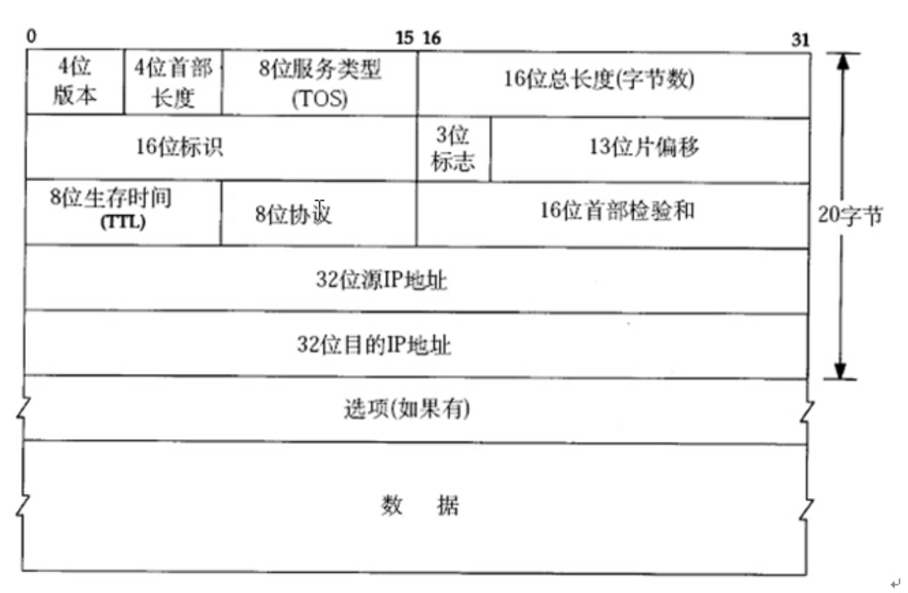
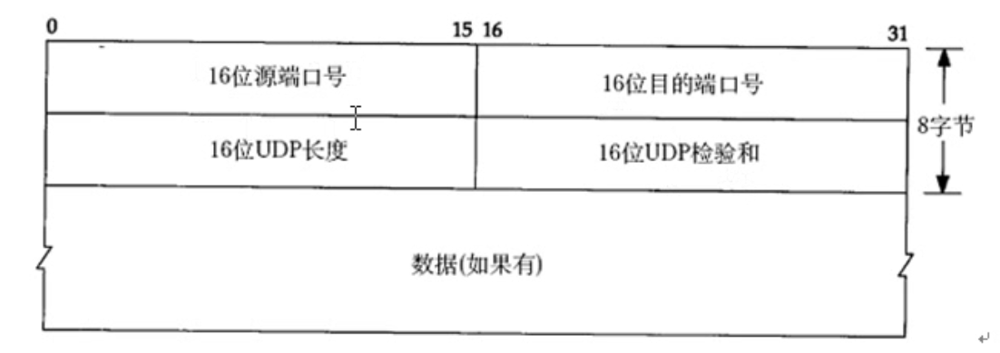
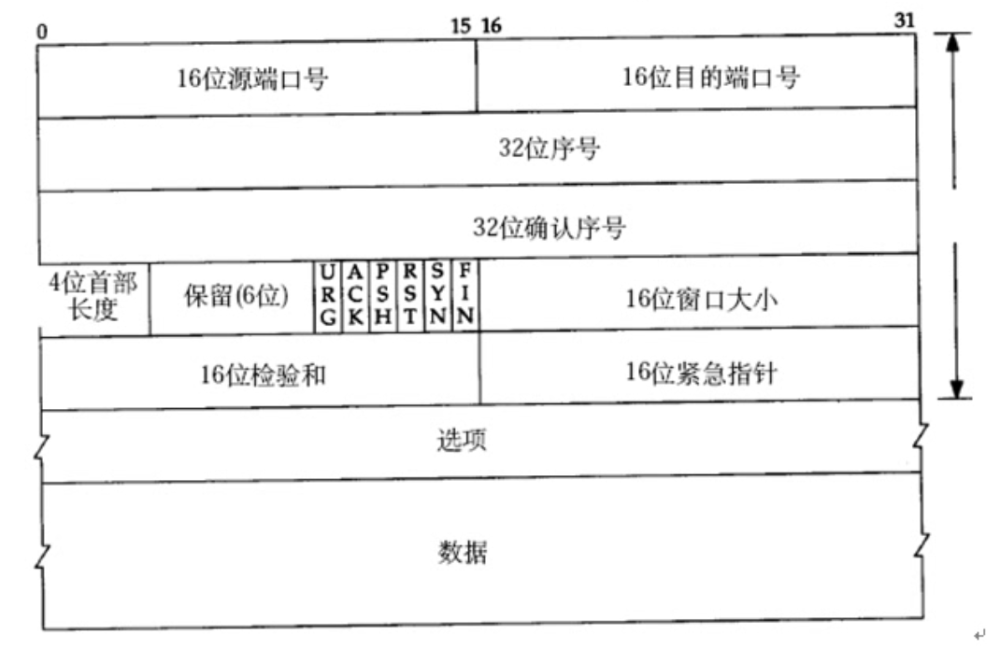
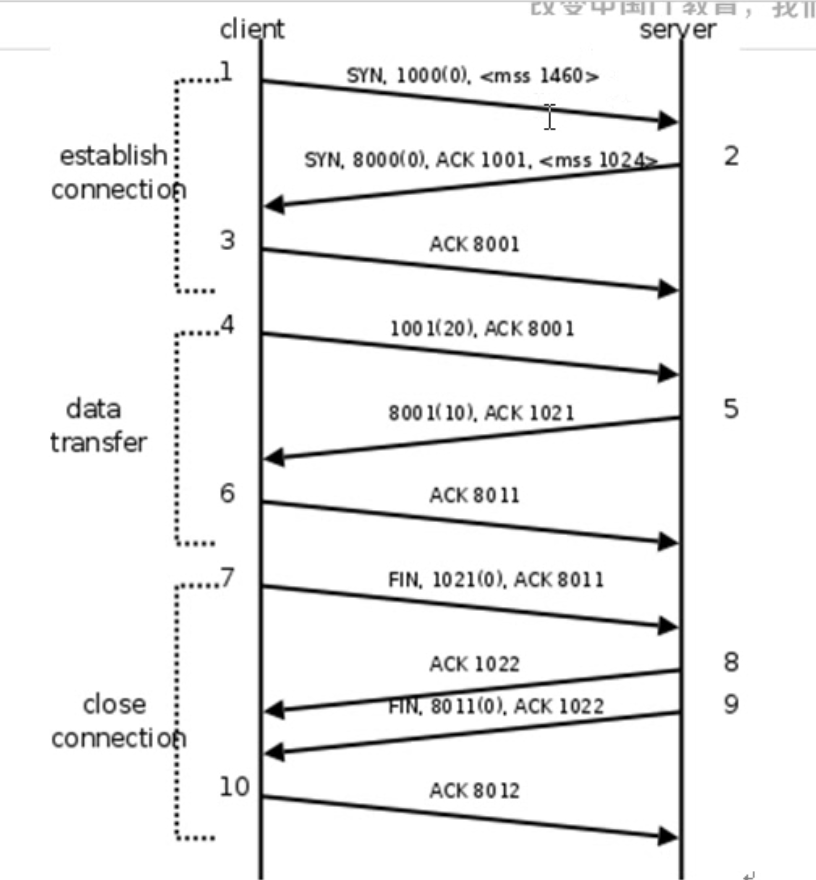
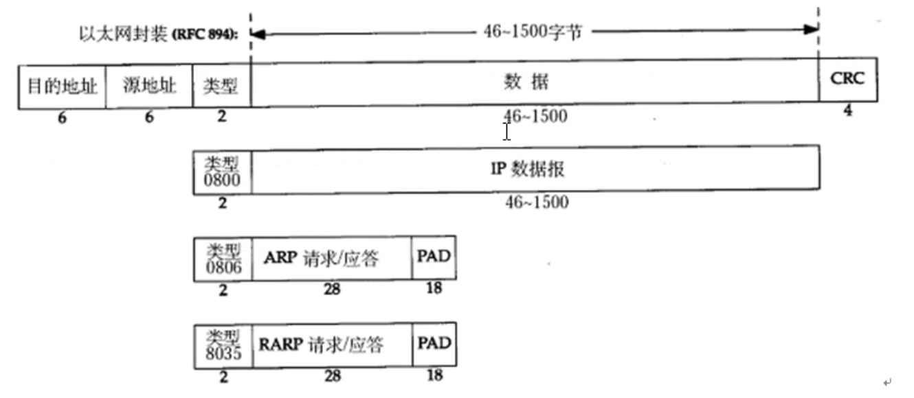
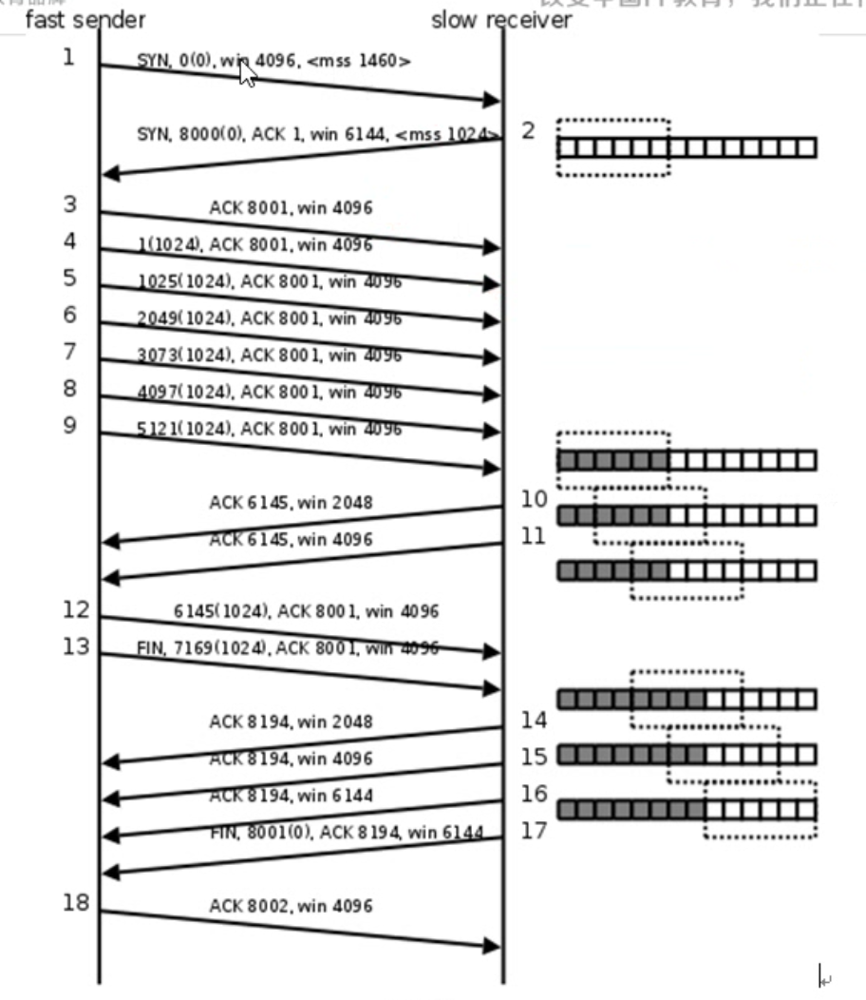
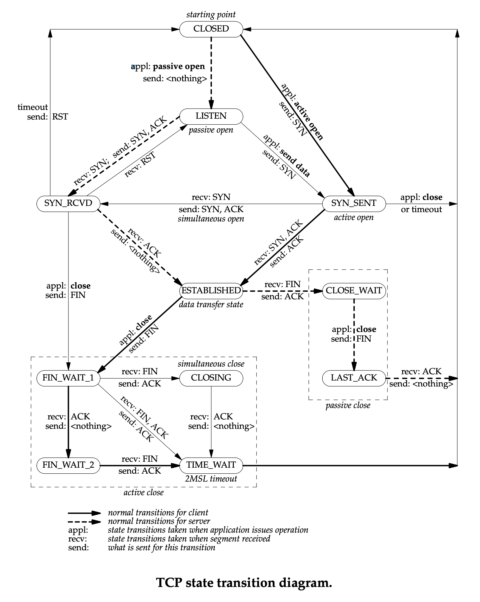

# 网络


### 协议
数据存储的规则,数据传输的规则

例如:传输文件的时候,开始先传文件名,然后传大小,然后传内容 -->ftp 的前身

分层模型结构
OSI 
七层模型,物数网传会表应
TCP/IP 
四层模型 网(链路层/网络接口层)网(网络层)传(传输层)应(应用层)
应用层: http ftp nfs ssh telnet
传输层: tcp udp
网络层: ip icmp igmp
链路层: 以太网帧协议,ARP协议

数据经过一层层的封装,最后在链路层进行传输.对端拿到包之后一层层解封,获取数据.
```ditaa
                                                                                                 
                     A                                                     B                     
                 ┌───────┐                                             ┌───────┐                 
                 │ data  │                                             │ data  │                 
                 └───────┘                                             └───────┘                 
                     │                                                     ▲                     
                     │                                                     │                     
                     │                                                     │                     
                     │                                                     │                     
                     ▼                                                     │                     
             ┌──────────────┐                                      ┌──────────────┐       ▲      
     │       │     data     │                                      │     data     │       │      
     │       ├──────────────┤                                      ├──────────────┤       │      
     │       │ application  │              user                    │ application  │    depackage 
     │    ───┼──────────────┼──────────────────────────────────────┼──────────────┼──▶    │      
 package     │transportation│            kernel                    │transportation│       │      
     │       ├──────────────┤     ─────────network─────────▶       ├──────────────┤       │      
     │       │   network    │                                      │   network    │       │      
     │       ├──────────────┤                                      ├──────────────┤       │      
     ▼       │     link     │                                      │     link     │       │      
             └──────────────┘                                      └──────────────┘              
```

应用层需要用户对数据进行封装.
传输层开始内核封装.
 
```ditaa
                                                      ┌────┐               
                                                      │data│               
                                                      └────┘               
                                                                           
                                                                           
                                                                           
                                     ┌────────────────┬────┐               
                                     │application head│data│               
                                     └────────────────┴────┘               
                                                                           
                                                                           
                                                                           
                          ┌──────────┬────────────────┬────┐               
                          │ TCP head │application head│data│               
                          └──────────┴────────────────┴────┘               
                                                                           
                                                                           
                                                                           
               ┌──────────┬──────────┬────────────────┬────┐               
               │ IP head  │ TCP head │application head│data│               
               └──────────┴──────────┴────────────────┴────┘               
                                                                           
                                                                           
┌──────────────┬──────────┬──────────┬────────────────┬────┬──────────────┐
│ethernet head │ IP head  │ TCP head │application head│data│ethernet tail │
└──────────────┴──────────┴──────────┴────────────────┴────┴──────────────┘
```

#### 以太网帧格式
```ditaa
┌────────────────┬─────────────┬─────────┬──────────────────────────────────────────────────┬────────┐
│MAC destination │ MAC source  │  type   │                       data                       │  CRC   │
└────────────────┴─────────────┴─────────┴──────────────────────────────────────────────────┴────────┘
                                                                                                      
 ─────────6──────▶──6──────────▶─2───────▶───────────────────46-1500────────────────────────▶──4─────▶
                                                                                                      

```
MAC地址:网卡硬件地址.厂商生产网卡的时候需要申请mac的空间.
目标MAC地址:在发送数据之前发送ARP请求获取MAC地址

#### ARP
ARP协议:根据IP地址获取mac地址 
ARP请求帧可以理解成以太网帧格式的一种特例

请求
```ditaa
┌─────────────────┬─────────────┬────┬─────┬──────────────┬──────────────┬────────────────┬──────────────┬────────┐
│ff:ff:ff:ff:ff:ff│ MAC source  │0806│8 bit│  MAC source  │  IP source   │ff:ff:ff:ff:ff:f│IP destination│  CRC   │
└─────────────────┴─────────────┴────┴─────┴──────────────┴──────────────┴────────────────┴──────────────┴────────┘
```
当前目标mac地址不知道,因此请求中都打上ff..ff
ARP请求发送后,在路由中转.路由表记录和路由器连接的其他路由器地址.路由对路由表的连接路由进行广播.如果是ARP的包头请求,收到的路由器会查看本机IP地址是否与请求包中目标IP地址一致,一致的话就回包,在回包中加上目标mac信息.不一致就丢弃.
回报的时候因为是发给source机器,因此发包的时候source的mac是自己的mac,但是目标mac就是请求中的source mac.包文中的信息也同样替换
根据格式填充的包文
```ditaa
┌─────────────┬────────────────┬────┬─────┬────────────────┬──────────────┬──────────────┬──────────────┬────────┐
│ MAC source  │MAC destination │0806│8 bit│MAC destination │IP destination│  MAC source  │  IP source   │  CRC   │
└─────────────┴────────────────┴────┴─────┴────────────────┴──────────────┴──────────────┴──────────────┴────────┘
```
RARP协议则是根据mac获取ip的请求 type是8035

#### 以太网帧格式
根据mac地址,完成数据报传输

#### IP协议

IP段格式

**版本**:ipv4 ipv6 4位

**TTL**:time to live,这里time是次数.这里设置的是数据报在路由节点中的跳转上限.
有可能因为网络不通,到达不了的请求会在网路路由中不断找.
TTL是一个次数,每一跳(就是从一个路由器跳转到下一个路由器)都会-1.当TTL减少为0的时候,数据报被路由器丢弃,防止拥塞网络.

**32位源IP** 4字节    
**32位目标IP**  4字节

日常用的192.168.101.1 是转给人类看的,称为点分十进制IP地址.是字符串.   真正网络传输是二进制的IP地址.


IP地址:可以在网络环境中唯一表示一台主机.
port:可以在网络的一台主机上唯一表示进程
IP + port: 网络环境中标识唯一进程

一般是5000以下有指定,使用5000以上的端口号较好


#### UDP协议

 


#### TCP协议

16位源端口号 2字节 2^16,65536 能描述最大的端口号
16位目的端口号 2字节 2^16 65536
32位序号
32位确认序号 相当于回执
6个标志位
16位窗口大小 65536


#### bs cs

||c s|b s|
|优点|缓存大量数据,协议选择灵活,速度快,|安全性好,跨平台,开发量小|
|缺点|安全性,不好跨平台,开发量大|不能缓存大量数据,严格遵守http|

#### 网络字节序
小端 intel提出.因为现在设备基本是intel芯片,所以很多机器是使用小端 little endian
高位存高地址,低位存低地址
ex:0x12345678
```ditaa
┌────┐ high
│ 12 │
├────┤
│ 34 │
├────┤
│ 56 │
├────┤
│ 78 │
└────┘ low
``` 

大端 IBM最初的协议.因为IBM最初做存储,因此网络使用大端 big endian
高位存低地址,低位存高地址
```ditaa
┌────┐  high
│ 78 │
├────┤
│ 56 │
├────┤
│ 34 │
├────┤
│ 12 │  low
└────┘
```

网络中使用大端解包.因此需要一次网络字节序和主机字节序的转换.

转换函数:
htonl //host to network long 本地转到网络(ip)
htons //host to network short 本地转网络(port)
ntohl //network to host long 网络转本地(ip)
ntohs //netowrk to host short 网络转本地(port)

### tcp/ip通信
 
#### 建立连接
大部分是客户端主动发起连接

客户端在标志位写上SYN 专门用于建立连接通信
下图的连接传输格式
mss:最长报文长度  maximum segment size
举例:
- SYN,1000(0),<mss 1460>
<当前标志位>,<当前序列号>(<当前数据大小>)<后续通信每个包的上限>
1460表示将来传输数据的时候数据的上限,
这个大小从以太网帧大小会得到控制

以太网的数据上限是1500,所以每个以太网帧的数据最大是1500.
但是在以太网数据中除了tcp数据还有ip头和tcp头
```ditaa
┌──────────────┬──────────┬──────────┬────────────────┬────┬──────────────┐
│ethernet head │ IP head  │ TCP head │         data        │ethernet tail │
└────14────────┴──────20──┴────20────┴────────────────┴────┴───────4──────┘
```
以太网帧的数据段大小是46-1500字节,因此tcp包的数据段是6-1460大小.

服务器**同意**建立连接的时候,标志位设成ACK 例如回包
- SYN,8000(0),ACK 1001,<mss 1024>
这里的1001表示:服务端给客户端说1001号包之前的数据我都收到了.
为什么是1001不是1000?客户端请求并没有带数据.
原因:因为客户端请求中有SYN标志位,**占一字节**.服务器认为收到了这一个字节的数据,意思是这个SYN标志位收到了.所以回包是1001,不是1000
<mss 1024>表示后续通信服务器发给客户端携带的数据上限是1024.
SYN 表示服务器要和客户端建立连接.
因为tcp是双向通信,不是单向通信,所以建立的是两条单向的连接.在前面ACK 1001看到服务端已经收到了客户端的SYN请求,到这里客户端->服务端的连接可以认为已经建立
8000表示服务器发送包的包号 0表示携带数据的大小

- ACK 8001
说明客户端受到服务端的连接请求,返回ACK <客户端包号>+1, 表示应答服务端的连接请求.
当服务器顺利收到ACK的时候,双方建立连接完成.

```ditaa
     │                                                  │    
     │                                                  │    
   cli                                                svr    
     │                                                  │    
     │                                                  │    
     ╳                                                  │    
     │╲                                                 │    
     │ ╲────────────────────SYN 1000(0)────────────────╲│    
     │                                                  ▼    
     │                                                  ╳    
     │                                                 ╱│    
     │╱────────────SYN 8000(0) ACK 1001───────────────╱ │    
     ▼                                                  │    
     ╳                                                  │    
     │╲                                                 │    
     │ ╲──────────────ACK 8001────────────────────────╲ │    
     │                                                 ╲│    
     │                                                  ▼  3次握手完成 (内核完成) 
     │                                                  │  cli:connect()成功执行并返回
     │                                                  │  svr:accept()成功执行并返回
     │                                                  │    
     │                                                  │    
     ▼                                                  │    
                                                        ▼    
```

#### 数据通信
cli->svr: 1001(20),ACK 8001
客户端向服务器发送数据.
- 1001:当前客户端的包号.
- 20:发送20字节数据过去.
- ACK 8001 前面连接已经建立,这一步其实可以不发送.但是鉴于复杂的网络情况:如果三次握手的时候,最后一个cli->svr的包ACK 8001没有发送到,或者因为网络阻塞等原因svr收到较晚,svr可能认为建立还没成功(因为没收到cli发来的答应).为了保险,把ACK 8001在第一次数据的时候也带上,这种情况下的数据发送svr会认同,并且数据接收成功.可以理解是一种**双保险**机制
ACK可以理解成一个回执.每次发数据/请求的时候都会带上,作为上一次对端数据发送的回执,告知对端数据的情况.

svr->cli: 8001(10),ACK 1021
- 8001:当前客户端的包号
- 10:发送10字节数据过去
- ACK 1021 cli的回执.表示1021号包之前的数据都已经收到.

包序号的问题:
每一端都管理自己的包号.例如:cli发送请求的时候,是1000 但是因为SYN标志位的原因,svr回包1001.后续发送数据的时候是1001开始.
可以理解成:1001包号发送的数据,里面的数据数是x.下个包号就是1001+x.也就是当前的序号是已经确认发送了的序号,然后未知道发送是否成功的大小,到了对端确认收成功的时候,把序号增加(表示已经传输成功)

cli->svr
- ACK 8011 8011号包之前的数据都已经收到了.

数据传输并不会每次都只发一个包.使用窗口机制可以批量发送.

cli发送很多包,svr反馈都收到了很多包.

#### 关闭连接
有可能服务器,也有可能客户端发起.
更多是客户端发起关闭.
```ditaa
                                                  │     
    │                                             │     
    │                                             │     
   cli                                           svr    
    │                                             │     
    ╳                                             │     
    │╲                                            │     
    │ ╲──────FIN,1021(0),ACK 8011────────────────╲│     
    │                                             ▼     
    │                                             ╳     
    │                                            ╱│     
    │ ╱─────────────ACK 1022────────────────────╱ │     
    │╱                                            │     
    ▼                                             │    半关闭完成.这里是cli完成半关闭.cli->svr的通信关闭
    │                                             ╳    底层可以理解cli的**写缓冲关闭**.
    │                                            ╱│    但是此时svr->cli的通信还没关闭. 
    │╱─────FIN,8011(0),ACK 1022─────────────────╱ │     
    ▼                                             │     
    ╳                                             │     
    │╲                                            │     
    │ ╲───────────────ACK 8012───────────────────╲│     
    │                                             ▼    4次挥手断开连接 (全关闭)
    │                                             │     
    │                                             │     
    │                                             │     
    │                                             │     
    │                                             │     
    │                                             │     
    │                                             │     
    │                                             │     
    ▼                                             ▼     
```
注意:这里的1021是cli管的包序号.观察cli的包序号可以看到:cli或者svr的包序号都是根据自己已经确认被发送的包个数增上去的.
cli->svr: FIN,1021(0),ACK 8011
表示客户端关闭连接,当前包序号是1021,ACK应答之前收到的包号是8011(8011之前的都收到了)
svr->cli: ACK 1022
表示svr已经收到了这个请求,并且发给cli FIN这个信息已经收到了.
到这里完成了半关闭

注意:cli发起关闭tcp连接之后,svr后续是读不到的.因为cli的sfd已经把写缓冲区关闭.
svr如果read为0(暂时这样理解,应该有更好地办法识别到cli关闭了通信),可以进行关闭tcp连接
```ditaa
                                                                      │                        
                        │                                             │                        
                        │                                             │                        
    cli close(sfd)     cli                                           svr                       
                        │                                             │                        
                        ╳                                             │                        
                        │╲                                            │                        
    ┌────────────┐      │ ╲──────FIN,1021(0),ACK8011─────────────────╲│                        
    │ cli socket │      │                                             ▼                        
    │            │      │                                             ╳                        
    ├────────────┤      │                                            ╱│                        
    │  r buffer  │      │ ╱─────────────ACK 1022────────────────────╱ │    svr read(sfd) == 0  
    ├────────────┤      │╱                                            │                        
    │██w buffer██│      ▼                                             │                        
    └────────────┘      │                                             │                        
                        │                                             │                        
                        │                                             │                        
                        │                                             │      svr close(sfd)    
                        │                                             │                        
                        │                                             ╳                        
                        │                                            ╱│                        
                        │╱─────FIN,8011(0),ACK 1022─────────────────╱ │                        
                        ▼                                             │                        
                        ╳                                             │                        
                        │╲                                            │                        
                        │ ╲───────────────ACK 8012───────────────────╲│                        
                        │                                             ▼                        
                        │                                             │                        
                        │                                             │                        
                        │                                             │                        
                        ▼                                             ▼                        
```
服务器close关闭成功的时候,拿到cli的最后返回.

**半关闭**:
```ditaa
┌────┐─────────────────────────────────────────▶┌────┐ 
│cli │                                          │svr │ 
└────┘◀─────────────────────────────────────────└────┘ 
                                                       
                          │                            
                          │                            
                          ▼                            
┌────┐                                          ┌────┐
│cli │─────────────────────────────────────────▶│svr │
└────┘                                          └────┘
```
从原来全双工通信退化成单工通信.数据只能单方向传输.

svr->cli FIN,8011(0),ACK 1022
表示服务端关闭连接.当前包序列号是8011 之前cli发给svr的1022号包之前的都已经收到(此处包括了FIN这1个字节,和SYN类似)
cli->svr ACK 8012
收到了svr的关闭请求,断开连接

为什么需要4次挥手不是3次?
原因:半关闭 svr可能还有数据要发

服务器必须收到了最后一个cli->svr ACK 8012,才能确认关闭连接这个事情完成.
ex:svr->cli FIN,8011(0),ACK 1022发送后,一直没有收到cli->svr ACK 8012,此时svr**隔一段时间就会发送一次**svr->cli FIN,8011(0),ACK 1022,确保cli收到svr发出的关闭连接请求.

//TODO 关闭的socket 内核机制

### 滑动窗口 tcp流量控制

16位的窗口大小,最大是65535

假定场景:发送方很开,但是接收方很慢.
接收方接收数据,本质是内核对这个sokcet的读buff接收可能过慢(例如进程较多,cpu处理不过来等)

如果接收方读buff已经满了,继续让发送方发送数据,可能导致读buff数据被覆盖.不可以发生.

服务器内部使用滑动窗口机制,指定缓冲区大小,让发送方根据指定的缓冲区大小发送数据.
如果缓冲区填满了,就告诉发送方先不要发

建立连接的时候,可以沟通滑动窗口win的大小.
建立连接时:
cli->svr win 4096 告知svr:cli的win是4096
svr->cli win 6144 告知cli:svr的win是6144

cli每次发数据时候都会把自己的win发送过去
在图示步骤4-9中,因为窗口大小是6144,因此sender直接发了5个包 5120大小.
再发的话会超 6145.因为超过了rcvr的win.
这时候  9 - 12 sender等待rcvr处理

步骤10:rcvr处理了滑动窗口中的部分字节,剩余2048字节可用.
步骤11:同上 处理多了点,剩余4096可以用.
利用滑动窗口不停接收和处理数据
把buffer当做窗口,已经处理的数据看成一个长的数据列

滑动窗口的目的是**防止数据丢失**

###32位序号 32位确认序号
每次返回的ACK的序号是32位确认序号(暂时理解为写缓冲处理完的序号)
告知对端当前发送的包序号是32位序号

这个序号最大是2^32


## tcp状态
netstat -apn |grep <port>
ex
```
➜  linux netstat -apn |grep 9999
(Not all processes could be identified, non-owned process info
 will not be shown, you would have to be root to see it all.)
tcp        0      0 0.0.0.0:9999            0.0.0.0:*               LISTEN      13918/./s
tcp        0      0 127.0.0.1:48924         127.0.0.1:9999          ESTABLISHED 13927/./c
tcp        0      0 127.0.0.1:9999          127.0.0.1:48924         ESTABLISHED 13918/./s
unix  2      [ ]         DGRAM                    6699991  -
```
可以看到 第一个fd是用于监听的,第三个是用于建立连接 (都是./s的)
第二个是cli的
监听的fd是LISTEN
建立连接的两个fd是ESTABLISHED

cli关闭后可以看到进入TIME_WAIT
```
➜  linux netstat -apn |grep 9999
(No info could be read for "-p": geteuid()=1000 but you should be root.)
tcp        0      0 127.0.0.1:48924         127.0.0.1:9999          TIME_WAIT   -
unix  2      [ ]         DGRAM                    6699991  -
```
//TODO  svr没有close主动退出进程, svr是fin_wait2 cli是close_wait 为什么
先关闭svr(没有close)然后再启动svr,启动失败,返回绑定地址事变
```
➜  linux netstat -apn |grep 9999
(Not all processes could be identified, non-owned process info
 will not be shown, you would have to be root to see it all.)
tcp        1      0 127.0.0.1:48948         127.0.0.1:9999          CLOSE_WAIT  20200/./c
tcp        0      0 127.0.0.1:9999          127.0.0.1:48948         FIN_WAIT2   -
unix  2      [ ]         DGRAM                    6699991  -
```

只有主动关闭的一方会进入TIME_WAIT

建立连接的时候如果svr在syn_rcvd状态没有收到cli的ack,会重新发送syn ack包,表示已经建立连接并且请求cli建立连接.防止网络原因丢包
其他状态下发送的请求也是,会不断重发.//TODO 发送时间多久

```ditaa
┌─────────────┐ │                                                  │ ┌─────────────┐
│             │ │                                                  │ │   CLOSED    │
│   CLOSED    │cli                                                svr├─────────────┤
│             │ │                                                  │ │             │
│             │ │                                                  │ │             │
├─────────────┤ ╳                                                  │ │   LISTEN    │
│             │ │╲                                                 │ │             │
│             │ │ ╲─────────────────────SYN 500(0)────────────────╲│ │             │
│             │ │                                                  ▼ │             │
│  SYN_SENT   │ │                                                  ╳ ├─────────────┤
│             │ │                                                 ╱│ │             │
│             │ │╱─────────────SYN 700(0) ACK 501────────────────╱ │ │             │
│             │ ▼                                                  │ │             │
├─────────────┤ ╳                                                  │ │  SYN_RCVD   │
│             │ │╲                                                 │ │             │
│             │ │ ╲──────────────ACK 701─────────────────────────╲ │ │             │
│             │ │                                                 ╲│ │             │
│             │ │                                                  ▼ ├─────────────┤
│             │ │                                                  │ │             │
│             │ │                                                  │ │             │
│             │ │                                                  │ │             │
│ ESTABLISHED │ │                                                  │ │             │
│             │ ▼                                                  ▼ │             │
│             │                                                      │             │
│             │                                                    │ │             │
│             │ │                                                  │ │ ESTABLISHED │
│             │ │                                                  │ │             │
│             │ │ cli                                            svr │             │
│             │ │                                                  │ │             │
├─────────────┤ ╳                                                  │ │             │
│             │ │╲                                                 │ │             │
│             │ │ ╲────────FIN,1021(0),ACK8011────────────────────╲│ │             │
│             │ │                                                  ▼ │             │
│ FIN_WAIT_1  │ │                                                  ╳ ├─────────────┤
│             │ │                                                 ╱│ │             │
│             │ │ ╱───────────────ACK 1022───────────────────────╱ │ │             │
│             │ │╱                                                 │ │             │
├─────────────┤ ▼                                                  │ │ CLOSE_WAIT  │
│             │ │                                                  │ │             │
│             │ │                                                  │ │             │
│             │ │                                                  │ │             │
│             │ │                                                  │ │             │
│ FIN_WAIT_2  │ │                                                  ╳ ├─────────────┤
│             │ │                                                 ╱│ │             │
│             │ │ ╱──────────────────────────────────────────────╱ │ │             │
│             │ │╱        FIN,8011(0),ACK 1022                     │ │             │
│             │ ▼                                                  │ │  LASK_ACK   │
├─────────────┤ ╳                                                  │ │             │
│             │ │╲                                                 │ │             │
│             │ │ ╲──────────────────ACK 8012─────────────────────╲│ │             │
│             │ │                                                  ▼ ├─────────────┤
│             │ │                                                  │ │             │
│  TIME_WAIT  │ │                                                  │ │             │
│             │ │                                                  │ │             │
│             │ ▼                                                  ▼ │             │
│             │                                                      │             │
│           2MSL(~40s)                                               │   CLOSED    │
├─────────────┤                                                      │             │
│             │                                                      │             │
│   CLOSED    │                                                      │             │
│             │                                                      │             │
│             │                                                      │             │
└─────────────┘                                                      └─────────────┘

```

2MSL 为了保证最后一个ACK成功被对端接收
等待期间如果对端没有收到,对端会再发送FIN
2MSL发生在主动发生关闭连接一端.因为是为最后一个ack服务的,确保最后一个ack在网络中消失:
- 如果对端收不到最后的ack,在msl内应该要再次发送一个fin ack,因为对端应该在last_ack内是等待本端的ack请求
- 对端最后的ack发放到本端接收最多不超过msl
如果连2个msl都超过,但是没有收到中间对端的fin ack,可以认为:
- 对端收到了最后的ack,对端已经成功close
- 当前网络gg


### 一些非常规情况
#### 握手过程cli没有收到svr的ack
内核会有超时时间,或者应用在SYN_SENT状态关闭了连接:cli**转为close状态**
可以认为当前的请求连接失败,进入关闭状态,后续重新连接.
```ditaa
┌─────────────┐ │                                                  │ ┌─────────────┐
│             │ │                                                  │ │   CLOSED    │
│   CLOSED    │cli                                                svr├─────────────┤
│             │ │                                                  │ │             │
│             │ │                                                  │ │             │
├─────────────┤ ╳                                                  │ │   LISTEN    │
│             │ │╲                                                 │ │             │
│             │ │ ╲─────────────────────SYN 500(0)────────────────╲│ │             │
│             │ │                                                  ▼ │             │
│             │ │                                                  │ └─────────────┘
│             │ │                                                  │                
│  SYN_SENT   │ │                                                  │                
│             │ │                                                  │                
│             │ │                                                  │                
│             │ │                                                  │                
│             │ │                                                  │                
│             │ │                                                  │                
╠═════════════╣ │                                                  │                
║             ║ │                                                  │                
║   CLOSED    ║ │                                                  │                
║             ║ │                                                  │                
╚═════════════╝ │                                                  │                
                ▼                                                  ▼                
```
#### SENT状态时候收到的不是SYN ACK 而是SYN
说明对端也在请求连接.这里会进入SYN_RCVD,等待对端的ack然后进入ESTABLISHED
可以认为是对端也在请求连接,所以需要发出确认信号(同时发syn ack).因为**此时对端已经有意向和本端连接**,所以没必要再次发送一次请求对端和本端连接的请求.收到对端的ack,可以认为对端已经确认了本端意向的通信.能成功拿到对端的syn ack就可以认为:
- 已经回复对端同意建立对端的连接请求
- 本端的连接请求对端已经同意连接

因此进入establish状态.
```ditaa
┌─────────────┐ │                                                  │ ┌─────────────┐
│             │ │                                                  │ │             │
│   CLOSED    │cli                                                svr│   CLOSED    │
│             │ │                                                  │ │             │
│             │ │                                                  │ │             │
├─────────────┤ ╳                                                  ╳ ├─────────────┤
│             │ │╲                                                ╱│ │             │
│             │ │ ╲─────────────────────SYN 500(0)───────────────╳ │ │  SYN_SENT   │
│             │ │                                               ╱ ╲│ │             │
│             │ │                                              ╱   ▼ │             │
│  SYN_SENT   │ │   ╱─────────────────SYN 700(0)──────────────╱    ╳ ├─────────────┤
│             │ │  ╱                                              ╱│ │             │
│             │ │ ╱                                              ╱ │ │             │
│             │ │╱                                              ╱  │ │             │
│             │ ▼                                              ╱   │ │             │
├─────────────┤ ╳                                             ╱    │ │  SYN_RCVD   │
│             │ │╲   ╱────────SYN 700(0) ACK 501─────────────╱     │ │             │
│             │ │ ╲ ╱                                              │ │             │
│  SYN_RCVD   │ │  ╳───────────SYN 500(0) ACK 701───────────────╲  │ │             │
│             │ │ ╱                                              ╲ │ │             │
│             │ │╱                                                ╲│ │             │
├─────────────┤ ▼                                                  ▼ ├─────────────┤
│             │ │                                                  │ │             │
│             │ │                                                  │ │             │
│ ESTABLISHED │ │                                                  │ │ ESTABLISHED │
│             │ │                                                  │ │             │
│             │ │                                                  │ │             │
│             │ │                                                  │ │             │
└─────────────┘ │                                                  │ └─────────────┘
                │                                                  │                
                │                                                  │                
                │                                                  │                
                │                                                  ▼                
                ▼                                                                   
```
#### SYN_RCVD之后对端没有发ack回应请求建立
这里有两种情况:
1.svr建立连接的时候收到cli的syn,返回了ack并且请求和cli建立连接(syn)但是没有得到回应(没有收到ack).内核会在超时后把状态流转为LISTEN//TODO 具体机制
2.svr在syn_rcvd时候收到了RST请求
会转到LISTEN,重新监听端口.
可以理解为:
本端同意了对端的连接,但是对端迟迟没有答复.这种可能对端gg了也可能网络gg了,继续监听.
如果收到了RST,就是对端要求重新连接.

#### 关闭时候对端也发送了FIN请求
同时关闭

1.对端发送的是fin请求
可以理解:
- 本端有意向请求对端关闭
- 本端知道对端有意向和本端关闭
- 本端回包ack,表示本端同意关闭
- 本端等待对端ack,如果收到,对端答应了本端的关闭
- 收到对端ack后进入TIME_WAIT,是因为收到对端ack能确认的是本端的关闭连接对端已经确认(也就是本端不在给对端传送数据),但是本端给对端的ack(也就是本端同意对端不再连接本端)的确认信息对端不一定会拿到.等待TIME_WAIT防止对端可能没有收到本端的ack,可能重新发包告知请求fin.
  
```ditaa
                                                                   │  ┌─────────────┐
┌─────────────┐ │                                                  │  │             │
│             │ │                                                  │  │             │
│ ESTABLISHED │ cli                                                │  │             │
│             │ │                                                svr  │ ESTABLISHED │
│             │ │                                                  │  │             │
├─────────────┤ ╳                                                  │  │             │
│             │ │╲                                                 │  │             │
│             │ │ ╲                                                │  │             │
│             │ │  ╲                                               ╳  ├─────────────┤
│             │ │   ╲                                             ╱│  │             │
│             │ │    ╲                                           ╱ │  │             │
│ FIN_WAIT_1  │ │     ╲                                         ╱  │  │             │
│             │ │   ╱──╳──────────────FIN, 8011(0)─────────────╱   │  │             │
│             │ │  ╱    ╲                                          │  │             │
│             │ │ ╱      ╲─────FIN,1021(0)────────────────╲        │  │             │
│             │ │╱                                         ╲       │  │             │
│             │ ▼                                           ╲      │  │ FIN_WAIT_1  │
╠═════════════╣ ╳                                            ╲     │  │             │
║             ║ │╲                                            ╲    │  │             │
║             ║ │ ╲                                            ╲   │  │             │
║             ║ │  ╲                                            ╲  │  │             │
║             ║ │   ╲                                            ╲ │  │             │
║             ║ │    ╲                                            ╲│  │             │
║   CLOSING   ║ │     ╲                                            ▼  │             │
║             ║ │      ╲──────ACK 8012──────────────────────╲      ╳  ╠═════════════╣
║             ║ │                                            ╲    ╱│  ║             ║
║             ║ │                                             ╲  ╱ │  ║             ║
║             ║ │  ╱───────────ACK 1022────────────────────────╳╱  │  ║   CLOSING   ║
║             ║ │ ╱                                             ╲  │  ║             ║
║             ║ │╱                                               ╲ │  ║             ║
╠═════════════╣ ▼                                                 ╲│  ║             ║
║             ║ │                                                  ▼  ╠═════════════╣
║             ║ │                                                  │  ║             ║
║             ║ │                                                  │  ║             ║
║             ║ │                                                  │  ║             ║
║  TIME_WAIT  ║ │                                                  │  ║             ║
║             ║ │                                                  │  ║  TIME_WAIT  ║
║             ║ │                                                  │  ║             ║
║             ║ │                                                  │  ║             ║
║             ║ │                                                  │  ║             ║
╚═════════════╝ │                                                  │  ║             ║
                ▼                                                  ▼  ╚═════════════╝
```

2.对端发送的是fin ack请求
可以理解为三次松手.
对端收到了FIN请求,然后请求对端断开本端的连接
后面的timewait和上一种情况类似.
```ditaa
┌─────────────┐                                                                     
│             │                                                    │                
│             │ │                                                  │ ┌─────────────┐
│ ESTABLISHED │ │                                                  │ │             │
│             │ │ cli                                            svr │             │
│             │ │                                                  │ │             │
├─────────────┤ ╳                                                  │ │ ESTABLISHED │
│             │ │╲                                                 │ │             │
│             │ │ ╲────────FIN,1021(0),ACK8011────────────────────╲│ │             │
│             │ │                                                  ▼ │             │
│ FIN_WAIT_1  │ │                                                  ╳ ╠═════════════╣
│             │ │                                                 ╱│ ║             ║
│             │ │ ╱─────────FIN, 8011() ACK 1022─────────────────╱ │ ║             ║
│             │ │╱                                                 │ ║             ║
│             │ ▼                                                  │ ║   CLOSING   ║
╠═════════════╣ ╳                                                  │ ║             ║
║             ║ │╲                                                 │ ║             ║
║             ║ │ ╲───────────────────ACK 8012───────────────────╲ │ ║             ║
║             ║ │                                                 ╲│ ║             ║
║             ║ │                                                  ▼ ╠═════════════╣
║  TIME_WAIT  ║ │                                                  │ ║             ║
║             ║ │                                                  │ ║             ║
║             ║ │                                                  │ ║             ║
║             ║ │                                                  │ ║             ║
║             ║ │                                                  │ ║  TIME_WAIT  ║
╠─────────────╣ │                                                  │ ║             ║
│             │ │                                                  │ ║             ║
│   CLOSED    │ │                                                  │ ║             ║
│             │ │                                                  │ ║             ║
│             │ │                                                  │ ╠─────────────╣
└─────────────┘ │                                                  │ │             │
                ▼                                                  ▼ │   CLOSED    │
                                                                     │             │
                                                                     │             │
                                                                     └─────────────┘
```


### tcp状态转移图



### 2MSL
端口复用
time_wait时候占用端口.只能通过复用的方法再用这个端口.否则绑定失败.
setsockopt能设置端口复用.
- optname SO_REUSEADDR
- optname SO_REUSEPORT

setsockopt(lfd,SOL_SOCKET,SO_REUSEADDR,(void *)&opt,sizeof(opt));
注意:需要在**绑定前**设置

//TODO test code

### 半关闭
shutdown(int  sockfd, int how)
- sockfd sfd
- how
    - SHUT_RD 读关闭 读缓存关闭
    - SHUT_WR 写关闭 写缓存关闭
    - SHUT_RDWR读写关闭

close和shutdown区别:
close无法精准关闭,只是关闭了fd.
简单文件操作,dup2(3,4)之后,close(3)还可以用4进行文件操作.
但是对于sock fd, 不管之前怎么dup,只要其中的sfd被shutdown,其他dup过去的fd都不能做对应的操作.所有指向socket fd的dentry都会关掉.
对比close,close只会是到了所有指向dentry的fd都关闭才会关闭.而shutdown会直接把这些fd都关闭-->**全关闭**

总结:
- 多个进程共享一个socket,close没调用1次,计数-1.直到计数为0,所有进程都close,socket被释放.
- 多个进程如果其中一个进程调用了shutdown,其他进程无法通信,因为使用的是**全关闭**的方法.但如果仅仅是close,其他进程不受影响.
