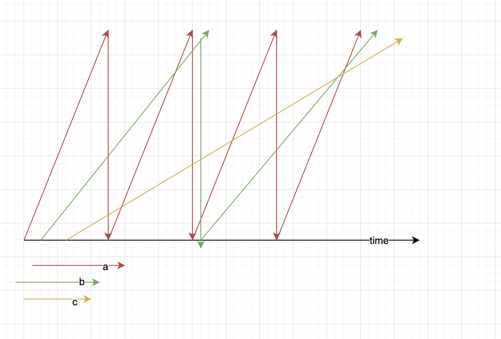

ng使用平滑分流的方式进行负载均衡
算法的做法大概是:
1.选出当前最大的  作为当前选出来的服务机器
2.最大的权重减去总权重总和
2.每个权重都加上自己原有的权重
举例子  a 4 b 2 c 1

|开始 |减少总和|加上自己权重|选择机器|
|---|---|---|---|
|4 2 1|-3 2 1|1 4 2|a|
|1 4 2|1 -3 2|5 -1 3|b|
|5 -1 3|-2 -1 3|2 1 4|a|
|2 1 4|2 1 -3|6 3 -2|c|
|6 3 -2|-1 3 -2|3 5 -1|a|
|3 5 -1|3 -2 -1|7 0 0|b|
|7 0 0|0 0 0|4 2 1|a|

大概理解是时间上根据频次进行分割,因此大概均匀
