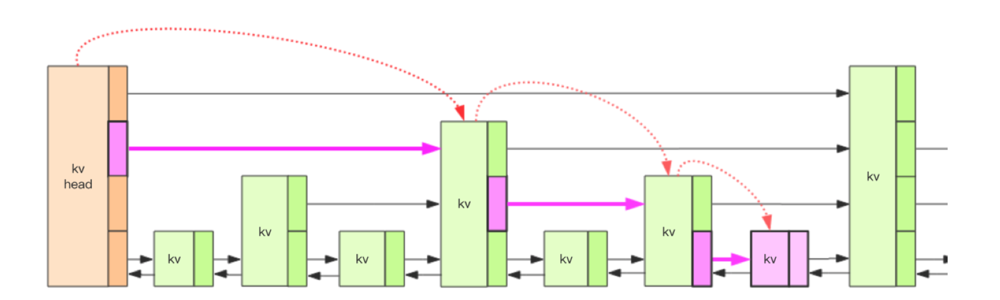

# SDS
字符串数据结构.  
通过结构体sdshdr sds handler 进行管理
```cpp
struct sdshdr {
    
    // buf 中已占用空间的长度
    int len;

    // buf 中剩余可用空间的长度
    int free;

    // 数据空间
    char buf[];
};
```
### sdslen
查看当前sds长度.  
因为每次操作的时候都会更新sdshdr.len,所以这里只是简单获取sdshdr的值.  
但是为了直接访问sds的内容,对外的sds指针是里面buf的指针.所以要先减去sdshdr大小,拿到sdshdr的头地址,然后访问.  
复杂度:O(1)
### sdsnewlen
根据给定的字符串长度,和内容,初始化字符串
注意:申请的内存大小是sdshdr和buf的大小,操作使用sdshdr操作,**返回的是buf的指针**.  
因此返回的内容可以直接当char*使用.  
### sdsempty
创建并返回一个空的sds  
直接是sdsnewlen("",0)
### sdsnew
给定字符串初始化sds,如果字符串有内容,用了strlen,复杂度:O(n)  
直接使用sdsnewlen创建
### sdsfree
释放sds,free O(n) //TODO为什么是n复杂度
### sdsclear
不释放sds内存,直接把buf第一个设置为\0,free=len,len=0.惰性删除.  
O(1)
### sdsMakeRoomFor
函数定义 sds sdsMakeRoomFor(sds s, size_t addlen) ,目标是对 sds 中 buf 的长度进行扩展，确保在函数执行之后buf 至少会有 addlen + 1 长度的空余空间.（额外的 1 字节是为 \0 准备的）

- s的free已经足够addlen大,直接返回s  
- s的free不够大,根据s的len加上入参addlen拿到新的长度newlen.  
    - newlen小于1024*1024,newlen *=2,预留长度防止后续继续扩张  
    - newlen已经>=1024*1024,加上一个 1024 *1024大小,防止后续扩张  
根据这个大小在入参s的sh地址zrealloc出sds头和buffer大小的空间  
注意:这里会**预先分配更多的空间**

### sdsRemoveFreeSpace
对sds的所有free空间会搜,使用zrealloc  
free设置为0.  
复杂度 O(N)
### sdsAllocSize
返回sds分配的字节数.直接返回sh len free +1的和.  
O(N)
### sdsgrowzero
让sds对设定的长度后面用0填充,用来扩充长度  
使用sdsMakeRoomFor扩充,memset塞0  
如果长度比原来的sds.len小,直接返回  
### sdscatlen
sdscatlen(sds s, const void *t, size_t len)  
把长度是len的t放在的后方.  
先对s使用sdsMakeRoomFor,扩展长度.(如果原来s足够大,不会扩展)  
把t通过memcpy放到sds的字符后方.(使用sdslen),在最后加上\0  
len和free进行调整.  
O(N)
### sdscat
sdscat(sds s, const char *t)  
把t放在s后.使用sdscatlen  
### sdscpylen
sdscpylen(sds s, const char *t, size_t len)  
把t放在s,buf的开始地址开始放,放len这么多.
如果s不够大,sdsMakeRoomFor  
然后memcpy
O(N)
### sdscpy
使用sdscpylen
### sdsll2str
ll转char*    
先把ll数据摆正  
逆序放入数组中,再进行一次调整,顺序回来.  
好处是不需要对负号进行再次调整.  
好处是不用每次都对指针进行定位.顺序的话指针需要多次移动,或者使用额外的空间存下来.  

```cpp
int sdsll2str(char *s, long long value) {
    char *p, aux;
    unsigned long long v;
    size_t l;

    /* Generate the string representation, this method produces
     * an reversed string. */
    v = (value < 0) ? -value : value;
    p = s;
    do {
        *p++ = '0'+(v%10);
        v /= 10;
    } while(v);
    if (value < 0) *p++ = '-';

    /* Compute length and add null term. */
    l = p-s;
    *p = '\0';

    /* Reverse the string. */
    p--;
    while(s < p) {
        aux = *s;
        *s = *p;
        *p = aux;
        s++;
        p--;
    }
    return l;
}
```
###  sdsull2str
没有负号转换的sdsll2str
### sdsfromlonglong
sdsll2str和sdsnewlen,返回sds

### sdscatvprintf
sds sdscatvprintf(sds s, const char *fmt, va_list ap)  
打印函数,使用静态数组提高效率,使用vsnprintf打印到指定buff,然后sdscat到s

### sdscatprintf
使用sdscatvprintf把字符串打印到s

### sdscatfmt
类似sdscatprintf,但是比较快,因为不使用sprintf,而是直接对sds的buff操作.
直接sdsMakeRoomFor之后memcpy,如果是数值型先sdsll2str等处理.

### sdstrim
sds sdstrim(sds s, const char *cset)   
修剪  
```cpp
* Example:
 *
 * s = sdsnew("AA...AA.a.aa.aHelloWorld     :::");
 * s = sdstrim(s,"A. :");
 * printf("%s\n", s);
 *
 * Output will be just "Hello World".

```
 核心
 如果当前指针的字符在cset集合中,跳过
 ```cpp
     // 修剪, T = O(N^2)
    while(sp <= end && strchr(cset, *sp)) sp++;
    while(ep > start && strchr(cset, *ep)) ep--;
 ```
如果当前字符不在起始位置,memmove.
然后更新属性
```cpp
    sh->free = sh->free+(sh->len-len);
    sh->len = len;
```
这里不会对内存做处理

### sdsrange
对buff内容做修改,使用memmove  
最后更新属性len free,不对内存做处理

### sdstolower
使用tolower
O(N)

### sdstoupper
使用toupper
O(N)

### sdscmp
使用memcmp

### sdssplitlen
sds *sdssplitlen(const char *s, int len, const char *sep, int seplen, int *count)  
返回数组
memcmp用来匹配断裂符号
使用sds数组指向结果,sdsnewlen新建结果存放
### sdsfreesplitres
释放sds数组,sdsfree每个sds,zfree数组
### sdscatrepr
sdscatrepr(sds s, const char *p, size_t len)  
在sds后追加长度为len的p字符串,如果p开始是特殊符号会在p结尾加上同样的特殊符号

### is_hex_digit
是否16进制.0-9,A-F,a-f

### hex_digit_to_int
16进制转10进制

### sdssplitargs
文本翻译成REPL格式
返回sds数组

### sdsmapchars
对固定长度的from 和to 字符替换


### sdsjoin
根据main的入参argc argv依次把字字符串连接

# adlist 双向链表
双端链表结构
```cpp
typedef struct list {

    // 表头节点
    listNode *head;

    // 表尾节点
    listNode *tail;

    // 节点值复制函数
    void *(*dup)(void *ptr);

    // 节点值释放函数
    void (*free)(void *ptr);

    // 节点值对比函数
    int (*match)(void *ptr, void *key);

    // 链表所包含的节点数量
    unsigned long len;

} list;
```
链表节点结构
```cpp
typedef struct listNode {

    // 前置节点
    struct listNode *prev;

    // 后置节点
    struct listNode *next;

    // 节点的值
    void *value;

} listNode;
```

迭代器结构
```cpp
typedef struct listIter {

    // 当前迭代到的节点
    listNode *next;

    // 迭代的方向
    int direction;

} listIter;

```

### list *listCreate(void)
zmalloc分配list内存创建链表.此时没有listNode  

### void listRelease(list *list)
遍历list的listNode zfree释放,最后zfree list

### list *listAddNodeHead(list *list, void *value)
zmalloc一个listNode空间,把value放入链表中.(链表中的value是个指针,需要注意)  
新节点放在头,list.len++

### list *listAddNodeTail(list *list, void *value)
类似上述,只是放在尾

### list *listInsertNode(list *list, listNode *old_node, void *value, int after) 
根据after看放在old_node的前面还是后面.  
zmalloc一个listNOde  
看情况改头指针  
list.len++

### void listDelNode(list *list, listNode *node)
删除一个节点.链表操作完成之后zfree node.  
list.len--  

### listIter *listGetIterator(list *list, int direction)
获取一个迭代器  
zmalloc申请listIter空间  
如果方向是AL_START_HEAD(0),从头开始,listIter.next是list.head  
如果方向不是,从尾开始,listIter.next是list.tail  
listIter.direction记录方向

### listReleaseIterator
zfree

### void listRewind(list *list, listIter *li) 
迭代器初始化,指向头 往尾

### void listRewindTail(list *list, listIter *li)
迭代器初始化,指向尾 往头

### listNode *listNext(listIter *iter)
返回迭代器的next指向的listNode,同时迭代器++(next=self.next)

### list *listDup(list *orig)
复制一个链表  
使用iterator,每个链表遍历,申请list和listNode   
如果listNode.dup有设置,对value进行复制.  
否则不复制,新旧list指向同一个value

### listNode *listSearchKey(list *list, void *key)
使用iterator,如果有定义match方法,就使用match对比ite的value和key.没有就直接对比listnode.value是否等于key  
返回结果前free ite

### listNode *listIndex(list *list, long index) 
如果index负数,从尾部开始;否则从头开始  
找第index个listnode

### void listRotate(list *list)
表尾节点放到表头

# DICT 字典
哈希表结构定义
```cpp
typedef struct dict {

    // 类型特定函数
    dictType *type;

    // 私有数据
    void *privdata;

    // 哈希表
    dictht ht[2];

    // rehash 索引
    // 当 rehash 不在进行时，值为 -1
    // hashing的时候是对应正在hash的值
    int rehashidx; /* rehashing not in progress if rehashidx == -1 */

    // 目前正在运行的安全迭代器的数量
    int iterators; /* number of iterators currently running */

} dict;
```
其中dictType用于定义哈希节点的具体函数  
```cpp
typedef struct dictType {

    // 计算哈希值的函数
    unsigned int (*hashFunction)(const void *key);

    // 复制键的函数
    void *(*keyDup)(void *privdata, const void *key);

    // 复制值的函数
    void *(*valDup)(void *privdata, const void *obj);

    // 对比键的函数
    int (*keyCompare)(void *privdata, const void *key1, const void *key2);

    // 销毁键的函数
    void (*keyDestructor)(void *privdata, void *key);
    
    // 销毁值的函数
    void (*valDestructor)(void *privdata, void *obj);

} dictType;
```
dict.ht[2]  
里面有哈希表数组,用于resize  
dictht定义  
```cpp
typedef struct dictht {
    
    // 哈希表数组
    dictEntry **table;

    // 哈希表大小
    unsigned long size;
    
    // 哈希表大小掩码，用于计算索引值
    // 总是等于 size - 1
    unsigned long sizemask;

    // 该哈希表已有节点的数量
    unsigned long used;

} dictht;
```
size是哈希的桶数.sizemask用来计算index  

哈希节点
```cpp
typedef struct dictEntry {
    
    // 键
    void *key;

    // 值
    union {
        void *val;
        uint64_t u64;
        int64_t s64;
    } v;

    // 指向下个哈希表节点，形成链表
    struct dictEntry *next;

} dictEntry;
```
看到里面是有指向next的,就是说如果冲突的话使用链地址法,冲突的往下一个添加.

dict迭代器  
用于迭代访问字典的每一项.
```cpp
typedef struct dictIterator {
        
    // 被迭代的字典
    dict *d;

    // table ：正在被迭代的哈希表号码，值可以是 0 或 1 。
    // index ：迭代器当前所指向的哈希表索引位置。
    // safe ：标识这个迭代器是否安全
    int table, index, safe;

    // entry ：当前迭代到的节点的指针
    // nextEntry ：当前迭代节点的下一个节点
    //             因为在安全迭代器运作时， entry 所指向的节点可能会被修改，
    //             所以需要一个额外的指针来保存下一节点的位置，
    //             从而防止指针丢失
    dictEntry *entry, *nextEntry;

    long long fingerprint; /* unsafe iterator fingerprint for misuse detection */
} dictIterator;
```

### dict *dictCreate(dictType *type,void *privDataPtr)
zmalloc出dict,对dict初始化_dictInit
### int _dictInit(dict *d, dictType *type,void *privDataPtr)
对dict各个元素初始化,其中privdata设置成privDataPtr,rehashidx设置成-1  
使用dictReset初始化ht  
_dictReset对ht的元素初始化,设置为0

### int dictResize(dict *d)
如果dict_can_resize是假,或者dictIsRehashing为真,不能resize.  
#### dict_can_resize
是全局变量,要么所有的哈希表都能resize,要么都不能resize.通过static全局控制.
#### dictIsRehashing
看rehashidx是否-1.如果-1表示当前没有在rehashing.不是的话表示正在rehash到第几个.

获取ht[0]的used,如果小于4,resize的时候至少是4.  
调用dictExpand 调整大小

### int dictExpand(dict *d, unsigned long size)
实际分配的空间会是size的两倍,但是size要小于  0x7fffffffffffffffL.  
如果d正在哈希,或者d的ht[0].used比size要大,报错  
根据计算的实际分配空间个数realsize,zcalloc(realsize * sizeof(dictEntry*)).把dictEntry使用数组存起来,就是哈希表.  
如果ht[0].table为空,这次初始化给ht[0].  
否则给ht[1],并且rehashidx=0,表示当前正在rehash.用于后续rehash
```ditaa
┌──────────────┐            ┌──────────────┐
│  dictEntry   │───────────▶│  dictEntry   │
├──────────────┤            └──────────────┘
│  dictEntry   │                            
├──────────────┤                            
│  dictEntry   │                            
├──────────────┤                            
│  dictEntry   │                            
├──────────────┤                            
│  dictEntry   │                            
├──────────────┤                            
│  dictEntry   │                            
├──────────────┤                            
│     ...      │                            
├──────────────┤                            
│  dictEntry   │                            
└──────────────┘                            
```


### int dictRehash(dict *d, int n) 
对d进行n步的rehash  
如果ht[0].used已经为0,就是ht[0]已经被处理干净.
- zfree(ht[0].table)
- d->ht[0] = d->ht[1]
- 重置ht[1]
- d->rehashidx = -1 表示rehash完成
- 返回0

在ht[0]根据d.rehashidx找非空的dictEntry,如果下一个idx是空,d.rehashidx++,记录当前找到的非空dictEntry在ht[0]中的位置.  
找到对应的ht[0][rehashid]入口之后  
- 计算在ht[1]中的哈希值
- 放入ht[1]对应位置
- ht[0].used--, ht[1].used++
- 如果当前ht[0][rehashid]还有其他元素,重复上述步骤.否则跳出往下
- ht[0][rehashid]置空 当前数组over
- d.rehashidx++ 表示rehash继续进发

### long long timeInMilliseconds(void)
获取当前毫秒时间戳

### int dictRehashMilliseconds(dict *d, int ms) 
以毫秒为单位,步长100,使用dictRehash进行哈希.如果超时就退出,返回已经哈希的次数.  
使用timeInMilliseconds控制时长


### static void _dictRehashStep(dict *d)
如果字典没有迭代器,对字典单步reahash.使用dictRehash(d,1)


### static int _dictExpandIfNeeded(dict *d)
根据需要初始化哈希表或者对字典哈希表进行扩展  
- 如果已经在rehashing,返回ok
- 如果ht[0].size是0,返回dictExpand(d, DICT_HT_INITIAL_SIZE),给ht[0]分配空间
- 如果ht[0].used >= ht[0].size,且当前全局变量允许扩展或者负载因子大于5,扩展成2倍dictExpand(d, d->ht[0].used*2)

注意:
- 如果ht[0]size是0,默认分配空间是4,实际分配是8
- 如果ht[0].used已经大于ht[0].size,也就是当前这个字典负载因子>1,需要扩size.如果全局变量dict_can_resize允许,就马上扩;但是如果全局变量dict_can_resize但是负载因子>5,基于字典可用性降低,会强制扩.除了这里其他地方都依据dict_can_resize来扩.


### dictCompareKeys(d, key1, key2) 
使用keyCompare比较key1,key2

### static int _dictKeyIndex(dict *d, const void *key)
返回可以将 key 插入到哈希表的索引位置  
如果key已经在d中,返回-1  
- 先执行_dictExpandIfNeeded,先根据需求进行扩容.
- 使用dictHashKey(使用h中的哈希方法)对key转化为数值.使用hashFunction计算key的值
- 从ht[0]开始看,计算哈希的值idx,看ht[i].table[idx]是否存在.
		- 如果存在,使用dictCompareKeys,看key是否和哈希表里的key一样.一样返回-1,不一样就next,
		- 如果next到空,说明找到了对应的位置(要么第一个,要么在链表尾部)
		- 如果这时候没有hashing,退出.否则说明ht[0]没有并没有key,但是现在rehashing,继续对ht[1]查找idx,以ht[1]为准.因为后续插入在ht[1]中.**这里应该有优化空间,直接根据rehashing状态判断是否查ht[1]即可**


### dictEntry *dictAddRaw(dict *d, void *key)
尝试将key放入d中,如果可以放,直接新建一个空的dictEntry,并返回.
- 如果当前d在rehashing,进行_dictRehashStep
- 计算key在d中的索引值,如果key已经存在,gg
- 如果正在rehashing,写入ht[1].否则写入ht[0]
- zmalloc分配dictEntry空间,加入对应的ht index中
- ht.used++
- dictSetKey(d, entry, key)设置新节点的键
- 返回dictEntry


### dictSetKey(d, entry, key)
如果有自定义keyDup,使用d中的keyDup进行key设定.  
否则直接把key赋值给entry.key

### dictSetVal(d, entry, _val_) 
有定义d的valDup就使用定义函数,没有的话直接val赋值给entry.val

### int dictAdd(dict *d, void *key, void *val)
往字典添加一个kv  
先使用dictAddRaw,添加给d一个空的dictentry,然后再用dictSetVal把value赋值过去.

### int dictReplace(dict *d, void *key, void *val)
给定的kv添加到字典.如果字典已经有,就替换value
- 先直接dictAdd,如果成功直接返回
- dictAdd失败,dictFind查找d中的key 
		- 先保存找到的entry(是保存dictEntry的内容)
		- 对原来的entry进行dictSetVal,把新的val到原来的entry
		- 把第一步中的entry内容进行dictFreeVal,释放旧的value.

### dictEntry *dictReplaceRaw(dict *d, void *key) 
如果节点存在,直接返回.   
如果不存在,直接dictAddRaw一个空的entry,返回  

### static int dictGenericDelete(dict *d, const void *key, int nofree)
查找删除key的节点.nofree表示是否释放entry  
**如果正在rehashing,会进行_dictRehashStep**
查找范围是**ht[0]到ht[1]**.如果没有rehashing,直接查ht[0],否则还会继续查ht[1]
如果设置了nofree是0,会dictFreeKey和dictFreeVal
最后zfree整个entry,对应的th[i].used--

### int dictDelete(dict *ht, const void *key) 
dictGenericDelete nofree=0

### int dictDeleteNoFree(dict *ht, const void *key)
nofree = 1

### int _dictClear(dict *d, dictht *ht, void(callback)(void *)) 
遍历整个哈希表,对每个entry的key value都释放,以及entry,ht,最后_dictReset ht  
最后目的是初始化了ht 


### void dictRelease(dict *d)
对d的两个ht进行_dictClear


### dictEntry *dictFind(dict *d, const void *key)
如果没有rehashing,就在ht[0]进行idx查找;否则在ht[1]也会查找.  
计算key,求出索引值idx  
注意:idx计算  
```cpp
idx = h & d->ht[table].sizemask
```
这里是使用位&,并不是求余数,是因为sizemask+1总是2^n,所以sizemask的二进制是000...000111...111,所以使用位&就能满足idx的获取.

### void *dictFetchValue(dict *d, const void *key)
dictFind + dictGetVal

### long long dictFingerprint(dict *d)
根据dict的信息(ht只有指针信息)计算指纹信息,应该用于验证


### dictIterator *dictGetIterator(dict *d)
zmalloc dictIterator, 初始化.这里:
- safe=0,
- table是0,默认0的ht.
- entry是NULL,
- index是-1

### dictIterator *dictGetSafeIterator(dict *d)
dictGetIterator + 设置safe=1


### dictEntry *dictNext(dictIterator *iter)
使用迭代器查找  
如果是安全迭代器,d的iterators++,表明当前有多少个安全迭代器在运行.否则就记录下d的指纹  
- 如果iter.index已经>=ht.size,说明已经到了当前ht的尾,要看当前是否rehashing.如果是,跳到ht[1],继续查找;否则报错  
- 如果当前entry位空,表示当前entry是在哈希列表中的某个空节点,或者是某个节点的尾节点.此时index++  
- 如果当前entry不是空,下一个节点就是nextEntry,可能是冲突导致,也可能当前哈希列表只有一个节点.

### void dictReleaseIterator(dictIterator *iter)
释放迭代器.  
如果之前迭代器已经在某个哈希表中使用过:
- 安全的迭代器释放时候d的iterator--
- 不安全的迭代器需要确认指纹是否一致,不一致的话exit(1)

zfree迭代器

### dictEntry *dictGetRandomKey(dict *d)
返回随机节点  
如果size是0,返空  
如果rehashing,**_dictRehashStep(d)**  
返回非空节点  
先找到一个非空的ht[i][idx],再在这个链表中找一个非空的entry返回

### int dictGetRandomKeys(dict *d, dictEntry **des, int count) 
获取随机节点数组

### static unsigned long rev(unsigned long v) 
翻转bits
```cpp
static unsigned long rev(unsigned long v) {
    unsigned long s = 8 * sizeof(v); // bit size; must be power of 2
    unsigned long mask = ~0;
    while ((s >>= 1) > 0) {
        mask ^= (mask << s);
        v = ((v >> s) & mask) | ((v << s) & ~mask);
    }
    return v;
}
```

### unsigned long dictScan(dict *d,unsigned long v,dictScanFunction *fn,void *privdata)
扫描d,fn是扫描到之后的处理动作.   
scan的时候回吧ht[i].table[j]上所有的dictEntry都会执行一次fn(也就是所有冲突的都会处理一次)
使用游标的方式,每次传入一个位置,查找完会返回下一个位置.  
游标的返回比较巧妙.

#### 字典scan顺序
如果当前ht只有一个(不是rehashing),fn处理当前的table[j]后返回下一个游标  
如果当前ht不止一个(正在rehashing):
- 先确保第一个处理的是size小的ht,否则互换
- size小的ht先遍历当前table[j]
- 大size的ht分别遍历j以及比小ht的mask高一位的位置置1的table[j]

此处j的变化
```cpp
        do {
            /* Emit entries at cursor */
            // 指向桶，并迭代桶中的所有节点
            de = t1->table[v & m1];
            while (de) {
                fn(privdata, de);
                de = de->next;
            }

            /* Increment bits not covered by the smaller mask */
            //这里是v在m0的前一位+1
            //ex:v 11010110 m0 1111
            //结果 11100110
            v = (((v | m0) + 1) & ~m0) | (v & m0);

            /* Continue while bits covered by mask difference is non-zero */
        } while (v & (m0 ^ m1));//比m0高出一位的.事实上就是m0 m1两个都走一次.上面的
```
关键部分
```cpp
v = (((v | m0) + 1) & ~m0) | (v & m0);
```
((v | m0) + 1)表示v在m0的前一个位置+1,然后超过m0的位置不变,和尾部拼接.  
(v & (m0 ^ m1))正常情况下v不应该大于2*mask,所以m0^m1表示m1最高位是1,其他都是0.经过两个循环之后v的这个位会恢复.所以退出.  

**游标变化**
```cpp
   v |= ~m0;//留尾部,前面都是1

    /* Increment the reverse cursor */
    v = rev(v);//二进制倒转
    v++;//自增
    v = rev(v);//二进制再返回
    //上述的处理完成,比如传入是0 m0是00001111
    //v先变成11110000,然后翻转 00001111 自增后  00010000再翻转00001000
    //所以下次遍历的是00001000,
    //再下次是00000100
    //再下次是00001100
    //如果当时的ht表更改了,扩容或者缩容,因为是2的倍数,
    //例如扩容,下一次遍历的位置是00011100,之前扩容搜索的位置可以确保不再被搜索

    return v;
```
举例:v开始是00001000,经过过程  11111000 00011111 00100000 00000100,下次遍历的位置是00000100
因为在遍历的时候有可能m0会变化.这里使用游标的好处:  
下面举例:原来mask是00001111.  
- 扩容时,例如上一次遍历位置在00001100,扩容后mask是00011111,经过过程后是00011100,下次只要直接访问00011100,再下次访问的idx是00000010(这和在没有扩容的00001100访问的下一个一样).因为在00001100前面的都已经遍历过,而这些遍历过的dictEntry扩容之后的下标是000x<原来下标>,这些之前都已经遍历过,所以不需要遍历.
- 缩容是,例如上次遍历位置是00001000,缩容后mask是00000111,经过上述过程转换后是00000100.因为缩容前的0000x<下标后缀>的下标缩容后变成00000<下标后缀>.这种情况下下次访问00000100实际上是访问00001100和00000100.00000100之前的(00000000,00001000)都已经被访问过.

因此使用这种方式进行遍历对扩容/缩容不会造成影响,不怕访问漏.  
但是可能多访问:  
扩容情况,原来mask00001111,访问了00000000后,mask变成00011111.此时下个遍历的是00010000.
但是在扩容前的00000000是包括了扩容后的00000000和00010000,所以这里的00010000会被重复访问.

```ditaa
         ┌────┐                  ┌────┐                     ┌────┐                       ┌────┐         
         │ 00 │                  │ 10 │                     │ 01 │                       │ 11 │         
         └────┘                  └────┘                     └────┘                       └────┘         
            │                       │                          │                            │           
      ┌─────┴────┐             ┌────┴─────┐             ┌──────┴────┐                ┌──────┴─────┐     
      │          │             │          │             │           │                │            │     
      ▼          ▼             ▼          ▼             ▼           ▼                ▼            ▼     
   ┌────┐     ┌────┐        ┌────┐     ┌────┐        ┌────┐      ┌────┐           ┌────┐       ┌────┐   
   │000 │     │100 │        │010 │     │110 │        │001 │      │101 │           │011 │       │111 │   
   └────┘     └────┘        └────┘     └────┘        └────┘      └────┘           └────┘       └────┘   
      ▲          ▲             ▲          ▲             ▲           ▲                ▲            ▲     
   ┌──┴──┐    ┌──┴──┐       ┌──┴──┐    ┌──┴──┐       ┌──┴──┐     ┌──┴──┐          ┌──┴──┐      ┌──┴──┐  
   │     │    │     │       │     │    │     │       │     │     │     │          │     │      │     │  
┌────┐┌────┬────┐┌────┐  ┌────┐┌────┬────┐┌────┐  ┌────┐┌────┐┌────┐┌────┐     ┌────┐┌────┐ ┌────┐┌────┐
│0000││1000│0100││1100│  │0010││1010│0110││1110│  │0001││1001││0101││1101│     │0011││1011│ │0111││1111│
└────┘└────┴────┘└────┘  └────┘└────┴────┘└────┘  └────┘└────┘└────┘└────┘     └────┘└────┘ └────┘└────┘
```


### dict有_dictRehashStep的操作
**重点注意**
所谓的渐进式rehash.增删改查都会有触发到
- dictAddRaw
- dictGenericDelete
- dictFind
- dictGetRandomKey
- dictAdd
- dictReplace
- dictReplaceRaw

### 迭代器和scan区别

|特点|迭代器|scan|
|---|---|---|
|单位|entry|table i|
|遍历顺序|table++,nextEntry|table编号后缀二进制倒叙|
|能不能保证完全遍历|不能.比如缩容|能|

# ziplist 
跳表结构  
```cpp
typedef struct zskiplist {

    // 表头节点和表尾节点
    struct zskiplistNode *header, *tail;

    // 表中节点的数量
    unsigned long length;

    // 表中层数最大的节点的层数
    int level;

} zskiplist;
```
头尾节点,数量,最大层数

跳表节点
```cpp
typedef struct zskiplistNode {

    // 成员对象
    robj *obj;

    // 分值
    double score;

    // 后退指针
    struct zskiplistNode *backward;

    // 层
    struct zskiplistLevel {

        // 前进指针
        struct zskiplistNode *forward;

        // 跨度
        unsigned int span;

    } level[];

} zskiplistNode;
```
成员,分值,这个节点的后退指.层包括层的前进指针以及这个前进指针对应的跨度. 
注意:层是结构体数组.本质是一个指向这个结构体的指针.  
头结点不记录数据,但是有每一层的层高,span,方便查找.

## zskiplistNode *zslInsert(zskiplist *zsl, double score, robj *obj) 

跳表插入.根据分数插入,返回新节点的地址.  
ZSKIPLIST_MAXLEVEL是跳表级数的最大上限,32.
插入之前先找到插入的路径.  
- 新建unsigned int rank[ZSKIPLIST_MAXLEVEL],用来记录跨度
- zskiplistNode * update[ZSKIPLIST_MAXLEVEL], * x,用来记录当前更新到哪个节点(就是搜索路经)
- 从头节点开始往下搜,头结点会记录最大的level.而rank[i]从zsl.level-1开始往下搜.最顶开始初始化是0,后续的初始化是上一个,就是rank[i+1]
		- 如果当前节点的level[i]有forward,而且需要插入的score比节点的score要大,或者有forward且插入的obj比节点的obj要大,rank[i] += x->level[i].span;x = x->level[i].forward;
        - 上述流程继续找,直到找到比要插入节点的要大的
        - 此时终止在刚好比自己小的节点上.这里rank[i]记录了从头节点到现在移动的跨度.记录下当时的x.update[i] = x
经过上面的跳转,可以理解成:从最高的level的节点开始找,找到刚好比自己大的,记录下这个跳表节点.如果这个节点已经没有forward,跳出来找下一级.  
这时候拿到了rank[],表示搜索的时候在当前的level跳转了多少距离到下一个符合条件的跳表节点.  
update[]表示的是每次每一级应该在哪个节点插入.
```cpp
    unsigned int rank[ZSKIPLIST_MAXLEVEL];
    int i, level;

    redisAssert(!isnan(score));

    // 在各个层查找节点的插入位置
    // T_wrost = O(N^2), T_avg = O(N log N)
    x = zsl->header;
    for (i = zsl->level-1; i >= 0; i--) {

        /* store rank that is crossed to reach the insert position */
        // 如果 i 不是 zsl->level-1 层
        // 那么 i 层的起始 rank 值为 i+1 层的 rank 值
        // 各个层的 rank 值一层层累积
        // 最终 rank[0] 的值加一就是新节点的前置节点的排位
        // rank[0] 会在后面成为计算 span 值和 rank 值的基础
        rank[i] = i == (zsl->level-1) ? 0 : rank[i+1];

        // 沿着前进指针遍历跳跃表
        // T_wrost = O(N^2), T_avg = O(N log N)
        while (x->level[i].forward &&
            (x->level[i].forward->score < score ||
                // 比对分值
                (x->level[i].forward->score == score &&
                // 比对成员， T = O(N)
                compareStringObjects(x->level[i].forward->obj,obj) < 0))
                ) {

            // 记录沿途跨越了多少个节点
            rank[i] += x->level[i].span;

            // 移动至下一指针
            x = x->level[i].forward;
        }
        // 记录将要和新节点相连接的节点
        update[i] = x;
    }
```
经过上面的跳转,可以拿到一条**搜索路径**.

概括来说就是从上到下开始,每次找到当前level适合插入的节点,然后降级,从上次的节点开始继续向下找.同时记录路径.  

下一步是通过连续枚举随机数,这个随机数用来确定当前这个跳表节点的level
```cpp
int zslRandomLevel(void) {
    int level = 1;

    while ((random()&0xFFFF) < (ZSKIPLIST_P * 0xFFFF))
        level += 1;

    return (level<ZSKIPLIST_MAXLEVEL) ? level : ZSKIPLIST_MAXLEVEL;
}
```
ZSKIPLIST_P是0.25,意味着在大概率里高一级的个数是低一级的1/4.  
节点的级数是通过概率来确定的,也就是会有极小的情况会拿到一个很高的level(当枚举足够大的时候才出现,是合理的.因为这时候已经有足够多的小level节点)  

如果高于当前zsl的level,高于level的需要进行初始化
```cpp
    if (level > zsl->level) {

        // 初始化未使用层
        // T = O(1)
        for (i = zsl->level; i < level; i++) {
            rank[i] = 0;
            update[i] = zsl->header;
            update[i]->level[i].span = zsl->length;
        }

        // 更新表中节点最大层数
        zsl->level = level;
    }
```
可以理解是:update[]这里高于level的都相当于从头节点开始找,这个level的span(就是到即将插入的节点)就是zsl的length(因为这个节点一定会放到最后面)

有了level和搜索路径,可以创建节点,然后把节点插入到跳表中.  
因为之前的update[i]就是刚好比即将插入节点要小的节点,所以节点的level[i]就是update[i]的level[i]的forward,就是刚好比自己小的节点的后驱  
update[i]的forward就是x(因为x插在后面)  
x的跨度update[i]->level[i].span - (rank[0] - rank[i]),因为已经比update[i]往后了(rank[0] - rank[i])这里rank[0]可以理解就是插入的排序.  
update[i].span也需要更改,因为已经不是之前的span,而是比之前span更往前.rank[i]就是当前update[i]的位置,所以直接是(rank[0] - rank[i]) + 1
```cpp
    for (i = 0; i < level; i++) {
        
        // 设置新节点的 forward 指针
        x->level[i].forward = update[i]->level[i].forward;
        
        // 将沿途记录的各个节点的 forward 指针指向新节点
        update[i]->level[i].forward = x;

        /* update span covered by update[i] as x is inserted here */
        // 计算新节点跨越的节点数量
        x->level[i].span = update[i]->level[i].span - (rank[0] - rank[i]);

        // 更新新节点插入之后，沿途节点的 span 值
        // 其中的 +1 计算的是新节点
        update[i]->level[i].span = (rank[0] - rank[i]) + 1;
    }
```
如果插入的节点level比原来的要高,span++(因为之前还没插入,现在节点插入了)    
最后设置x的backward指针,就是update[0],以及zsl的长度++  

插入前
```ditaa
┌─────────────┐                                                                                                                                                           
│     zsl     │          ┌──────────────┐                                                                                                                                 
├─────────────┤          │     ...      │                                                                                                                                 
│   header    │          ├──────────────┤                                                                                                                                 
│             │─────────▶│      L4      │                                                                                                                                 
├─────────────┤          ├──────────────┤                                                                                                                                 
│    tail     │          │      L3      │                                                                                                                                 
│             │          ├──────────────┤                                                                                                                                 
├─────────────┤          │      L2      │                                                                                                                                 
│    level    │          ├──────────────┤                                                                      ┌──────────────┐                                           
│             │          │      L1      │──────────────────────────────────────────────2──────────────────────▶│      L1      │                                           
├─────────────┤          ├──────────────┤                 ┌──────────────┐            ┌──────────────┐         ├──────────────┤          ┌──────────────┐                 
│   length    │          │      L0      │─────1──────────▶│      L0      │────1──────▶│      L0      │───1────▶│      L0      │───1─────▶│      L0      │────────────────▶
│             │          └──────────────┘                 ├──────────────┤            ├──────────────┤         ├──────────────┤          ├──────────────┤                 
├─────────────┤                                     ┌─────│   backward   │            │   backward   │         │   backward   │          │   backward   │                 
│             │                                     │     ├──────────────┤            ├──────────────┤         ├──────────────┤          ├──────────────┤                 
│             │                                     │     │    score     │            │    score     │         │    score     │          │    score     │                 
│             │                                ◀────┘     ├──────────────┤            ├──────────────┤         ├──────────────┤          ├──────────────┤                 
│             │                                           │     obj      │            │     obj      │         │     obj      │          │     obj      │                 
│             │                                           └──────────────┘            └──────────────┘         └──────────────┘          └──────────────┘                 
└─────────────┘                                                                                                                                                                                                                                                                                                                   
```

找到路径
```ditaa
┌─────────────┐                                                                                                                                                                                    
│     zsl     │          ┌──────────────┐                                                                                                                                                          
├─────────────┤          │     ...      │                                                                                                                                                          
│   header    │          ├──────────────┤                                                                                                                                                          
│             │─────────▶│      L4      │                                                                                                                                                          
├─────────────┤          ├──────────────┤                                                                                                                                                          
│    tail     │          │      L3      │                                                                                                                                                          
│             │          ├──────────────┤                                                                                                                                                          
├─────────────┤          │      L2      │                                                                                                                                                          
│    level    │          ├──────────────┤                                                                      ┌──────────────┐                                                                    
│             │          │      L1      │──────────────────────────────────────────────2──────────────────────▶│      L1      │───────────────▶                                                    
├─────────────┤          ├──────────────┤                 ┌──────────────┐            ┌──────────────┐         ├──────────────┤               ┌──────────────┐                                     
│   length    │          │      L0      │─────1──────────▶│      L0      │────1──────▶│      L0      │───1────▶│      L0      │─────1────────▶│      L0      │────────────────────────────▶        
│             │          └──────────────┘                 ├──────────────┤            ├──────────────┤         ├──────────────┤               ├──────────────┤                                     
├─────────────┤                                     ┌─────│   backward   │            │   backward   │         │   backward   │               │   backward   │                                     
│             │                                     │     ├──────────────┤            ├──────────────┤         ├──────────────┤               ├──────────────┤                                     
│             │                                     │     │    score     │            │    score     │         │    score     │               │    score     │                                     
│             │                                ◀────┘     ├──────────────┤            ├──────────────┤         ├──────────────┤               ├──────────────┤                                     
│             │                                           │     obj      │            │     obj      │         │     obj      │               │     obj      │                                     
│             │                                           └──────────────┘            └──────────────┘         └──────────────┘               └──────────────┘                                     
└─────────────┘                                                                                                        ▲                              ▲                                            
                                                                                                                       │                              │                            ┌──────────────┐
                                                                                                                       │                              │                            │   new node   │
                                                                                                                       │                              │                            ├──────────────┤
                                                                                                                       │                              │                            │      L0      │
                                                                                                                       │                              │                            ├──────────────┤
                                                                                                                       │                              │                            │   backward   │
                                                                                                                       │                              │                            ├──────────────┤
                                                                                                                       │                              │                            │    score     │
                                                                                                                       │                              │                            ├──────────────┤
                                                                                                                       │         ┌────────┐           │         ┌────────┐         │     obj      │
                                                                                                                       │         │ update │           │         │  rank  │         └──────────────┘
                                                                                                                       │         ├────────┤           │         ├────────┤                         
                                                                                                                       └─────────│   1    │           │         │   3    │                         
                                                                                                                                 ├────────┤           │         ├────────┤                         
                                                                                                                                 │   0    │───────────┘         │   4    │                         
                                                                                                                                 └────────┘                     └────────┘                         
                                                                                                                                
```

插入后
```ditaa
┌─────────────┐                                                                                                                                                                                          
│     zsl     │          ┌──────────────┐                                                                                                                                                                
├─────────────┤          │     ...      │                                                                                                                                                                
│   header    │          ├──────────────┤                                                                                                                                                                
│             │─────────▶│      L4      │                                                                                                                                                                
├─────────────┤          ├──────────────┤                                                                                                                                                                
│    tail     │          │      L3      │                                                                                                                                                                
│             │          ├──────────────┤                                                                                                                                                                
├─────────────┤          │      L2      │                                                                                                                                                                
│    level    │          ├──────────────┤                                                                      ┌──────────────┐                                               ┌──────────────┐           
│             │          │      L1      │──────────────────────────────────────────────2──────────────────────▶│      L1      │───────────────▶                               │   new node   │           
├─────────────┤          ├──────────────┤                 ┌──────────────┐            ┌──────────────┐         ├──────────────┤               ┌──────────────┐                ├──────────────┤           
│   length    │          │      L0      │─────1──────────▶│      L0      │────1──────▶│      L0      │───1────▶│      L0      │─────1────────▶│      L0      │───────1───────▶│      L0      │──────────▶
│             │          └──────────────┘                 ├──────────────┤            ├──────────────┤         ├──────────────┤               ├──────────────┤                ├──────────────┤           
├─────────────┤                                     ┌─────│   backward   │◀───────────│   backward   │◀────────│   backward   │◀──────────────│   backward   │◀───────────────│   backward   │           
│             │                                     │     ├──────────────┤            ├──────────────┤         ├──────────────┤               ├──────────────┤                ├──────────────┤           
│             │                                     │     │    score     │            │    score     │         │    score     │               │    score     │                │    score     │           
│             │                                ◀────┘     ├──────────────┤            ├──────────────┤         ├──────────────┤               ├──────────────┤                ├──────────────┤           
│             │                                           │     obj      │            │     obj      │         │     obj      │               │     obj      │                │     obj      │           
│             │                                           └──────────────┘            └──────────────┘         └──────────────┘               └──────────────┘                └──────────────┘           
└─────────────┘                                                                                                        ▲                              ▲                                                  
                                                                                                                       │                              │                                                  
                                                                                                                       │                              │                                                  
                                                                                                                       │                              │                                                  
                                                                                                                       │                              │                                                  
                                                                                                                       │                              │                                                  
                                                                                                                       │                              │                                                  
                                                                                                                       │                              │                                                  
                                                                                                                       │                              │                                                  
                                                                                                                       │                              │                                                  
                                                                                                                       │         ┌────────┐           │         ┌────────┐                               
                                                                                                                       │         │ update │           │         │  rank  │                               
                                                                                                                       │         ├────────┤           │         ├────────┤                               
                                                                                                                       └─────────│   1    │           │         │   3    │                               
                                                                                                                                 ├────────┤           │         ├────────┤                               
                                                                                                                                 │   0    │───────────┘         │   4    │                               
                                                                                                                                 └────────┘                     └────────┘                               


```

### void zslDeleteNode(zskiplist *zsl, zskiplistNode *x, zskiplistNode **update)
和插入类似,使用update数组记录搜索路径,对每一个刚好比x小的节点都释放掉x(指针不指向x,而是指向x.forward.而且span+=x.level[i].span - 1,补全了和删除后的forward的距离)

其次:level[0].forward更改,forward的backward更改,以及zsl的length --

如果这个节点是最高的节点,zsl的level调整.  
如果这个节点是尾部,zsl.tail调整.

# intset
```cpp
typedef struct intset {
    
    // 编码方式
    uint32_t encoding;

    // 集合包含的元素数量
    uint32_t length;

    // 保存元素的数组
    int8_t contents[];

} intset;

```
搜索:二分查找(因为底层有序)

### 插入
intset在插入的时候会判断新插入的元素判断是否升级格式,如果是,需要升级insert格式.  
每次都需要insert resize,因为inset长度需要改变.
需要调整的位置使用把整块内存往后移动  

如果需要调整空间(要么插入的数比所有的数都大,要么是负数)
- 申请足够的空间 zrealloc
- _intsetSet让每个元素放到适合的地方(避开新插入的元素)
- 插入新元素

如果当前的编码是适合的,直接插入
- 找出插入元素的位置,使用二分法
- memmove符合位置后面的数据
- 元素放入合适的位置

### 删除
找出对应删除的位置,后续数组memmove到要删除的位置(覆盖原来数据),然后zrealloc(size-1)


# ziplist 压缩列表
结构
```
<zlbytes><zltail><zllen><entry><entry><zlend>
```
- <zlbytes> 是一个无符号整数，保存着 ziplist 使用的内存数量。为了不需要遍历整个ziplist而记录.
- <zltail> 保存着到达列表中最后一个节点的偏移量。 这样使得pop不需要遍历都可以实现.O(1)
- <zllen> 保存着列表中的节点数量。 但是当zllen > 2**16-2 要遍历才知道实际多少节点.
- <zlend> 的长度为 1 字节，值为 255 ，标识列表的末尾
- <entry> 格式是<header><body> <header>记录两个信息:
    - 前置节点的长度,用于向前遍历.
        - 如果前置节点长度 < 254,使用一个字节保存(2^8).
        - 否则使用5个字节保存:第一个字节是254表示是一个5字节长度的长度值.后面4个字节保存实际长度.
    - 当前节点的类型和长度.不同类型会有不同的格式
        - 字符串类型,如果长度足够小,信息直接放在头中
        - 整形都放在body中
        - 如果是11111111,表示是zpilist的结尾.

```
 * 1) 如果节点保存的是字符串值，
 *    那么这部分 header 的头 2 个位将保存编码字符串长度所使用的类型，
 *    而之后跟着的内容则是字符串的实际长度。
 *
 * |00pppppp| - 1 byte
 *      String value with length less than or equal to 63 bytes (6 bits).
 *      字符串的长度小于或等于 63 字节。
 * |01pppppp|qqqqqqqq| - 2 bytes
 *      String value with length less than or equal to 16383 bytes (14 bits).
 *      字符串的长度小于或等于 16383 字节。
 * |10______|qqqqqqqq|rrrrrrrr|ssssssss|tttttttt| - 5 bytes
 *      String value with length greater than or equal to 16384 bytes.
 *      字符串的长度大于或等于 16384 字节。
 *
 * 2) 如果节点保存的是整数值，
 *    那么这部分 header 的头 2 位都将被设置为 1 ，
 *    而之后跟着的 2 位则用于标识节点所保存的整数的类型。
 *
 * |11000000| - 1 byte
 *      Integer encoded as int16_t (2 bytes).
 *      节点的值为 int16_t 类型的整数，长度为 2 字节。
 * |11010000| - 1 byte
 *      Integer encoded as int32_t (4 bytes).
 *      节点的值为 int32_t 类型的整数，长度为 4 字节。
 * |11100000| - 1 byte
 *      Integer encoded as int64_t (8 bytes).
 *      节点的值为 int64_t 类型的整数，长度为 8 字节。
 * |11110000| - 1 byte
 *      Integer encoded as 24 bit signed (3 bytes).
 *      节点的值为 24 位（3 字节）长的整数。
 * |11111110| - 1 byte
 *      Integer encoded as 8 bit signed (1 byte).
 *      节点的值为 8 位（1 字节）长的整数。
 * |1111xxxx| - (with xxxx between 0000 and 1101) immediate 4 bit integer.
 *      Unsigned integer from 0 to 12. The encoded value is actually from
 *      1 to 13 because 0000 and 1111 can not be used, so 1 should be
 *      subtracted from the encoded 4 bit value to obtain the right value.
 *      节点的值为介于 0 至 12 之间的无符号整数。
 *      因为 0000 和 1111 都不能使用，所以位的实际值将是 1 至 13 。
 *      程序在取得这 4 个位的值之后，还需要减去 1 ，才能计算出正确的值。
 *      比如说，如果位的值为 0001 = 1 ，那么程序返回的值将是 1 - 1 = 0 。
 * |11111111| - End of ziplist.
 *      ziplist 的结尾标识
 *
 * All the integers are represented in little endian byte order.
 *
 * 所有整数都表示为小端字节序。
 ```

 ziplist格式
 ```cpp
 /* 
空白 ziplist 示例图

area        |<---- ziplist header ---->|<-- end -->|

size          4 bytes   4 bytes 2 bytes  1 byte
            +---------+--------+-------+-----------+
component   | zlbytes | zltail | zllen | zlend     |
            |         |        |       |           |
value       |  1011   |  1010  |   0   | 1111 1111 |
            +---------+--------+-------+-----------+
                                       ^
                                       |
                               ZIPLIST_ENTRY_HEAD
                                       &
address                        ZIPLIST_ENTRY_TAIL
                                       &
                               ZIPLIST_ENTRY_END

非空 ziplist 示例图

area        |<---- ziplist header ---->|<----------- entries ------------->|<-end->|

size          4 bytes  4 bytes  2 bytes    ?        ?        ?        ?     1 byte
            +---------+--------+-------+--------+--------+--------+--------+-------+
component   | zlbytes | zltail | zllen | entry1 | entry2 |  ...   | entryN | zlend |
            +---------+--------+-------+--------+--------+--------+--------+-------+
                                       ^                          ^        ^
address                                |                          |        |
                                ZIPLIST_ENTRY_HEAD                |   ZIPLIST_ENTRY_END
                                                                  |
                                                        ZIPLIST_ENTRY_TAIL
*/
```
zltail是从ztail开始到zlend之前这段内存偏移的大小. 空白图例中的ztail+zllen  
zlbytes是从zlbytes开始到zlend最后这段内存的偏移. 空白图例中的zlbytes+zltail+zllen+zlend

zlentry结构
```cpp
/*
 * 保存 ziplist 节点信息的结构
 */
typedef struct zlentry {

    // prevrawlen ：前置节点的长度
    // prevrawlensize ：编码 prevrawlen 所需的字节大小
    unsigned int prevrawlensize, prevrawlen;

    // len ：当前节点值的长度
    // lensize ：编码 len 所需的字节大小
    unsigned int lensize, len;

    // 当前节点 header 的大小
    // 等于 prevrawlensize + lensize
    unsigned int headersize;

    // 当前节点值所使用的编码类型
    unsigned char encoding;

    // 指向当前节点的指针
    unsigned char *p;

} zlentry;
```

### __ziplistCascadeUpdate
因为ziplist是连续的,如果元素更改的时候需要调整大小,需要zrelloc,后续元素也需要往后挪动.  
同理,缩小的时候也会有这样的问题.但是为了避免反复出现扩展/缩小的情景,缩小的时候内存不调整,任由prevlen更长.
每次发现下一个节点需要挪动的时候,zrealloc以及memmove  
如果发现有节点不需要扩展,后续的都不需要扩展,就不需要挪动.
最极端的情况是如果都是253字节长度,第一个entry扩展之后,因为下一个的prevlen需要扩展成5bytes,导致自身长度增加,引发后续的所有entry都需要扩展.  
但是如果到某一个的prevlen不需要扩展,他的下一个也不需要更改.这就是为什么发现有节点不需要扩展,后续都不需要.


# 对象
对象结构
```cpp
typedef struct redisObject {

    // 类型
    unsigned type:4;

    // 编码
    unsigned encoding:4;

    // 对象最后一次被访问的时间
    unsigned lru:REDIS_LRU_BITS; /* lru time (relative to server.lruclock) */

    // 引用计数
    int refcount;

    // 指向实际值的指针
    void *ptr;

} robj;
```
其中lru是REDIS_LRU_BITS,24.  
对象被创建的时候  
```cpp
robj *createObject(int type, void *ptr) {

    robj *o = zmalloc(sizeof(*o));

    o->type = type; //类型
    o->encoding = REDIS_ENCODING_RAW;  //编码规则
    o->ptr = ptr; //数据
    o->refcount = 1;

    /* Set the LRU to the current lruclock (minutes resolution). */
    o->lru = LRU_CLOCK();
    return o;
}
```
初始的lru是LRU_CLOCK
```cpp
#define LRU_CLOCK() ((1000/server.hz <= REDIS_LRU_CLOCK_RESOLUTION) ? server.lruclock : getLRUClock())
```
1000/server.hz 是server每秒被调用的次数  默认10次,最小1 最大500
REDIS_LRU_CLOCK_RESOLUTION 是1000,    这里应该理解成**多少毫秒作为一个采样周期**.  
server.lruclock后续被调整  

如果当前1000/hz <= 1000,也就是当前系统没有被调用,使用getLRUClock;否则使用服务的lruclock.
```cpp
unsigned int getLRUClock(void) {
    return (mstime()/REDIS_LRU_CLOCK_RESOLUTION) & REDIS_LRU_CLOCK_MAX;
}
```
```cpp
#define REDIS_LRU_CLOCK_MAX ((1<<REDIS_LRU_BITS)-1)
```
所以LRU的上限是2^24 - 1,getLRUClock拿到的就是秒数时间戳. 2^24 -1 大约是388天.所以一个LRU周期是388天  
综上:如果服务器最近一秒被访问超过一次,也就是最近server的时钟是可信的,因为在最近的采样周期内server被访问过.1000表示的是1000个ms.这里的意思是当前的服务器采样周期是否比REDIS_LRU_CLOCK_RESOLUTION,也就是默认的采样周期要小.如果采样周期比默认的都小,说明这时候服务的采样是可信的,精度更高,直接使用server的lrulclock.否则计算一次,拿到一个秒级别的时间戳(需要&2<<24 -1)

除非REDIS_LRU_CLOCK_RESOLUTION设置比较小,采样周期比较小,否则都会拿到server.lruclock  

### 字符串类型
REDIS_ENCODING_EMBSTR  
使用连续的空间,redisObject,sds以及sds的buf空间连续.  
当长度<=39 使用EMBSTR类型,否则使用RawStringObject(buf内存和sds不连续)  
#### 39作为分水岭
```cpp
struct sdshdr {
    
    // buf 中已占用空间的长度 
    int len;

    // buf 中剩余可用空间的长度
    int free;

    // 数据空间
    char buf[];
};
```
```cpp
typedef struct redisObject {

    // 类型
    unsigned type:4;

    // 编码
    unsigned encoding:4;

    // 对象最后一次被访问的时间
    unsigned lru:REDIS_LRU_BITS; /* lru time (relative to server.lruclock) */

    // 引用计数
    int refcount;

    // 指向实际值的指针
    void *ptr;

} robj;
```
robj:8+8+8+4+8 =36
sds:4+4+? = 8+?   
还要再最后留一个字符给\0,39的意义是**刚好整块内存空间是64,满足jmalloc的一个小内存分配**,字符对齐且满足日常小字符串使用.  
```cpp
we allocate as EMBSTR will still fit into the 64 byte arena of jemalloc
```

#### robj *createStringObjectFromLongLong(long long value)
传入的整数值保存为字符串对象  
- 如果小于10000,会引用预先开辟好的共享内存空间(常用小数字,字符等),减少内存碎片
- 如果value大小在0x7fffffffffffffffL内,直接转为void*,就是用ptr存放数据,编码类型REDIS_ENCODING_INT.  
- 如果value大小超过0x7fffffffffffffffL,新建一个REDIS_STRING对象,里面的sds的buff放的是value转化为字符串之后的buffer.
```cpp
robj *createStringObjectFromLongLong(long long value) {

    robj *o;

    // value 的大小符合 REDIS 共享整数的范围
    // 那么返回一个共享对象
    if (value >= 0 && value < REDIS_SHARED_INTEGERS) {
        incrRefCount(shared.integers[value]);
        o = shared.integers[value];

    // 不符合共享范围，创建一个新的整数对象
    } else {
        // 值可以用 long 类型保存，
        // 创建一个 REDIS_ENCODING_INT 编码的字符串对象
        if (value >= LONG_MIN && value <= LONG_MAX) {
            o = createObject(REDIS_STRING, NULL);
            o->encoding = REDIS_ENCODING_INT;
            o->ptr = (void*)((long)value);

        // 值不能用 long 类型保存（long long 类型），将值转换为字符串，
        // 并创建一个 REDIS_ENCODING_RAW 的字符串对象来保存值
        } else {
            o = createObject(REDIS_STRING,sdsfromlonglong(value));
        }
    }

    return o;
}
```

#### robj *createStringObjectFromLongDouble(long double value) 
使用17位小数,初始化之后对字符串最后的0删除.如果最后的是小数点,直接删除.  
然后createStringObject

#### robj *dupStringObject(robj *o) 
新建一个对象,包括字符串内容.  
根据对象的类型:REDIS_ENCODING_RAW,REDIS_ENCODING_EMBSTR,REDIS_ENCODING_INT分别对应复制.  
新对象refcount=1,就是当做新对象对待.

#### 新建对象类型

|函数|对象类型|对象编码|
|---|---|---|
|createListObject|REDIS_LIST|REDIS_ENCODING_LINKEDLIST|
|createZiplistObject|REDIS_LIST|REDIS_ENCODING_ZIPLIST|
|createHashObject|REDIS_HASH|REDIS_ENCODING_ZIPLIST|
|createZsetObject|REDIS_ZSET|REDIS_ENCODING_SKIPLIST|
|createZsetZiplistObject|REDIS_ZSET|REDIS_ENCODING_ZIPLIST|

#### 对象编码类型
- list类
    - REDIS_ENCODING_LINKEDLIST 释放需要挨个节点释放
    - REDIS_ENCODING_ZIPLIST 直接zfree
- set类
    - REDIS_ENCODING_HT 需要挨个ht的table释放
    - REDIS_ENCODING_INTSET  直接zfree
- zset类
    - REDIS_ENCODING_SKIPLIST  挨个跳表节点释放
    - REDIS_ENCODING_ZIPLIST  直接释放
- 哈希类
    - REDIS_ENCODING_HT  挨个ht释放
    - REDIS_ENCODING_ZIPLIST  zfree

#### decrRefCount
对象引用减少.减少到0时候释放内存.  
类似inode  

#### robj *tryObjectEncoding(robj *o)
尝试对字符串对象进行编码,节约内存.  
只在字符串的编码为 RAW 或者 EMBSTR 时尝试进行编码  
REDIS_ENCODING_EMBSTR尝试转换为REDIS_ENCODING_INT  
REDIS_ENCODING_RAW尝试转换为REDIS_ENCODING_EMBSTR,失败的话sdsRemoveFreeSpace(zrealloc)

#### unsigned long long estimateObjectIdleTime(robj *o)
```cpp
unsigned long long estimateObjectIdleTime(robj *o) {
    unsigned long long lruclock = LRU_CLOCK();
    if (lruclock >= o->lru) {
        return (lruclock - o->lru) * REDIS_LRU_CLOCK_RESOLUTION;
    } else {
        return (lruclock + (REDIS_LRU_CLOCK_MAX - o->lru)) *
                    REDIS_LRU_CLOCK_RESOLUTION;
    }
}
```
LRU_CLOCK可以看成是秒(ts&2^24 - 1)  
如果当前的时间戳比对象的lru大,直接返回毫秒格式的  
如果当前对象的lru比当前的时间戳大,说明可能已经过了一个轮回,lru置0.所以实际的空转时间是max-o.lru+lurclock  
```ditaa
┌─────────────────────────────────────────────────────────────┐       
│                            o.lru                            │       
├─────────────────────────────────────────────────────────────┴──────┐
│                              LRU_MAX                               │
├───────────┬────────────────────────────────────────────────────────┘
│LRU_CLOCK()│                                                         
└───────────┘                                                         
```

### zset
```cpp
/*
 * 有序集合
 */
typedef struct zset {

    // 字典，键为成员，值为分值
    // 用于支持 O(1) 复杂度的按成员取分值操作
    dict *dict;

    // 跳跃表，按分值排序成员
    // 用于支持平均复杂度为 O(log N) 的按分值定位成员操作
    // 以及范围操作
    zskiplist *zsl;

} zset;
```

zset中包括跳表和dict
如果zset同时满足下面条件:  
- 元素数量<128
- 每个元素长度<64 b

zset可以退化成ziplist.注意,**此时仅有ziplist,没有dict**  
#### 编码转换
```cpp
        // 有序集合在 ziplist 中的排列：
        //
        // | member-1 | score-1 | member-2 | score-2 | ... |
        //
```
ziplist->skiplist(+dict):每次取出member和score,zsInsert给skiplist,dictAdd给dict
```cpp
    if (zobj->encoding == REDIS_ENCODING_ZIPLIST) {
        unsigned char *zl = zobj->ptr;
        unsigned char *eptr, *sptr;
        unsigned char *vstr;
        unsigned int vlen;
        long long vlong;

        if (encoding != REDIS_ENCODING_SKIPLIST)
            redisPanic("Unknown target encoding");

        // 创建有序集合结构
        zs = zmalloc(sizeof(*zs));
        // 字典
        zs->dict = dictCreate(&zsetDictType,NULL);
        // 跳跃表
        zs->zsl = zslCreate();

        // 有序集合在 ziplist 中的排列：
        //
        // | member-1 | score-1 | member-2 | score-2 | ... |
        //
        // 指向 ziplist 中的首个节点（保存着元素成员）
        eptr = ziplistIndex(zl,0);
        redisAssertWithInfo(NULL,zobj,eptr != NULL);
        // 指向 ziplist 中的第二个节点（保存着元素分值）
        sptr = ziplistNext(zl,eptr);
        redisAssertWithInfo(NULL,zobj,sptr != NULL);

        // 遍历所有 ziplist 节点，并将元素的成员和分值添加到有序集合中
        while (eptr != NULL) {
            
            // 取出分值
            score = zzlGetScore(sptr);

            // 取出成员
            redisAssertWithInfo(NULL,zobj,ziplistGet(eptr,&vstr,&vlen,&vlong));
            if (vstr == NULL)
                ele = createStringObjectFromLongLong(vlong);
            else
                ele = createStringObject((char*)vstr,vlen);

            /* Has incremented refcount since it was just created. */
            // 将成员和分值分别关联到跳跃表和字典中
            node = zslInsert(zs->zsl,score,ele);
            redisAssertWithInfo(NULL,zobj,dictAdd(zs->dict,ele,&node->score) == DICT_OK);
            incrRefCount(ele); /* Added to dictionary. */

            // 移动指针，指向下个元素
            zzlNext(zl,&eptr,&sptr);//每次eptr和sptr都跳两次
        }

        // 释放原来的 ziplist
        zfree(zobj->ptr);

        // 更新对象的值，以及编码方式
        zobj->ptr = zs;
        zobj->encoding = REDIS_ENCODING_SKIPLIST;

    // 从 SKIPLIST 转换为 ZIPLIST 编码
    } 
```
注意点:
- ele对象是**新建**的,所以跳表和字典的ele是共享的,不会有重复的ele对象
- ele需要新建是因为后续ziplist会释放掉,原来的数据都会gg
- **字典的key是ele的指针,value就是score**
- 跳表为了统计快,字典为了查找快


skiplist->ziplist:释放dict,遍历skiplist,依次按照member,score写入到skiplist.  
```cpp
else if (zobj->encoding == REDIS_ENCODING_SKIPLIST) {

        // 新的 ziplist
        unsigned char *zl = ziplistNew();

        if (encoding != REDIS_ENCODING_ZIPLIST)
            redisPanic("Unknown target encoding");

        /* Approach similar to zslFree(), since we want to free the skiplist at
         * the same time as creating the ziplist. */
        // 指向跳跃表
        zs = zobj->ptr;

        // 先释放字典，因为只需要跳跃表就可以遍历整个有序集合了
        dictRelease(zs->dict);

        // 指向跳跃表首个节点
        node = zs->zsl->header->level[0].forward;

        // 释放跳跃表表头
        zfree(zs->zsl->header);
        zfree(zs->zsl);

        // 遍历跳跃表，取出里面的元素，并将它们添加到 ziplist
        while (node) {

            // 取出解码后的值对象
            ele = getDecodedObject(node->obj);

            // 添加元素到 ziplist
            zl = zzlInsertAt(zl,NULL,ele,node->score);
            decrRefCount(ele);

            // 沿着跳跃表的第 0 层前进
            next = node->level[0].forward;
            zslFreeNode(node);
            node = next;
        }

        // 释放跳跃表
        zfree(zs);

        // 更新对象的值，以及对象的编码方式
        zobj->ptr = zl;
        zobj->encoding = REDIS_ENCODING_ZIPLIST;
    } 
```
注意:
- 因为字典释放的时候根据(d)->type->valDestructor方法析构val(具体节点),是否val被释放要看zset创建
- 根据顺序member score加入ziplist
- 最后ele不是直接删除,而是decrRefCount.引用为0自动删除.防止其他对象有对ele引用报错

#### createZsetObject
创建skiplist的zset
```cpp
robj *createZsetObject(void) {

    zset *zs = zmalloc(sizeof(*zs));

    robj *o;

    zs->dict = dictCreate(&zsetDictType,NULL);
    zs->zsl = zslCreate();

    o = createObject(REDIS_ZSET,zs);

    o->encoding = REDIS_ENCODING_SKIPLIST;

    return o;
}
```
注意:object是REDIS_ZSET类型,编码是REDIS_ENCODING_SKIPLIST

#### createZsetZiplistObject
```cpp
robj *createZsetZiplistObject(void) {

    unsigned char *zl = ziplistNew();

    robj *o = createObject(REDIS_ZSET,zl);

    o->encoding = REDIS_ENCODING_ZIPLIST;

    return o;
}
```
注意:本质就是一个ziplist,只是对象的type是REDIS_ZSET

## robj *lookupKey(redisDb *db, robj *key)
redis在db中找key对应的指针   底层使用dict存储.
```cpp
robj *lookupKey(redisDb *db, robj *key) {

    // 查找键空间
    dictEntry *de = dictFind(db->dict,key->ptr);

    // 节点存在
    if (de) {
        

        // 取出值
        robj *val = dictGetVal(de);

        /* Update the access time for the ageing algorithm.
         * Don't do it if we have a saving child, as this will trigger
         * a copy on write madness. */
        // 更新时间信息（只在不存在子进程时执行，防止破坏 copy-on-write 机制）
        if (server.rdb_child_pid == -1 && server.aof_child_pid == -1)
            val->lru = LRU_CLOCK();

        // 返回值
        return val;
    } else {

        // 节点不存在

        return NULL;
    }
}
```
注意:只有在没有子进程的时候才会更新对象的lru.更新lru会改变内存,有子进程的时候会避免更改


#### zaddGenericCommand
如果server的dict(db的管理key模块,使用dict)没有key,新建:  
- 如果配置server.zset_max_ziplist_entries是0,或者server.zset_max_ziplist_value(默认64)小于第一个key的长度,使用createZsetObject
- 否则使用createZsetZiplistObject
- 新建对象添加到c->db 使用dbAdd

对象如果存在,检查type  
- ziplist类型
    - 如果之前没存在,添加
    - 如果之前存在,score加上,然后删除,添加(更新流程)
- skiplist类型
    - 之前没存在,添加
    - 之前存在,skiplist删除后重新添加(更新流程),dict直接对value更新

最后清理临时变量

# db
db结构体
```cpp
typedef struct redisDb {

    // 数据库键空间，保存着数据库中的所有键值对
    dict *dict;                 /* The keyspace for this DB */

    // 键的过期时间，字典的键为键，字典的值为过期事件 UNIX 时间戳
    dict *expires;              /* Timeout of keys with a timeout set */

    // 正处于阻塞状态的键
    dict *blocking_keys;        /* Keys with clients waiting for data (BLPOP) */

    // 可以解除阻塞的键
    dict *ready_keys;           /* Blocked keys that received a PUSH */

    // 正在被 WATCH 命令监视的键
    dict *watched_keys;         /* WATCHED keys for MULTI/EXEC CAS */

    struct evictionPoolEntry *eviction_pool;    /* Eviction pool of keys */

    // 数据库号码
    int id;                     /* Database ID */

    // 数据库的键的平均 TTL ，统计信息
    long long avg_ttl;          /* Average TTL, just for stats */

} redisDb;
```
dcit:key是kv的key,v是对象指针  
expires 记录key 的过期时间,value是unix时间戳  
blocking_keys 记录阻塞状态的key  BLPOP使用
ready_keys 记录可以解除阻塞的key PUSH使用
watched_keys  记录正在waich的key,value是对应的client链表.  MULTI/EXEC使用  


### robj *lookupKey(redisDb *db, robj *key)
在db.dict中查找并返回.
如果存在,当前有子进程,不更新lru(否则子进程需要重新拷贝一次内存,意义不大)

### robj *lookupKeyRead(redisDb *db, robj *key)
```cpp
robj *lookupKeyRead(redisDb *db, robj *key) {
    robj *val;

    // 检查 key 释放已经过期
    expireIfNeeded(db,key);

    // 从数据库中取出键的值
    val = lookupKey(db,key);

    // 更新命中/不命中信息
    if (val == NULL)
        server.stat_keyspace_misses++;
    else
        server.stat_keyspace_hits++;

    // 返回值
    return val;
}
```
先看是否过期,如果过期,根据情况会释放掉过期的数据.  
然后从dict中找value的指针.根据找到的情况更新命中/不命中信息.  
这里server是全局信息.  


### int expireIfNeeded(redisDb *db, robj *key) 
看是否过期,如果key过期会删掉.
```cpp
int expireIfNeeded(redisDb *db, robj *key) {

    // 取出键的过期时间
    mstime_t when = getExpire(db,key);
    mstime_t now;

    // 没有过期时间
    if (when < 0) return 0; /* No expire for this key */

    /* Don't expire anything while loading. It will be done later. */
    // 如果服务器正在进行载入，那么不进行任何过期检查
    if (server.loading) return 0;

    /* If we are in the context of a Lua script, we claim that time is
     * blocked to when the Lua script started. This way a key can expire
     * only the first time it is accessed and not in the middle of the
     * script execution, making propagation to slaves / AOF consistent.
     * See issue #1525 on Github for more information. */
    now = server.lua_caller ? server.lua_time_start : mstime();

    /* If we are running in the context of a slave, return ASAP:
     * the slave key expiration is controlled by the master that will
     * send us synthesized DEL operations for expired keys.
     *
     * Still we try to return the right information to the caller, 
     * that is, 0 if we think the key should be still valid, 1 if
     * we think the key is expired at this time. */
    // 当服务器运行在 replication 模式时
    // 附属节点并不主动删除 key
    // 它只返回一个逻辑上正确的返回值
    // 真正的删除操作要等待主节点发来删除命令时才执行
    // 从而保证数据的同步

    if (server.masterhost != NULL) return now > when;

    // 运行到这里，表示键带有过期时间，并且服务器为主节点

    /* Return when this key has not expired */
    // 如果未过期，返回 0
    if (now <= when) return 0;

    /* Delete the key */ 

    //能到这里的逻辑已经是master
    server.stat_expiredkeys++;

    // 向 AOF 文件和附属节点传播过期信息
 
    propagateExpire(db,key);

    // 发送事件通知
    notifyKeyspaceEvent(REDIS_NOTIFY_EXPIRED,
        "expired",key,db->id);

    // 将过期键从数据库中删除
    return dbDelete(db,key);
}
```
when:当前key的过期时间,如果-1,没有设置    
now:当前时间  
如果是slave,只返回结果,不删除.因为删除流程从master发起  
如果正常没过期,返回0  
主机删除需要的动作:
- server过期key个数++
- AOF文件写入删除信息
- 发送事件给client:已经过期
- 从db.dict删除key

### robj *lookupKeyWrite(redisDb *db, robj *key)
expireIfNeeded + lookupKey  
不会统计命中信息

### robj *lookupKeyReadOrReply(redisClient *c, robj *key, robj *reply)
lookupKeyRead  
如果不存在,addReply给客户端发送reply信息 与客户端交互使用

### robj *lookupKeyWriteOrReply(redisClient *c, robj *key, robj *reply)
lookupKeyWrite
如果不存在,addReply给客户端发送reply信息 与客户端交互使用

### void dbAdd(redisDb *db, robj *key, robj *val)
dictAdd  
如果开启了集群模式,slotToKeyAdd  

### void slotToKeyAdd(robj *key)
计算key的hash值,(使用低key crc16后&0x3FFF),往server.cluster->slots_to_keys这个跳表写入,score是key的hash,value是key  
使用跳表的好处是:跳表的score是根据key计算的,所以根据score已经区分了位置,所以想知道这个key是否在某个slot中比较方便.(key是根据字典序在跳表中排列)  
最后添加对key的引用
```cpp
void slotToKeyAdd(robj *key) {

    // 计算出键所属的槽
    unsigned int hashslot = keyHashSlot(key->ptr,sdslen(key->ptr));

    // 将槽 slot 作为分值，键作为成员，添加到 slots_to_keys 跳跃表里面
    zslInsert(server.cluster->slots_to_keys,hashslot,key);
    incrRefCount(key);
}
```

### void dbOverwrite(redisDb *db, robj *key, robj *val) 
目的是把key的value更改,也就是把key对应的对象进行更改.
db.dict找key  
如果不存在,gg  
存在,dictReplace


### void setKey(redisDb *db, robj *key, robj *val)
是一种不会过期的set key.不存在就加上,存在的话就直接更改.  
需要告知watch的client有更改.使用signalModifiedKey,实际上调用的就是touchWatchedKey
```cpp
    // 添加或覆写数据库中的键值对
    if (lookupKeyWrite(db,key) == NULL) {
        dbAdd(db,key,val);
    } else {
        dbOverwrite(db,key,val);
    }

    incrRefCount(val);

    // 移除键的过期时间
    removeExpire(db,key);

    // 发送键修改通知
    signalModifiedKey(db,key);
```

### void touchWatchedKey(redisDb *db, robj *key)
如果某个键被客户端监视,这些cli执行exec时事务失败.  
获取db->watched_keys,本质上是一个dict,key是kv的key,value是client列表.根据key是否在被watch添加到这个字典中.  
如果key在db->watched_keys中存在,clients中的所有flags都打上REDIS_DIRTY_CAS,表示watch的时候已经被修改.后续exec的时候会失败.  

### int dbDelete(redisDb *db, robj *key)
dictDelete(db->expires,key->ptr)  
dictDelete(db->dict,key->ptr)  
如果是集群模式slotToKeyDel(key)  
不存在返回0,存在正常删除返回1  

### void slotToKeyDel(robj *key)
zslDelete(server.cluster->slots_to_keys,hashslot,key)  
把当前的db中slots_to_keys对应的hashslot的key删除.

### void slotToKeyFlush(void)
清空节点中所有槽保存的所有键  
先对server.cluster->slots_to_keys进行zslFree  
再进行zslCreate()  

### unsigned int getKeysInSlot(unsigned int hashslot, robj **keys, unsigned int count) 
记录入参是hashslot,以及count表示数组大小. 
回参keys,robj数组,表示属于hashslot中count个的robj 
把这些数组都放进去hashslot中,并且返回加入之后这个slot的key个数.

### unsigned int delKeysInSlot(unsigned int hashslot) 
删除hashslot的key,返回删除的个数

### unsigned int countKeysInSlot(unsigned int hashslot)
计算hashslot的key个数.  
使用rank头尾相减得到

### long long emptyDb(void(callback)(void*))
清空db所有数据  
对每个db[]下的dict以及expires进行清空(dictEmpty)  
如果server.cluster_enabled,slotToKeyFlush  
返回删除key个数

### int selectDb(redisClient *c, int id)
c.db=server.db[id]

### void signalFlushedDb(int dbid)
db清空的时候会触发,调用touchWatchedKeysOnFlush

### void touchWatchedKeysOnFlush(int dbid)
当某个db清空的时候,如果cli的watch key的db是传入的dbid,需要打标REDIS_DIRTY_CAS  
server的cli是链表形式存放,client的watch_keys也使用链表形式存放

### void flushdbCommand(redisClient *c)
清空客户端所有的数据库  
signalFlushedDb(c->db->id),对这个db的所有关联cli发通知  
清空cli.db.dict cli.d..expires  
如果开启集群模式slotToKeyFlush  
给cli返回成功信息

### void flushallCommand(redisClient *c) 
清空server所有db  
signalFlushedDb(-1)   
如果有正在保存的新的rdb,取消保存操作(kill进程,unlink文件)  
如果当前server还有saving points,rdbSave之后把原来的server.dirty属性在执行rdbSave后恢复到server(因为rdbSave的时候会调整dirty属性)


### void delCommand(redisClient *c)
c会有需要删除的键  使用命令DEL k1 k2 ...  
先删除过期的key  
然后dbDelete(c->db,c->argv[j]),成功的话db->watched_keys写入dirty(其他watch这个key的client会感知)  
notifyKeyspaceEvent,把删除事件通知到对应的db  

### void notifyKeyspaceEvent(int type, char *event, robj *key, int dbid) 
- event:c字符串,表示事件名称
- key:事件相关的key
- dbid:key所在的dbid
- type:发送通知类型

如果配置server.notify_keyspace_events不发送对应的type,直接返回  
如果配置了发送REDIS_NOTIFY_KEYSPACE  
chan格式: __keyspace@<db>__:<key>  发送<event>

如果配置了发送REDIS_NOTIFY_KEYEVENT
chan格式:__keyevente@<db>__:<event> 发送<key>

使用pubsubPublishMessage发送消息

### int pubsubPublishMessage(robj *channel, robj *message)
如果channel在server的订阅频道中存在(使用dict存储),这个channel下挂的cli链表发送消息  
如果server有pubsub_patterns(客户端订阅的所有模式的名字,list,内容是cli和模式结构体),如果模式匹配(正则表达式),给对应的cli发送消息


```cpp

  int pubsubPublishMessage(robj *channel, robj *message) {
      int receivers = 0;
      dictEntry *de;
      listNode *ln;
      listIter li;

      /* Send to clients listening for that channel */
      // 取出包含所有订阅频道 channel 的客户端的链表
      // 并将消息发送给它们
      de = dictFind(server.pubsub_channels,channel);
      if (de) {
          list *list = dictGetVal(de);
          listNode *ln;
          listIter li;

          // 遍历客户端链表，将 message 发送给它们
          listRewind(list,&li);
          while ((ln = listNext(&li)) != NULL) {
              redisClient *c = ln->value;

              // 回复客户端。
              // 示例：
              // 1) "message"
              // 2) "xxx"
              // 3) "hello"
              addReply(c,shared.mbulkhdr[3]);
              // "message" 字符串
              addReply(c,shared.messagebulk);
              // 消息的来源频道
              addReplyBulk(c,channel);
              // 消息内容
              addReplyBulk(c,message);

              // 接收客户端计数
              receivers++;
          }
      }

      /* Send to clients listening to matching channels */
      // 将消息也发送给那些和频道匹配的模式
      if (listLength(server.pubsub_patterns)) {

          // 遍历模式链表
          listRewind(server.pubsub_patterns,&li);
          channel = getDecodedObject(channel);
          while ((ln = listNext(&li)) != NULL) {

              // 取出 pubsubPattern
              pubsubPattern *pat = ln->value;

              // 如果 channel 和 pattern 匹配
              // 就给所有订阅该 pattern 的客户端发送消息
              if (stringmatchlen((char*)pat->pattern->ptr,
                                  sdslen(pat->pattern->ptr),
                                  (char*)channel->ptr,
                                  sdslen(channel->ptr),0)) {

                  // 回复客户端
                  // 示例：
                  // 1) "pmessage"
                  // 2) "*"
                  // 3) "xxx"
                  // 4) "hello"
                  addReply(pat->client,shared.mbulkhdr[4]);
                  addReply(pat->client,shared.pmessagebulk);
                  addReplyBulk(pat->client,pat->pattern);
                  addReplyBulk(pat->client,channel);
                  addReplyBulk(pat->client,message);

                  // 对接收消息的客户端进行计数
                  receivers++;
              }
          }

          decrRefCount(channel);
      }

      // 返回计数
      return receivers;
  }
```

### void existsCommand(redisClient *c)
先检查key是否过期  
给c返回是否存在

### void selectCommand(redisClient *c)
这里的select是切换db,换到对应dbid
1.看c的dbid是否合法,不合法gg  
2.看当前是否集群模式,如果是,不允许select  
3.切换db,失败gg  
4.给c返回  

### void keysCommand(redisClient *c)
返回keys,对c->db->dict遍历,addReplyBulk返回给c

### void scanGenericCommand(redisClient *c, robj *o, unsigned long cursor)
SCAN,HSCAN,SSCAN实现函数  
解析命令,根据对象encoding进行扫描,dict使用dictscan,跳表使用ite  
整合数据后返回

### void renameGenericCommand(redisClient *c, int nx)
更改key名字.RENAME a b
- 名字一样,报错
- 取出a,如果不存在,gg
- 查看b的key是否存在,存在分情况,RENAMENX直接返回,RENAME就删除b
- 把a在dict中的o给b

### void moveCommand(redisClient *c) 
从c.db移动到c->argv[2]指定的db 类似rename,只是在不同的dbidx中转移

### void propagateExpire(redisDb *db, robj *key)
将某个key的过期事件传播给AOF文件以及附属节点  
如果server.aof_state != REDIS_AOF_OFF,AOF中添加上删除key命令  
使用replicationFeedSlaves对各个server.slaves传播删除key命令

### void expireGenericCommand(redisClient *c, long long basetime, int unit)  
过期,主机且不在loading状态:notifyKeyspaceEvent 删除
其他:可能过期,notifyKeyspaceEvent expire

## redisDb
```cpp
typedef struct redisDb {

    // 数据库键空间，保存着数据库中的所有键值对
    dict *dict;                 /* The keyspace for this DB */

    // 键的过期时间，字典的键为键，字典的值为过期事件 UNIX 时间戳
    dict *expires;              /* Timeout of keys with a timeout set */

    // 正处于阻塞状态的键
    dict *blocking_keys;        /* Keys with clients waiting for data (BLPOP) */

    // 可以解除阻塞的键
    dict *ready_keys;           /* Blocked keys that received a PUSH */

    // 正在被 WATCH 命令监视的键
    dict *watched_keys;         /* WATCHED keys for MULTI/EXEC CAS */

    struct evictionPoolEntry *eviction_pool;    /* Eviction pool of keys */

    // 数据库号码
    int id;                     /* Database ID */

    // 数据库的键的平均 TTL ，统计信息
    long long avg_ttl;          /* Average TTL, just for stats */

} redisDb;
```

### void activeExpireCycle(int type) 
定期删除  
```cpp
void activeExpireCycle(int type) {
    /* This function has some global state in order to continue the work
     * incrementally across calls. */
    // 静态变量，用来累积函数连续执行时的数据
    static unsigned int current_db = 0; /* Last DB tested. */
    static int timelimit_exit = 0;      /* Time limit hit in previous call? */
    static long long last_fast_cycle = 0; /* When last fast cycle ran. */

    unsigned int j, iteration = 0;
    // 默认每次处理的数据库数量
    unsigned int dbs_per_call = REDIS_DBCRON_DBS_PER_CALL;
    // 函数开始的时间
    long long start = ustime(), timelimit;

    // 快速模式
    if (type == ACTIVE_EXPIRE_CYCLE_FAST) {
        /* Don't start a fast cycle if the previous cycle did not exited
         * for time limt. Also don't repeat a fast cycle for the same period
         * as the fast cycle total duration itself. */
        // 如果上次函数没有触发 timelimit_exit ，那么不执行处理
        if (!timelimit_exit) return;
        // 如果距离上次执行未够一定时间，那么不执行处理
        if (start < last_fast_cycle + ACTIVE_EXPIRE_CYCLE_FAST_DURATION*2) return;
        // 运行到这里，说明执行快速处理，记录当前时间
        last_fast_cycle = start;
    }

    /* We usually should test REDIS_DBCRON_DBS_PER_CALL per iteration, with
     * two exceptions:
     *
     * 一般情况下，函数只处理 REDIS_DBCRON_DBS_PER_CALL 个数据库，
     * 除非：
     *
     * 1) Don't test more DBs than we have.
     *    当前数据库的数量小于 REDIS_DBCRON_DBS_PER_CALL
     * 2) If last time we hit the time limit, we want to scan all DBs
     * in this iteration, as there is work to do in some DB and we don't want
     * expired keys to use memory for too much time. 
     *     如果上次处理遇到了时间上限，那么这次需要对所有数据库进行扫描，
     *     这可以避免过多的过期键占用空间
     */
    if (dbs_per_call > server.dbnum || timelimit_exit)
        dbs_per_call = server.dbnum;

    /* We can use at max ACTIVE_EXPIRE_CYCLE_SLOW_TIME_PERC percentage of CPU time
     * per iteration. Since this function gets called with a frequency of
     * server.hz times per second, the following is the max amount of
     * microseconds we can spend in this function. */
    // 函数处理的微秒时间上限
    // ACTIVE_EXPIRE_CYCLE_SLOW_TIME_PERC 默认为 25 ，也即是 25 % 的 CPU 时间
    timelimit = 1000000*ACTIVE_EXPIRE_CYCLE_SLOW_TIME_PERC/server.hz/100;
    //hz是每秒的次数.1000000/hz就是看us/time,表示这次处理的时候最多是多少个微秒.  
    timelimit_exit = 0;
    if (timelimit <= 0) timelimit = 1;

    // 如果是运行在快速模式之下
    // 那么最多只能运行 FAST_DURATION 微秒 
    // 默认值为 1000 （微秒）
    if (type == ACTIVE_EXPIRE_CYCLE_FAST)
        timelimit = ACTIVE_EXPIRE_CYCLE_FAST_DURATION; /* in microseconds. */

    // 遍历数据库
    for (j = 0; j < dbs_per_call; j++) {
        int expired;
        // 指向要处理的数据库
        redisDb *db = server.db+(current_db % server.dbnum);

        /* Increment the DB now so we are sure if we run out of time
         * in the current DB we'll restart from the next. This allows to
         * distribute the time evenly across DBs. */
        // 为 DB 计数器加一，如果进入 do 循环之后因为超时而跳出
        // 那么下次会直接从下个 DB 开始处理
        current_db++;

        /* Continue to expire if at the end of the cycle more than 25%
         * of the keys were expired. */
        do {
            unsigned long num, slots;
            long long now, ttl_sum;
            int ttl_samples;

            /* If there is nothing to expire try next DB ASAP. */
            // 获取数据库中带过期时间的键的数量
            // 如果该数量为 0 ，直接跳过这个数据库
            if ((num = dictSize(db->expires)) == 0) {
                db->avg_ttl = 0;
                break;
            }
            // 获取数据库中键值对的数量
            slots = dictSlots(db->expires);
            // 当前时间
            now = mstime();

            /* When there are less than 1% filled slots getting random
             * keys is expensive, so stop here waiting for better times...
             * The dictionary will be resized asap. */
            // 这个数据库的使用率低于 1% ，扫描起来太费力了（大部分都会 MISS）
            // 跳过，等待字典收缩程序运行
            if (num && slots > DICT_HT_INITIAL_SIZE &&
                (num*100/slots < 1)) break;

            /* The main collection cycle. Sample random keys among keys
             * with an expire set, checking for expired ones. 
             *
             * 样本计数器
             */
            // 已处理过期键计数器
            expired = 0;
            // 键的总 TTL 计数器
            ttl_sum = 0;
            // 总共处理的键计数器
            ttl_samples = 0;

            // 每次最多只能检查 LOOKUPS_PER_LOOP 个键
            if (num > ACTIVE_EXPIRE_CYCLE_LOOKUPS_PER_LOOP)
                num = ACTIVE_EXPIRE_CYCLE_LOOKUPS_PER_LOOP;

            // 开始遍历数据库
            while (num--) {
                dictEntry *de;
                long long ttl;

                // 从 expires 中随机取出一个带过期时间的键
                if ((de = dictGetRandomKey(db->expires)) == NULL) break;
                // 计算 TTL
                ttl = dictGetSignedIntegerVal(de)-now;
                // 如果键已经过期，那么删除它，并将 expired 计数器增一
                if (activeExpireCycleTryExpire(db,de,now)) expired++;
                if (ttl < 0) ttl = 0;
                // 累积键的 TTL
                ttl_sum += ttl;
                // 累积处理键的个数
                ttl_samples++;
            }

            /* Update the average TTL stats for this database. */
            // 为这个数据库更新平均 TTL 统计数据
            if (ttl_samples) {
                // 计算当前平均值
                long long avg_ttl = ttl_sum/ttl_samples;
                
                // 如果这是第一次设置数据库平均 TTL ，那么进行初始化
                if (db->avg_ttl == 0) db->avg_ttl = avg_ttl;
                /* Smooth the value averaging with the previous one. */
                // 取数据库的上次平均 TTL 和今次平均 TTL 的平均值
                db->avg_ttl = (db->avg_ttl+avg_ttl)/2;
            }

            /* We can't block forever here even if there are many keys to
             * expire. So after a given amount of milliseconds return to the
             * caller waiting for the other active expire cycle. */
            // 我们不能用太长时间处理过期键，
            // 所以这个函数执行一定时间之后就要返回

            // 更新遍历次数
            iteration++;

            // 每遍历 16 次执行一次
            if ((iteration & 0xf) == 0 && /* check once every 16 iterations. */
                (ustime()-start) > timelimit)
            {
                // 如果遍历次数正好是 16 的倍数
                // 并且遍历的时间超过了 timelimit
                // 那么断开 timelimit_exit
                timelimit_exit = 1;
            }

            // 已经超时了，返回
            if (timelimit_exit) return;

            /* We don't repeat the cycle if there are less than 25% of keys
             * found expired in the current DB. */
            // 如果已删除的过期键占当前总数据库带过期时间的键数量的 25 %
            // 那么不再遍历
        } while (expired > ACTIVE_EXPIRE_CYCLE_LOOKUPS_PER_LOOP/4);
    }
}
```

注意:  
如果过期超过5个,继续循环.因为最后一次可能会少于5个,就是没有expire可以删  
如果扫了16次还没有超过时间限制,继续扫.需要**超过时间限制并且扫了16的倍数**才完成  
hz是每秒的次数.1000000/hz就是看us/time,表示这次处理的时候最多是多少个微秒.  


