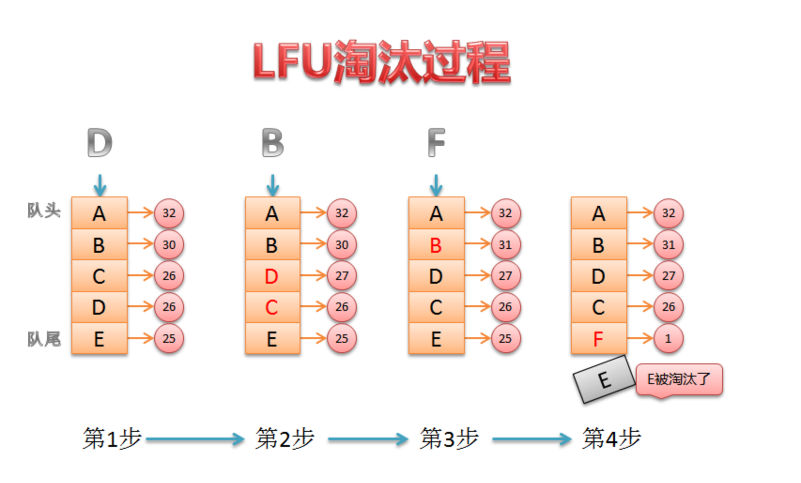
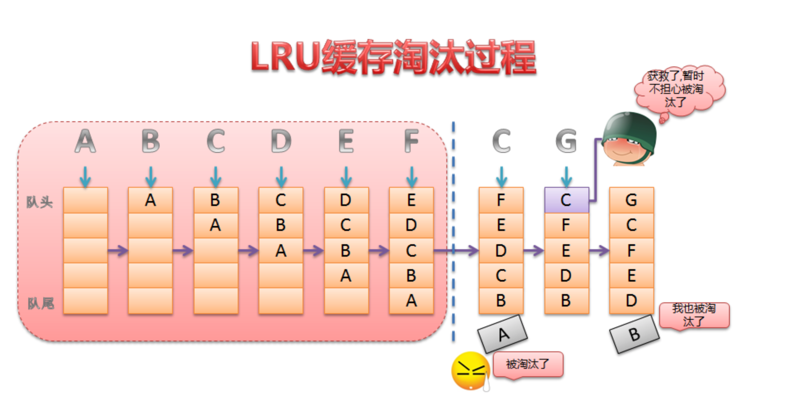

### LFU
最不经常访问的被淘汰.记录的是元素的访问次数  

### LRU
最少使用的被淘汰

### NRU
最近使用过的算法.维护读取和修改次数,根据次数维护优先级.优先级是读>写

|优先级|item|R|M|
|---|---|---|---|
|3|A|1|1|
|2|B|1|0|
|1|C|0|1|
|0|D|0|0|

需要维护的还有周期时钟.到达时间会把所有R都清零.  
缓存满的时候会找优先级低的.如果一样随机删除  

### FIFO
先加入的被淘汰,不管有没有被访问过  

### second_chance
FIFO改进版  
新增一个引用标志位.如果对象被使用(读/写),置为1  
淘汰的时候如果队列头的元素标志位是1,放入队尾并且置为0.然后继续出队.是0的淘汰  

